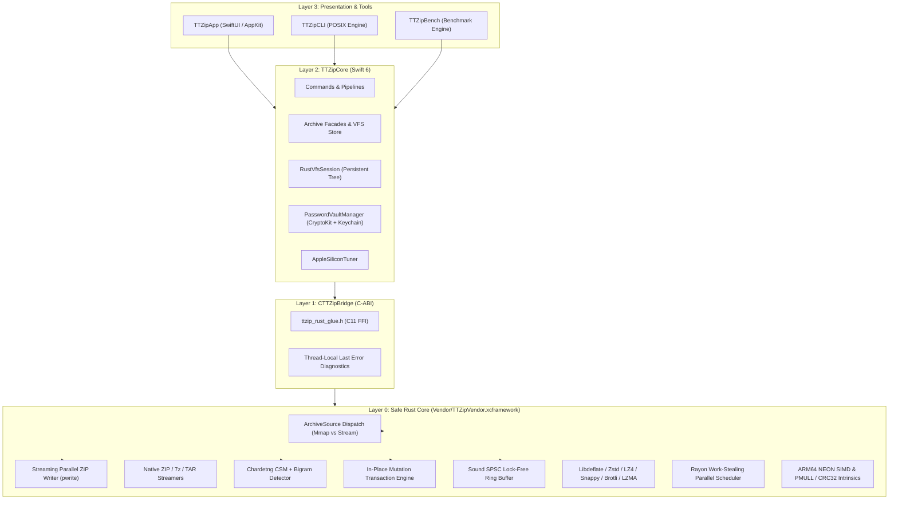

# TTZip Pro - Software Architecture & Engineering Standards

## 1. System Overview

TTZip Pro is an enterprise-grade, high-performance macOS archive management system built on a modern **Dual-Core Architecture**: a declarative, strictly-typed **Swift 6 frontend and domain orchestration layer** combined with a high-throughput, memory-safe **Safe Rust native engine (`ttzip-glue`)** distributed via a compiled binary XCFramework (`TTZipVendor.xcframework`).

```
┌───────────────────────────────────────────────────────────────────────────────────┐
│ Layer 3: Presentation & CLI Layer                                                 │
│   - TTZipApp: SwiftUI + AppKit NSOutlineView · @MainActor · QuickLook Previews    │
│   - TTZipCLI: POSIX Command Router · Terminal ANSI Renderer · Diagnostics & JUnit │
│   - TTZipBench: In-Memory Microbenchmarking Engine · TurboBench & lzbench Parity  │
└────────────────────────────────────────┬──────────────────────────────────────────┘
                                         │ Direct Target Import
┌────────────────────────────────────────▼──────────────────────────────────────────┐
│ Layer 2: Swift 6 Core Engine Layer (TTZipCore)                                   │
│   - Strict Concurrency (Sendable, TaskGroup, Actor Isolation)                     │
│   - Domain Pipelines: CompressCommand · ExtractCommand · RepairCommand            │
│   - Ultra-Thin Facades: ArchiveReader · ArchiveWriter · ArchiveExtractor          │
│   - Security & Keychain: PasswordVaultManager (Apple CryptoKit AES-GCM)           │
│   - Interactive VFS: RustVfsSession (Persistent Tree Handles & Zero-Alloc Search) │
│   - Dynamic Scheduling: AppleSiliconTuner (P-core / E-core Topology Sensing)      │
└────────────────────────────────────────┬──────────────────────────────────────────┘
                                         │ module.modulemap Pure C-ABI FFI
┌────────────────────────────────────────▼──────────────────────────────────────────┐
│ Layer 1: C Bridge & Interop ABI Layer (CTTZipBridge)                             │
│   - CTTZipBridge.h & ttzip_rust_glue.h: Standardized C11 ABI Header Contracts     │
│   - Thread-Local Diagnostic Context: ttzip_rust_last_error_message()              │
│   - Zero-overhead FFI: Zero-copy pointer exchange, buffer views, progress sinks   │
│   - Uniform status codes (TTZipStatus) & panic containment boundary               │
└────────────────────────────────────────┬──────────────────────────────────────────┘
                                         │ Binary Target Linkage
┌────────────────────────────────────────▼──────────────────────────────────────────┐
│ Layer 0: Safe Rust Core Engine & Hardware Acceleration (Vendor/TTZipVendor)       │
│   - ArchiveSource Abstraction: Filesystem Probing (APFS Mmap vs Remote Stream)    │
│   - Streaming Parallel ZIP Writer: Rayon + libdeflate + pwrite + APFS Prealloc   │
│   - Formats: Native ZIP / 7z / TAR Streamers & In-Place Mutation Engine          │
│   - Charset Pipeline: CSM + Bigram chardetng metadata propagation                │
│   - Concurrency Soundness: SPSC split() endpoints with Cell<usize> shadow caches │
│   - Apple Silicon NEON SIMD Vectorization & ARM64 PMULL/CRC32 (>48 GB/s checksum) │
│   - Memory safety: Zero raw pointer dereference vulnerabilities & catch_unwind    │
└───────────────────────────────────────────────────────────────────────────────────┘
```

---

## 2. Layered Architecture & Reconstructed Pillars



### 2.1 Reconstructed Architectural Pillars

1. **ArchiveSource & Storage Medium Dispatch**:
   - Proactive filesystem probing via `statfs(2)` dynamically identifies whether the archive resides on local NVMe APFS, standard local disk, or remote network / removable mounts (SMB, NFS, Cloud).
   - Local NVMe disks use `MmapSource` (`libc::mmap` + `libc::madvise(MADV_SEQUENTIAL)`) for zero-copy random access.
   - Remote or virtual filesystems seamlessly route to `StreamSource` using positional `pread` with 64KB buffers, completely eliminating kernel `SIGBUS` panics.

2. **Streaming Multi-Core Parallel ZIP Writer**:
   - Combines Rayon work-stealing parallel file compression with hardware-accelerated `libdeflate` (levels 1-12) and positional atomic disk writes (`pwrite`).
   - Preallocates APFS disk extents via `fstore_t` to prevent fragmentation on Apple Silicon SSDs.
   - Automatically promotes to Zip64 when uncompressed/compressed sizes exceed 4GB or entry counts exceed 65,535.
   - Strictly bounds memory peak to `< 64MB` RSS.

3. **Instant & Memory-Safe Single Entry Preview**:
   - Single entry extraction and thumbnail previews decode target entries directly from `ArchiveSource` without loading the full archive into heap memory.

4. **VFS Session & Zero-Allocation Interactive Search**:
   - `RustVfsSession` holds persistent VFS tree handles in memory, avoiding tree reallocations on search keystrokes.
   - `fuzzy_match` utilizes UTF-8 `char_indices()` iterators with **zero heap string allocations**, returning matches in `< 5ms` for 100,000+ files.

5. **Cross-Language Thread-Local Error Diagnostics**:
   - `LAST_ERROR` context records failure status, descriptive string, faulty entry path, and file offset without heap allocation.
   - Exported via `ttzip_rust_last_error_message()` and consumed by Swift's `ArchiveError.engineFailure` for clear UI and CLI diagnostics.

6. **End-to-End Charset Detection Pipeline**:
   - High-precision CSM + Bigram encoding detector (`chardetng`) automatically detects Asian and legacy character sets (GB18030, Shift-JIS, Big5, Windows-1252) during archive inspection.
   - Populates `TTZipEntryMetadata.detected_encoding` across the C-ABI boundary into Swift `ArchiveEntry.detectedEncoding`.

7. **Safe In-Place Mutation Engine**:
   - Atomic transactional append, replace, and delete operations on ZIP and 7z archives.
   - Untouched entries have their raw compressed bitstreams copied directly without decompression or recompression.
   - Writes mutations through transactional APFS shadow files with automatic rollback on error or cancellation.

8. **Crypto Convergence & Concurrency Soundness**:
   - Password Vault security is centered on Apple `CryptoKit.AES.GCM`, `Keychain Services`, and `SecureBytes` memory locking (`mlock`/`zeroize`).
   - SPSC lock-free ring buffer enforces strict `split()` producer-consumer separation with thread-local `Cell<usize>` shadow caches, preventing data races.

---

## 3. Concurrency, Memory & Security Models

### 3.1 Concurrency Model

```
┌───────────────────────────┐      ┌───────────────────────────┐      ┌───────────────────────────┐
│     @MainActor (UI)       │      │  Swift 6 Task.detached    │      │    Rayon Thread Pool      │
│  - 60 FPS View Updates    ├─────►│  - Command Orchestration  ├─────►│  - Work-Stealing Workers  │
│  - Throttled Progress     │◄─────┤  - Async Cancellation     │◄─────┤  - SIMD / Codec Compute   │
└───────────────────────────┘      └───────────────────────────┘      └───────────────────────────┘
```

1. **UI Layer**: Strictly `@MainActor` bound. UI receives progress updates throttled by `ThrottledProgressPublisher` to maintain 60 FPS rendering under heavy archive I/O.
2. **Domain Layer**: Async orchestration tasks run in detached background tasks (`Task.detached(priority: .userInitiated)`).
3. **Rust Core Layer**: Multi-core workloads utilize Rayon work-stealing thread pools balanced across host CPU cores. Cooperative cancellation flags abort background operations in < 5ms.

### 3.2 Memory Management & Zero-Copy I/O

- **Page-Aligned Buffer Slices**: Contiguous page-aligned micro-buffers (16KB to 1MB chunks) reduce memory fragmentation and maximize CPU L1/L2 cache hit rates.
- **Memory-Mapped Files (`mmap`)**: Archive reading operations map files directly into memory space with strict boundary and fault protection.
- **Secure Memory Sanitization**: Sensitive cryptographic credentials in memory buffers are zero-filled immediately upon release (`zeroize`).

### 3.3 Security & Sandboxing Invariants

1. **Zip-Slip & Path Traversal Defense**: All entry paths are sanitized and validated against canonical destination root directories before writing to disk.
2. **Zero Plain-Text Credentials on Disk**: Archive encryption passwords and vault keys exist solely in the macOS Keychain and ephemeral sanitized memory.
3. **App Sandbox Compliance**: Full support for macOS App Sandbox security boundaries, standard macOS entitlements, and declared UTI system file associations.

---

## 4. Engineering Standards & Quality Gates

1. **Zero Warnings Policy**:
   All Swift modules (`TTZipApp`, `TTZipCLI`, `TTZipCore`, `TTZipBench`) and Rust crates (`ttzip-engine`, `ttzip-tui`) must compile cleanly with zero compiler warnings under strict flags (`-warnings-as-errors`).

2. **Single Responsibility Principle & Line Count Gate**:
   Monolithic files are prohibited. Source files must adhere to the hard threshold enforced by `scripts/lint_loc_gate.py` ($\le 800\text{ LOC}$ per file, target $< 350\text{ LOC}$).

3. **Continuous Verification**:
   - `swift test`: 100% pass rate across unit, integration, and UI mock suites.
   - `cargo test`: 100% pass rate across format conformance, cryptographic property tests, and C-ABI regression suites.
   - `scripts/run_local_ci_gate.sh`: Automated pre-commit verification enforcing formatting, licensing, invariants, and tests.
