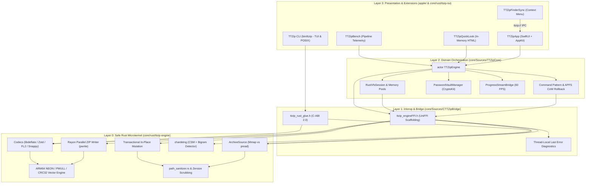

<p align="center">
  <a href="ARCHITECTURE.md"><strong>English</strong></a> |
  <a href="ARCHITECTURE_zh.md">简体中文</a>
</p>

# TTZip - System Architecture & Engineering Standards

> **Document Classification**: System Architecture Whitepaper & Engineering Governance Standard  
> **Target Subsystems**: `core/` (`ttzip-core`), `apple/` (`ttzip-apple`), Shared Infrastructure (`infra/ttkit`)  
> **Specification Version**: v2.0.0 (Unified Dual-Core UniFFI Standard)  
> **Last Updated**: August 2026

---

## 1. System Overview & Dual-Core Philosophy

TTZip is an enterprise-grade, ultra-high-throughput archiving and compression ecosystem engineered for Apple Silicon and cross-platform environments. It adopts a strict **Dual-Core Architecture**:
1. **Compute & Data Plane (Safe Rust Microkernel)**: Computationally heavy, memory-critical, cryptographic, and POSIX I/O tasks are executed in pure Safe Rust (`ttzip-engine`), distributed as a precompiled static binary XCFramework (`TTZipVendor.xcframework`).
2. **Control & Presentation Plane (Swift 6 & SwiftUI/AppKit)**: High-level lifecycle, domain orchestration, transactional undo/redo rollback, macOS system extensions (FinderSync, QuickLook), and declarative UI state machines are implemented in Swift 6 under complete concurrency checking.
3. **Automated Interop Boundary (Mozilla UniFFI 0.28)**: Zero manual C pointers on primary interfaces. All cross-language types, objects, and async streams are generated via Mozilla UniFFI macros, supplemented by a standardized C-ABI 2.0 export for multi-language SDKs (C11, C++20, Python, Go, JVM/Kotlin, C#, Dart, Node).

```
┌───────────────────────────────────────────────────────────────────────────────────────────┐
│ Layer 3: Presentation & System Integration Layer                                          │
│   • TTZipApp (apple/Sources/TTZipApp): SwiftUI + AppKit · 4 Orthogonal Sub-States · WSJ UI│
│   • TTZipFinderSync (apple/Sources/TTZipFinderSync): 10 Menu Actions · ttzip:// IPC       │
│   • TTZipQuickLook (apple/Sources/TTZipQuickLook): Zero-Disk-IO HTML Previews (QLPreview) │
│   • TTZip CLI (core/rust/ttzip-tui): Pure Rust POSIX CLI & Interactive TUI (`ttzip`)      │
│   • TTZipBench (core/Sources/TTZipBench): In-Memory Microbench & Pipeline Telemetry Tool  │
└─────────────────────────────────────────────┬─────────────────────────────────────────────┘
                                              │ SwiftPM / Native Direct Import
┌─────────────────────────────────────────────▼─────────────────────────────────────────────┐
│ Layer 2: Swift 6 Domain Orchestration Layer (TTZipCore)                                   │
│   • Strict Concurrency: Actor-isolated TTZipEngine, Sendable Domain Models, Detached Tasks│
│   • Command & Transaction Engine: CompressCommand / ExtractCommand with APFS CoW Undo     │
│   • Facades & High-Level APIs: ArchiveReader, ArchiveWriter, ArchiveExtractor             │
│   • Interactive VFS Session: RustVfsSession (Persistent UniFFI Tree, Zero-Alloc Fuzzy)    │
│   • Security & Key Management: PasswordVaultManager (CryptoKit AES-GCM + SecureBytes)     │
│   • Rate-Limited Telemetry: ProgressStreamBridge (60 FPS / 16.6ms Nanosecond Throttling)  │
└─────────────────────────────────────────────┬─────────────────────────────────────────────┘
                                              │ Mozilla UniFFI 0.28 Scaffolding + C-ABI 2.0
┌─────────────────────────────────────────────▼─────────────────────────────────────────────┐
│ Layer 1: C Bridge & UniFFI Scaffolding Layer (CTTZipBridge)                               │
│   • ttzip_engineFFI.h & CTTZipBridge.h: Mozilla UniFFI C Scaffolding Function Contracts    │
│   • ttzip_rust_glue.h: Standardized C-ABI 2.0 Struct Layouts (cbindgen, ABI Version 2)    │
│   • Diagnostic Context: Thread-Local LAST_ERROR (Zero-alloc TTZipErrorInfo)              │
│   • Safety Boundary: catch_unwind FFI Panic Containment & Universal Deallocator ttzip_free│
└─────────────────────────────────────────────┬─────────────────────────────────────────────┘
                                              │ Static Binary Linkage (libTTZipVendor.a)
┌─────────────────────────────────────────────▼─────────────────────────────────────────────┐
│ Layer 0: Safe Rust Microkernel & Hardware Acceleration (ttzip-engine)                     │
│   • Storage Probing: ArchiveSource Dispatch (APFS Mmap vs Remote Stream pread)            │
│   • Parallel ZIP Writer: Rayon Work-Stealing + libdeflate + pwrite + APFS Preallocation   │
│   • Solid Codec Pipelines: 7z Solid Streamer, Fast-LZMA2, Zstandard MT, Snappy, Brotli   │
│   • Hardware Vector SIMD: ARM64 12-Way PMULL/CRC32 (>63 GB/s), UDOT Adler32 (>30 GB/s)   │
│   • Encoding Pipeline: chardetng (CSM + Bigram) Multi-Language Character Set Auto-Detect  │
│   • In-Place Mutation: Transactional Shadow Files + Compressed Bitstream Bit-Exact Copy   │
│   • Defense-in-Depth: Zero-Alloc path_sanitizer.rs (Zip-Slip & TOCTOU Proof), Zeroize     │
└───────────────────────────────────────────────────────────────────────────────────────────┘
```

---

## 2. End-to-End Architectural Pillars



### 2.1 Storage Medium Dispatch (`ArchiveSource`)
- Dynamically queries filesystem topology via `statfs(2)`.
- **Local NVMe APFS**: Utilizes `MmapSource` (`libc::mmap` + `libc::madvise(MADV_SEQUENTIAL)`) for zero-copy, direct memory-mapped access.
- **Remote / Removable Mounts (SMB, NFS, Cloud Drives)**: Seamlessly routes to `StreamSource` using positional `pread` with 64KB buffers, completely preventing kernel `SIGBUS` panics caused by network dropouts.

### 2.2 Streaming Parallel Multi-Core ZIP Writer
- Combines `Rayon` work-stealing parallelism with hardware-accelerated `libdeflate` (levels 1-12) and positional atomic disk writes (`pwrite`).
- Allocates contiguous APFS disk extents ahead of execution via `fstore_t` (`F_PREALLOCATE`), eliminating filesystem fragmentation on Apple Silicon SSDs.
- Automatically promotes containers to Zip64 when uncompressed/compressed sizes exceed 4GB or entry counts exceed 65,535.
- Limits peak resident set size to strictly $< 64\text{MB}$ RSS regardless of input archive size.

### 2.3 Interactive VFS & Zero-Allocation Fuzzy Search
- `RustVfsSession` maintains persistent tree handles in memory, eliminating tree reconstruction on user keystrokes.
- The `fuzzy_match` algorithm operates entirely over UTF-8 `char_indices()` iterators with **zero intermediate heap allocations**, completing searches over 100,000 nodes in $< 5\text{ms}$.

### 2.4 Transactional In-Place Mutation Engine
- Provides atomic append, replace, and delete operations on existing ZIP and 7z archives.
- Unmodified entries have their raw compressed bitstreams copied bit-for-bit without decompression or recompression.
- All writes are directed to transactional APFS shadow files (`.tmp_<UUID>`), which are atomically swapped upon validation or rolled back on error.

### 2.5 Cross-Language Diagnostic Context
- The thread-local `LAST_ERROR` context stores status codes, error descriptions, problematic file paths, and byte offsets without heap allocation.
- Exposed across the FFI boundary via `ttzip_rust_get_last_error_info()` and mapped into Swift's `ArchiveError.engineFailure` for clear UI and CLI error reporting.

### 2.6 Automatic Character Set Detection Pipeline
- Integrates `chardetng` (Character Set Model + Bigram analysis) and `encoding_rs` to detect Asian and legacy encodings (GB18030, Big5, Shift-JIS, EUC-KR, Windows-1252) from raw archive entry header bytes.
- Propagates `TTZipEntryMetadata.detected_encoding` into Swift's `ArchiveEntry.detectedEncoding` and normalizes filenames to Unicode NFC.

---

## 3. Concurrency, Memory & Security Models

### 3.1 Concurrency Architecture
```
┌───────────────────────────┐      ┌───────────────────────────┐      ┌───────────────────────────┐
│     @MainActor (UI)       │      │  Swift 6 Task.detached    │      │    Rayon Thread Pool      │
│  - 60 FPS View Updates    ├─────►│  - Command Orchestration  ├─────►│  - Work-Stealing Workers  │
│  - Throttled Progress     │◄─────┤  - NativeComputeDispatcher│◄─────┤  - SIMD / Codec Compute   │
└───────────────────────────┘      └───────────────────────────┘      └───────────────────────────┘
```

1. **UI Layer**: Strictly `@MainActor` bound. UI receives progress updates throttled by `ProgressStreamBridge` using `os_unfair_lock` and `CLOCK_UPTIME_RAW` to maintain 60 FPS under intensive I/O.
2. **Domain Layer**: Async orchestration tasks run in detached background tasks (`Task.detached(priority: .userInitiated)`). `NativeComputeDispatcher` offloads blocking UniFFI calls to a dedicated GCD queue (`org.ttzip.native.compute`), preventing starvation of the Swift 6 cooperative thread pool.
3. **Rust Core Layer**: Multi-core workloads utilize Rayon thread pools balanced across host P-cores and E-cores. Atomic `CancellationToken` flags abort background operations in $< 5\text{ms}$.

### 3.2 Memory Safety & Defense-in-Depth
- **Zeroize Memory Scrubbing**: `SecureBuffer` and `SecureBytes` enforce RAII `Drop` volatile zeroing (`std::ptr::write_volatile` + `compiler_fence(Ordering::SeqCst)`) and `mlock` page locking, preventing Dead Store Elimination (DSE) from retaining sensitive cryptographic keys in memory.
- **Zip-Slip & Path Traversal Defense**: `path_sanitizer.rs` validates entry paths without heap allocation, rejecting parent directory traversal (`../`), absolute paths, Windows DOS reserved device names (`CON`, `PRN`, `AUX`, `NUL`, `COM1-9`, `LPT1-9`), and NTFS Alternate Data Streams (ADS).
- **Constant-Time Comparison**: Cryptographic comparisons use `constant_time_eq_16` paired with `std::hint::black_box` to prevent timing side-channel attacks.

---

## 4. Multi-Language SDK Architecture

The core engine exports a dual-layer interface:

| Language / Ecosystem | Integration Mechanism | Key Capabilities |
| :--- | :--- | :--- |
| **Swift 6 (macOS / iOS)** | Mozilla UniFFI + `CTTZipBridge` | Strict Concurrency, `actor TTZipEngine`, VFS Sessions, APFS CoW Undo |
| **Rust** | `Cargo.toml`: `ttzip-engine = "1.0.0"` | Native Crate, `ArchiveBuilder`, Zero-Copy Views, Streaming Writers |
| **Python 3** | PyO3 0.22 (`_ttzip.so`) | Buffer Protocol (`memoryview`), GIL-released computation, `ZipFile` drop-in |
| **C11 / C++20** | Standard C-ABI 2.0 (`ttzip_rust_glue.h`) | Header-only RAII wrappers, CMake targets (`ttzip::ttzip_cpp`), `pkg-config` |
| **Go** | CGO + C-ABI 2.0 | Idiomatic `ttzip` Go package, cross-platform compression & CRC32/64 |
| **JVM (Java 22+ / Kotlin)** | UniFFI Scaffolding / Panama FFM | Zero-copy Foreign Function & Memory API, Kotlin Coroutines |
| **C# / .NET 8** | P/Invoke (`DllImport`) | Managed `TTZipEngine` class with `SafeHandle` automatic resource cleanup |
| **Dart / Flutter** | `dart:ffi` | Desktop FFI bindings for macOS/Windows/Linux Flutter applications |

---

## 5. Architectural Invariants & Testing Governance

### 5.1 Resource Invariant Test Harnesses
1. **APFS Sparse Virtual Fixture Invariant**:
   - Generates 50GB+ virtual sparse Zip64 archives in $< 5\text{ms}$ using APFS seek holes without consuming physical disk storage.
   - Continuously samples Darwin Mach `task_info` RSS and hard-fails if peak RSS exceeds $32.00\text{ MB}$ (`sparse_fixture_rss_test.rs`).
2. **Zero-Allocation Interactive VFS Invariant**:
   - Uses a custom `TrackingAllocator` implementing `std::alloc::GlobalAlloc` to track runtime allocations.
   - Hard-fails if searching 100,000 VFS tree nodes incurs even a single heap allocation (`zero_alloc_vfs_search_test.rs`, `ZeroAllocVfsBridgeTests.swift`).
3. **Zero-Disk-IO Amplification Invariant**:
   - Inspects Darwin `proc_pid_rusage(..., RUSAGE_INFO_V4)` for `ri_diskio_byteswritten`.
   - Asserts that in-memory single-entry previews perform zero intermediate disk writes (`ZeroDiskIOLeakHarnessTests.swift`).

### 5.2 Mozilla UniFFI Symbol Parity Gate
- `scripts/verify_uniffi_symbols.sh` validates 100% full-parity alignment between Mozilla UniFFI header definitions (`ttzip_engineFFI.h`) and static library Mach-O symbol tables (`libTTZipVendor.a`).
- Embedded directly into Stage 2 of `./scripts/run_local_ci_gate.sh`.

### 5.3 Non-Forgeable Execution Provenance & Anti-Fallback Assertions
- The Rust kernel records `TTZipExecutionProvenance` in thread-local storage on every operation.
- Exported via `ttzip_rust_get_last_execution_provenance` and captured in Swift via `EngineProvenanceCollector`.
- `TTZipAssertions.assertEngineExecution` and `assertNoFallback` verify in unit and integration tests that zero operations silently fall back to legacy wrappers or CLI subprocesses (`E2EEnginePathTracerTests.swift`).

---

## 6. Build, Package & Verification Matrix

### 6.1 Core Engine (`core/`)
```bash
cd core

# 1. Build Rust microkernel & generate UniFFI bindings
./scripts/build_rust.sh

# 2. Build Swift 6 Core library (Debug & Release)
swift build
swift build -c release

# 3. Run Swift unit & integration test suite
swift test --parallel

# 4. Run Rust workspace test matrix
cd rust && cargo test --workspace && cd ..

# 5. Run full-pipeline benchmark & regression gates
swift run ttzip-bench gate
swift run ttzip-bench pipeline

# 6. Run 100% local CI gate (Symbols, Invariants, LOC limits, Tests)
./scripts/run_local_ci_gate.sh
```

### 6.2 Apple Desktop Client (`apple/`)
```bash
cd apple

# 1. Build Swift Package products
swift build -c release

# 2. Assemble fully signed .app bundle (Direct or App Store channel)
./scripts/bundle_app.sh --channel direct
# For Mac App Store Sandbox build:
# ./scripts/bundle_app.sh --channel mas

# 3. Run UI, design system & state machine test suite
swift test
```

---

## 7. License & Ecosystem Governance

- **TTZip Core (`core/`)**: Dual-licensed under the **BSD 3-Clause License** ([LICENSE-BSD](LICENSE-BSD)) and the **Apache License 2.0** ([LICENSE-APACHE](LICENSE-APACHE)).
- **TTZip Apple Client (`apple/`)**: Licensed under the **GNU General Public License v3.0 or later** ([apple/LICENSE](../apple/LICENSE)).
- **SPDX Standard**: All source files must include standard SPDX header identifiers and author attribution: `Witt Kung <witt.w.kung@gmail.com>`.
