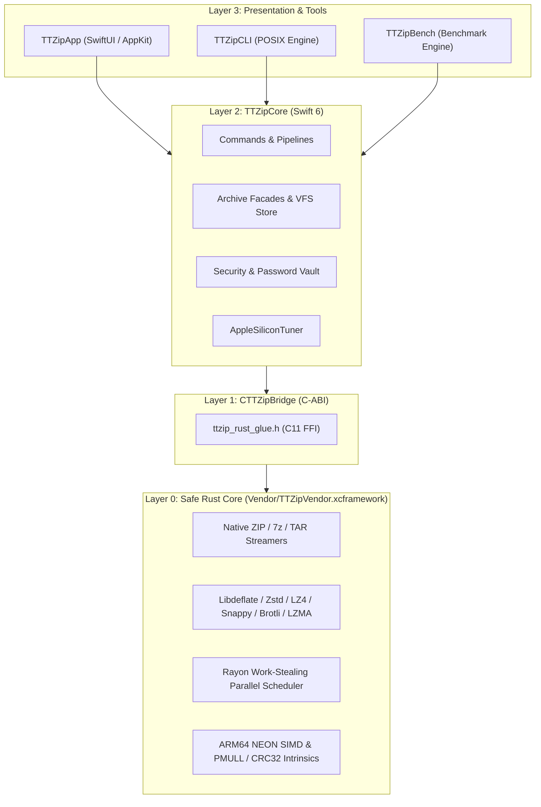

# TTZip Pro - Software Architecture & Engineering Standards

## 1. System Overview

TTZip Pro is an enterprise-grade, high-performance macOS archive management system built on a modern **Dual-Core Architecture**: a declarative, strictly-typed **Swift 6 frontend and domain orchestration layer** combined with a high-throughput, memory-safe **Safe Rust native engine (`ttzip-glue`)** distributed via a compiled binary XCFramework (`TTZipVendor.xcframework`).

```
┌───────────────────────────────────────────────────────────────────────────────────┐
│ Layer 3: Presentation & CLI Layer                                                 │
│   - TTZipApp: SwiftUI + AppKit NSOutlineView · @MainActor · QuickLook Previews    │
│   - TTZipCLI: POSIX Command Router · Terminal ANSI Renderer · Diagnostics & JUnit │
│   - TTZipBench: In-Memory Microbenchmarking Engine · TurboBench & lzbench Parity  │
└────────────────────────────────────────┬──────────────────────────────────────────┘
                                         │ Direct Target Import
┌────────────────────────────────────────▼──────────────────────────────────────────┐
│ Layer 2: Swift 6 Core Engine Layer (TTZipCore)                                   │
│   - Strict Concurrency (Sendable, TaskGroup, Actor Isolation)                     │
│   - Domain Pipelines: CompressCommand · ExtractCommand · RepairCommand            │
│   - Ultra-Thin Facades: ArchiveReader · ArchiveWriter · ArchiveExtractor          │
│   - Security & Keychain: PasswordVaultManager · SecurityScanner Path Sanitizer    │
│   - Dynamic Scheduling: AppleSiliconTuner (P-core / E-core Topology Sensing)      │
└────────────────────────────────────────┬──────────────────────────────────────────┘
                                         │ module.modulemap Pure C-ABI FFI
┌────────────────────────────────────────▼──────────────────────────────────────────┐
│ Layer 1: C Bridge & Interop ABI Layer (CTTZipBridge)                             │
│   - CTTZipBridge.h & ttzip_rust_glue.h: Standardized C11 ABI Header Contracts     │
│   - Zero-overhead FFI: Zero-copy pointer exchange, buffer views, progress sinks   │
│   - Uniform status codes (TTZipStatus) & panic containment boundary               │
└────────────────────────────────────────┬──────────────────────────────────────────┘
                                         │ Binary Target Linkage
┌────────────────────────────────────────▼──────────────────────────────────────────┐
│ Layer 0: Safe Rust Core Engine & Hardware Acceleration (Vendor/TTZipVendor)       │
│   - rust/ttzip-glue: Safe Rust format kernels (ZIP, 7z, TAR, GZ, BZ2, XZ, ZSTD)   │
│   - Rayon Work-Stealing Parallelism & Lock-Free Thread Pool Distribution          │
│   - Apple Silicon NEON SIMD Vectorization & ARM64 PMULL/CRC32 (>48 GB/s checksum) │
│   - APFS clonefile / fstore_t preallocation & mmap zero-copy micro-buffering      │
│   - Memory safety: Zero raw pointer dereference vulnerabilities & catch_unwind    │
└───────────────────────────────────────────────────────────────────────────────────┘
```

---

## 2. Layered Architecture & Subsystem Responsibilities



### 2.1 Layer 3: Presentation & User Experience

- **TTZipApp (macOS Application)**:
  - **Architecture**: MVVM-C with strict `@MainActor` UI state isolation (`AppViewState`, partitioned into modular sub-states: `AppSubStates`, `AppViewState+ArchiveOperations`, `AppViewState+Commands`, `AppViewState+Tasks`).
  - **Native Finder Integration**: `NativeArchiveOutlineView` bridging AppKit `NSOutlineView` via `NSViewRepresentable` providing 0ms instant directory tree expansion and fluid native collapse animations.
  - **Multi-Tab & Workspace Management**: Tab persistence and state caching via `KeepAliveTabContainer` and `WorkspaceTab`.
  - **QuickLook & Media Previews**: `QuickLookPreviewCoordinator`, `MediaPreviewFactory`, and `EphemeralPreviewCacheManager` for in-archive media previewing and automatic scratch file life-cycle cleanup.
  - **System Services**: `FinderFavoritesReader`, `ArchiveFilePromiseProvider` for file dragging, `AppKitMenuSynchronizer`, and `DockProgressManager`.

- **TTZipCLI (POSIX Command-Line Interface)**:
  - **Modular Command Routing**: `CLICommandRouter` dispatching `compress`, `extract`, `inspect`, `benchmark`, `test`, `diagnostics`, and `maintenance` commands.
  - **POSIX Conformance**: Robust short/long option parsing (`POSIXCLIArgumentParser`), automated shell completion generators (Bash, Zsh, Fish, Nu), and man page generators.
  - **Terminal Presentation**: ANSI colored tree formatting (`ArchiveVisualTreeRenderer`), interactive paging (`TerminalPagerEngine`), and JUnit XML telemetry report generation.

- **TTZipBench (Microbenchmarking Suite)**:
  - High-precision in-memory benchmarking runner comparing throughput (MB/s), compression ratios, and latency with TurboBench and lzbench metric parity.

### 2.2 Layer 2: Swift 6 Core Engine (TTZipCore)

- **Strict Concurrency**: 100% Swift 6 compliant with `Sendable` domain structures, structured concurrency (`TaskGroup`, `AsyncStream`), and actor isolation.
- **Domain Command Hierarchy**: Encapsulated pipeline operations via `CompressCommand`, `ExtractCommand`, `RepairCommand`, and `MacroArchiveCommand`.
- **Ultra-Thin Facades**:
  - `ArchiveReader`: Inspects and enumerates archive structures into immutable `ArchiveEntry` and `ArchiveTreeNode` hierarchies.
  - `ArchiveWriter`: Dispatches parallel multi-file compression pipelines.
  - `ArchiveExtractor`: Coordinates safe extraction pipelines with progress reporting and cancellation.
  - `ArchiveSelectiveExtractor`: Low-latency targeted extraction of single archive entries.
  - `ArchiveRepairEngine`: Recovers damaged ZIP/TAR archive headers and truncated streams.
- **Bridge Delegation**: Facades (`ArchiveEngineBridge`, `RustVfsBridge`, `NativeMicrokernelBridge`, `CUnsafeBufferAdapter`) delegate heavy compute and format processing directly to the Rust core via C-ABI.
- **Security & Integrity**:
  - `PasswordVaultManager`: Secure credential storage backed by macOS Keychain with memory-wiping on deallocation.
  - `SecurityScanner`: Zip-slip path traversal prevention, symlink boundary checks, and malicious payload sanitization.
- **Hardware Sensing**: `AppleSiliconTuner` dynamically inspects P-core/E-core distributions to configure optimal parallel concurrency limits.

### 2.3 Layer 1: C Bridge & Interop ABI (CTTZipBridge)

- **Pure C ABI Boundary**: Zero C++ symbol dependencies, defined cleanly in `Sources/CTTZipBridge/include/` (`CTTZipBridge.h`, `ttzip_rust_glue.h`, `module.modulemap`).
- **Data Exchange Contract**: Standardized scalar types, C-style string slices (`const char*`, `size_t`), and memory buffer pointers avoiding unneeded memory copies.
- **Uniform Error Handling**: Negative integer status codes (`TTZipStatus`) map deterministic failure conditions across languages without exceptions.
- **Asynchronous Callback Sinks**: Function pointers (`TTZipProgressCallback`, cancellation token pointers) allowing real-time progress events and responsive operation cancellation.

### 2.4 Layer 0: Safe Rust Core Engine (Vendor/TTZipVendor.xcframework)

- **Memory Safety & Invariants**: Safe Rust eliminates data races, use-after-free, buffer overflows, and null-pointer dereferences. Panic containment boundaries (`catch_unwind`) prevent host crashes across the FFI boundary.
- **Format Engines (`rust/ttzip-glue/src/`)**:
  - `zip`: Native Zip32/Zip64 container writer and reader, PKWare standard decryption, WinZip AES-128/AES-256 hardware decryption.
  - `sevenz`: Native 7z header parsing, solid LZMA/LZMA2 payload decoders, and AES-256 encrypted volume support.
  - `archive`: POSIX TAR streaming, damaged header salvaging, and split volume reassembly (`detect_volume_chain`, `SplitVolumeWriter`).
  - `vfs`: High-performance in-memory virtual filesystem tree indexer with regex/fuzzy path searching.
- **Codecs & Accelerators**:
  - `libdeflate`, `zstd`, `lz4`, `snappy`, `brotli`, `lzfse`, and `lzma` integrated natively.
- **Hardware Acceleration**:
  - ARM64 NEON SIMD vectorization and PMULL / CRC32 assembly instructions yielding >48 GB/s checksum verification throughput.
  - APFS `clonefile` / `fstore_t` preallocation routines for instant zero-copy file duplication on Apple Silicon SSDs.

---

## 3. Concurrency, Memory & Security Models

### 3.1 Concurrency Model

```
┌───────────────────────────┐      ┌───────────────────────────┐      ┌───────────────────────────┐
│     @MainActor (UI)       │      │  Swift 6 Task.detached    │      │    Rayon Thread Pool      │
│  - 60 FPS View Updates    ├─────►│  - Command Orchestration  ├─────►│  - Work-Stealing Workers  │
│  - Throttled Progress     │◄─────┤  - Async Cancellation     │◄─────┤  - SIMD / Codec Compute   │
└───────────────────────────┘      └───────────────────────────┘      └───────────────────────────┘
```

1. **UI Layer**: Strictly `@MainActor` bound. UI receives progress updates throttled by `ThrottledProgressPublisher` to maintain 60 FPS rendering under heavy archive I/O.
2. **Domain Layer**: Async orchestration tasks run in detached background tasks (`Task.detached(priority: .userInitiated)`).
3. **Rust Core Layer**: Multi-core workloads utilize Rayon work-stealing thread pools balanced across host CPU cores. Cooperative cancellation flags abort background operations in < 5ms.

### 3.2 Memory Management & Zero-Copy I/O

- **Page-Aligned Buffer Slices**: Contiguous page-aligned micro-buffers (16KB to 1MB chunks) reduce memory fragmentation and maximize CPU L1/L2 cache hit rates.
- **Memory-Mapped Files (`mmap`)**: Archive reading operations map files directly into memory space with strict boundary and fault protection.
- **Secure Memory Sanitization**: Sensitive cryptographic credentials in memory buffers are zero-filled immediately upon release (`zeroize`).

### 3.3 Security & Sandboxing Invariants

1. **Zip-Slip & Path Traversal Defense**: All entry paths are sanitized and validated against canonical destination root directories before writing to disk.
2. **Zero Plain-Text Credentials on Disk**: Archive encryption passwords and vault keys exist solely in the macOS Keychain and ephemeral sanitized memory.
3. **App Sandbox Compliance**: Full support for macOS App Sandbox security boundaries, standard macOS entitlements, and declared UTI system file associations.

---

## 4. Engineering Standards & Quality Gates

1. **Zero Warnings Policy**:
   All Swift modules (`TTZipApp`, `TTZipCLI`, `TTZipCore`, `TTZipBench`) and Rust crates (`ttzip-glue`, `ttzip-tui`) must compile cleanly with zero compiler warnings under strict flags (`-warnings-as-errors`).

2. **Single Responsibility Principle & Line Count Gate**:
   Monolithic files are prohibited. Source files must adhere to the hard threshold enforced by `scripts/lint_loc_gate.py` ($\le 800\text{ LOC}$ per file, target $< 350\text{ LOC}$).

3. **Continuous Verification**:
   - `swift test`: 100% pass rate across unit, integration, and UI mock suites.
   - `cargo test`: 100% pass rate across format conformance, cryptographic property tests, and C-ABI regression suites.
   - `scripts/run_local_ci_gate.sh`: Automated pre-commit verification enforcing formatting, licensing, invariants, and tests.


