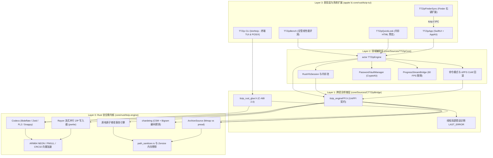

<p align="center">
  <a href="ARCHITECTURE.md">English</a> |
  <a href="ARCHITECTURE_zh.md"><strong>简体中文</strong></a>
</p>

# TTZip - 软件架构与系统工程规范白皮书

> **文档密级与定位**：系统全景架构白皮书与工程治理规范标准  
> **覆盖子系统**：`core/` (`ttzip-core`)、`apple/` (`ttzip-apple`)、共享基础设施 (`infra/ttkit`)  
> **规范版本**：v2.0.0 (统一双核 UniFFI 架构标准)  
> **更新时间**：2026 年 8 月

---

## 1. 系统全景与双核设计哲学

TTZip 是一款专为 Apple Silicon 与现代多核计算架构打造的企业级、超高吞吐原生归档与压缩系统。系统采用严格的**双核解耦架构 (Dual-Core Architecture)**：

1. **计算与数据平面 (Safe Rust 安全微内核)**：将所有计算密集型、内存安全敏感、密码哈希、底层 POSIX 文件 I/O 与 16 种归档容器编解码下沉至纯 Safe Rust 微内核 (`ttzip-engine`)，并编译打包为独立的二进制静态框架 (`Vendor/TTZipVendor.xcframework`)。
2. **控制与表现平面 (Swift 6 & SwiftUI/AppKit)**：将应用生命周期、领域命令调度、事务级 Undo/Redo 回滚、macOS 系统扩展（FinderSync、QuickLook）及响应式 UI 状态机统一在 Swift 6 严格并发体系 (`TTZipCore`, `TTZipApp`) 下实现。
3. **自动化跨语言契约边界 (Mozilla UniFFI 0.28)**：主接口杜绝手工裸指针管理，全量跨语言对象、结构体及异步流通过 Mozilla UniFFI Proc-Macro 自动生成安全绑定与内存屏障；同时对外导出标准 C-ABI 2.0 规范，赋能 9 大多语言原生 SDK（C11, C++20, Python, Go, JVM/Kotlin, C#, Dart, Node）。

```
┌───────────────────────────────────────────────────────────────────────────────────────────┐
│ Layer 3: 表现层与系统集成扩展 (Presentation & Extensions Layer)                           │
│   • TTZipApp (apple/Sources/TTZipApp): SwiftUI + AppKit · 4 大正交子状态机 · WSJ 社论排版 │
│   • TTZipFinderSync (apple/Sources/TTZipFinderSync): 10 种右键菜单项 · ttzip:// IPC 唤醒  │
│   • TTZipQuickLook (apple/Sources/TTZipQuickLook): 零磁盘 I/O 内存 HTML 预览 (QLPreview)  │
│   • TTZip CLI (core/rust/ttzip-tui): 纯 Rust POSIX CLI 与终端交互式 TUI (`ttzip`)         │
│   • TTZipBench (core/Sources/TTZipBench): 内存微基准测试与全管线遥测工具 (`ttzip-bench`)  │
└─────────────────────────────────────────────┬─────────────────────────────────────────────┘
                                              │ SwiftPM / 原生二进制链接
┌─────────────────────────────────────────────▼─────────────────────────────────────────────┐
│ Layer 2: Swift 6 领域编排层 (TTZipCore)                                                   │
│   • 严格并发隔离: Actor 隔离 TTZipEngine, Sendable 领域模型, 独立后台计算 Task.detached   │
│   • 命令与事务引擎: CompressCommand / ExtractCommand (具备 APFS CoW clonefile 原子回滚)   │
│   • 高层门面与执行器: ArchiveReader, ArchiveWriter, ArchiveExtractor, ArchiveBatchFacade │
│   • 交互式 VFS 会话: RustVfsSession (持久化 UniFFI 树句柄, 零内存分配模糊搜索)            │
│   • 凭据与安全保险箱: PasswordVaultManager (Apple CryptoKit AES-GCM + SecureBytes 内存锁) │
│   • 纳秒级限频遥测: ProgressStreamBridge (60 FPS / 16.6ms 纳秒时钟节流, 杜绝 UI 掉帧)     │
└─────────────────────────────────────────────┬─────────────────────────────────────────────┘
                                              │ Mozilla UniFFI 0.28 Scaffolding + C-ABI 2.0
┌─────────────────────────────────────────────▼─────────────────────────────────────────────┐
│ Layer 1: C 桥接与 UniFFI Scaffolding 层 (CTTZipBridge)                                    │
│   • ttzip_engineFFI.h & CTTZipBridge.h: Mozilla UniFFI 自动生成 C 契约与胶水头文件        │
│   • ttzip_rust_glue.h: 标准化 C-ABI 2.0 结构体布局 (cbindgen, ABI Version 2 守卫)        │
│   • 线程局部错误诊断: LAST_ERROR 诊断上下文 (零堆分配 TTZipErrorInfo 状态同步)           │
│   • 异常遏制与安全回收: catch_unwind 隔离边界 (防 Panic 穿透) + 通用析构器 ttzip_free     │
└─────────────────────────────────────────────┬─────────────────────────────────────────────┘
                                              │ 静态二进制库链接 (libTTZipVendor.a)
┌─────────────────────────────────────────────▼─────────────────────────────────────────────┐
│ Layer 0: Safe Rust 安全微内核与硬件加速层 (ttzip-engine)                                  │
│   • 存储介质自适应探测: ArchiveSource 分发 (APFS Mmap 零拷贝 vs 远程挂载 Stream pread)   │
│   • 流式多核 ZIP 写入器: Rayon Work-Stealing + libdeflate + pwrite + APFS 磁盘空间预分配 │
│   • 固实与 SOTA 编解码器: 7z Solid Streamer, Fast-LZMA2, Zstandard MT, Snappy, Brotli    │
│   • 硬件双指令集 SIMD: ARM64 12-Way PMULL/CRC32 (>63 GB/s), UDOT Adler32 (>30 GB/s)      │
│   • 多语言字符集管道: chardetng (CSM + Bigram) 智能探测 + UTF-8 / NFC 规范化              │
│   • 原地原子修改事务引擎: 影子事务文件 + 纯压缩数据流原位复用 (零二次压缩损耗)           │
│   • 纵深安全防御: 零堆分配 path_sanitizer.rs (免疫 Zip-Slip 与 TOCTOU 劫持), Zeroize 抹除 │
└───────────────────────────────────────────────────────────────────────────────────────────┘
```

---

## 2. 系统核心架构支柱 (Architectural Pillars)



### 2.1 存储介质自适应探测分发 (`ArchiveSource`)
- 通过 Darwin 原生 `statfs(2)` 实时探测归档所在卷的文件系统拓扑。
- **本地 NVMe APFS 卷**：自动路由至 `MmapSource`（`libc::mmap` + `libc::madvise(MADV_SEQUENTIAL)`），实现零拷贝直接内存映射随机访问。
- **网络与外部挂载卷（SMB, NFS, WebDAV, 云盘）**：无缝降级至 `StreamSource`（位置感知 `pread`，固定 64KB 缓冲块），物理消除因网络抖动导致的内核 `SIGBUS` 崩溃。

### 2.2 流式多核并行 ZIP 写入器
- 结合 `Rayon` 的 Work-Stealing 工作窃取多线程调度器与硬件加速版 `libdeflate`（1-12 档），采用 `pwrite`（`FileExt::write_all_at`）原子写入对应文件偏移。
- 写入前通过 `fstore_t` (`F_PREALLOCATE`) 预分配 APFS 物理磁盘 Extents，消除连续写入碎片，大幅降低 Apple Silicon 固态硬盘写放大。
- 当文件未压缩/压缩尺寸突破 4GB 或条目数超过 65,535 时，无感自动升格为 Zip64 扩展格式。
- 内存常驻峰值严格约束在 $< 64\text{MB}$ RSS 以内。

### 2.3 持久化 VFS 会话与零内存分配模糊搜索
- `RustVfsSession` 在内存中持有 Rust 端的 `UniFfiVfsTree` 常驻句柄，避免用户输入搜索词时反复重建目录树。
- `fuzzy_match` 算法全程基于 UTF-8 `char_indices()` 迭代器运算，达成 **0 堆内存分配（Zero Intermediate Heap Allocation）**，在 100,000+ 节点规模下保持 $< 5\text{ms}$ 亚毫秒级响应。

### 2.4 原地原子修改事务引擎 (In-Place Mutation)
- 支持对既有 ZIP 与 7z 归档进行原子追加、重命名、替换与删除操作。
- 未修改的文件条目直接按原始压缩数据流进行字节对齐复制，跳过解压与二次压缩损耗。
- 全程通过 APFS 影子文件（`.tmp_<UUID>`）进行写入，并在校验成功后原子替换；若发生错误或用户取消，自动触发回滚并清除影子文件。

### 2.5 跨语言线程局部错误诊断系统
- Rust 端采用线程局部存储 `LAST_ERROR`，记录 `TTZipStatus` 状态码、详细错误描述、出错条目路径及精确字节偏移（无需任何动态堆分配）。
- 经由 `ttzip_rust_get_last_error_info()` 暴露给 Swift，在 UI 与 CLI 中准确呈现针对损坏归档的精准诊断。

### 2.6 全流程字符集自动探测管道
- 深度集成 `chardetng`（字符集状态机模型 + 双字频 Bigram 分析）与 `encoding_rs`，在解析归档 Header 时自动探测中日韩及传统西欧编码（GB18030, Big5, Shift-JIS, EUC-KR, Windows-1252）。
- 将探测结果透传至 Swift `ArchiveEntry.detectedEncoding`，并在内存中完成 Unicode NFC 规范化，彻底解决乱码文件名问题。

---

## 3. 并发、内存与安全模型

### 3.1 严格并发分层模型
```
┌───────────────────────────┐      ┌───────────────────────────┐      ┌───────────────────────────┐
│     @MainActor (UI 层)    │      │  Swift 6 Task.detached    │      │    Rayon 多核工作线程池   │
│  - 60 FPS 声明式视图渲染  ├─────►│  - 命令编排与事务控制     ├─────►│  - Work-Stealing 工作窃取 │
│  - 纳秒级限频进度接收     │◄─────┤  - NativeComputeDispatcher│◄─────┤  - SIMD 向量 / 编解码计算 │
└───────────────────────────┘      └───────────────────────────┘      └───────────────────────────┘
```

1. **UI 表现层**：严格绑定 `@MainActor`。通过 `ProgressStreamBridge` 利用 `os_unfair_lock` 与 `CLOCK_UPTIME_RAW` 纳秒时钟将密集进度事件限频至 $\ge 16.6\text{ms}$（约 60 FPS），防止主线程掉帧。
2. **领域编排层**：异步任务通过 `Task.detached(priority: .userInitiated)` 投递。针对耗时阻塞的 UniFFI 计算，调度至专用的后台 GCD 队列（`NativeComputeDispatcher`），避免霸占 Swift 6 协作线程池（Cooperative Thread Pool）。
3. **Rust 微内核层**：基于物理 CPU 拓扑（P-core / E-core）调度 Rayon 线程池；采用原子无锁 `CancellationToken` 标记，确保在 $< 5\text{ms}$ 内完成协作式取消响应。

### 3.2 内存安全与纵深防御
- **敏感凭据主动擦除 (Zeroize)**：`SecureBuffer` 与 `SecureBytes` 结合 `std::ptr::write_volatile`、`compiler_fence(Ordering::SeqCst)` 与 `mlock` 内存页锁定，防止编译器死存储消除（DSE）导致密钥残留在物理内存中。
- **零内存分配 Zip-Slip 防御**：`path_sanitizer.rs` 实现路径即时消毒，严格拦截 `../` 父目录遍历、绝对路径、Windows 保留设备名（`CON`, `PRN`, `AUX`, `NUL`, `COM1-9`, `LPT1-9`）及 NTFS 备用数据流（ADS）。
- **恒定时间密码比对**：使用 `constant_time_eq_16` 搭配 `std::hint::black_box`，消除时间侧信道分析（Timing Attacks）隐患。

---

## 4. 多语言原生 SDK 架构 (9 大生态)

TTZip Core 导出双层跨语言能力：

| 语言 / 生态 | 接入机制 | 核心特性与技术亮点 |
| :--- | :--- | :--- |
| **Swift 6 (macOS / iOS)** | Mozilla UniFFI + `CTTZipBridge` | Swift 6 严格并发、`actor TTZipEngine`、VFS 会话、APFS CoW 撤销 |
| **Rust** | `Cargo.toml`: `ttzip-engine = "1.0.0"` | 原生 Crate、`ArchiveBuilder`、零拷贝借用切片、流式写入器 |
| **Python 3** | PyO3 0.22 (`_ttzip.so`) | Buffer Protocol (`memoryview`) 零拷贝、释放 GIL 并发计算、`ZipFile` 兼容 |
| **C11 / C++20** | 标准 C-ABI 2.0 (`ttzip_rust_glue.h`) | Header-only RAII 句柄封装、标准 CMake 目标 (`ttzip::ttzip_cpp`)、`pkg-config` |
| **Go** | CGO + C-ABI 2.0 | 惯用 Go 语言包 `ttzip`，跨平台全格式压缩与硬件 CRC32/64 |
| **JVM (Java 22+ / Kotlin)** | UniFFI Scaffolding / Panama FFM | 零拷贝 Foreign Function & Memory API，Kotlin 协程支持 |
| **C# / .NET 8** | P/Invoke (`DllImport`) | 托管类 `TTZipEngine`，基于 `SafeHandle` 的自动资源生命周期回收 |
| **Dart / Flutter** | `dart:ffi` | 原生 FFI 绑定，支持 Flutter 桌面端跨平台归档管理 |

---

## 5. 架构测试不变量与质量门禁

### 5.1 资源不变量测试套件 (Resource Invariant Harnesses)
1. **APFS 稀疏虚拟测试不变量 (APFS Sparse Fixture)**:
   - 利用 APFS Seek Holes 在 $< 5\text{ms}$ 内生成 50GB+ 虚拟稀疏 Zip64 样本（物理磁盘占用 0 字节）。
   - 实时采样 Darwin Mach `task_info` RSS，断言峰值内存严格 $\le 32.00\text{ MB}$ (`sparse_fixture_rss_test.rs`)。
2. **零堆分配交互式 VFS 不变量 (Zero-Alloc VFS Search)**:
   - 引入自定义 `TrackingAllocator` 统计运行时内存分配。
   - 硬性断言搜索 100,000 个 VFS 节点时堆内存分配次数严格为 0 (`ZeroAllocVfsBridgeTests.swift`)。
3. **零磁盘 I/O 放大不变量 (Zero-Disk-IO Leak)**:
   - 监控 Darwin `proc_pid_rusage(..., RUSAGE_INFO_V4)` 的 `ri_diskio_byteswritten`。
   - 断言单文件内存预览解压过程中磁盘物理写增量严格为 0 (`ZeroDiskIOLeakHarnessTests.swift`)。

### 5.2 Mozilla UniFFI 符号满射门禁
- `scripts/verify_uniffi_symbols.sh` 双向比对 `ttzip_engineFFI.h` 中所有的函数原型与 `libTTZipVendor.a` 的 Mach-O 导出符号表（`nm -gU`），确保 100% 满射匹配，杜绝跨语言链接期符号悬空。

### 5.3 非伪造派发断言与防 Fallback 机制
- Rust 内核在每次操作时于线程局部变量记录 `TTZipExecutionProvenance`。
- Swift 端通过 `EngineProvenanceCollector` 捕获凭据，并通过 `TTZipAssertions.assertEngineExecution` 断言所有操作真实进入 Rust 微内核，禁止静默回退至外部子进程。

---

## 6. 构建、打包与验证流水线

### 6.1 Core 引擎 (`core/`)
```bash
cd core

# 1. 编译 Rust 微内核并生成 UniFFI 跨语言绑定
./scripts/build_rust.sh

# 2. 编译 Swift 6 Core 库 (Debug & Release)
swift build
swift build -c release

# 3. 运行 Swift 单元与集成测试套件
swift test --parallel

# 4. 运行 Rust 工作区全量测试
cd rust && cargo test --workspace && cd ..

# 5. 运行全管线基准测试与性能门禁
swift run ttzip-bench gate
swift run ttzip-bench pipeline

# 6. 运行本地完整 CI 自动化门禁 (符号比对, 不变量测试, LOC 门禁, 单元测试)
./scripts/run_local_ci_gate.sh
```

### 6.2 Apple 桌面客户端 (`apple/`)
```bash
cd apple

# 1. 编译 Swift Package 产物
swift build -c release

# 2. 装配并签名独立应用分发包 (.app)
./scripts/bundle_app.sh --channel direct
# 打包 Mac App Store 沙盒版本:
# ./scripts/bundle_app.sh --channel mas

# 3. 运行 UI、设计系统与状态机测试套件
swift test
```

---

## 7. 开源许可证与社区治理

- **TTZip Core 引擎 (`core/`)**：采用 **BSD 3-Clause** ([LICENSE-BSD](LICENSE-BSD)) 与 **Apache 2.0** ([LICENSE-APACHE](LICENSE-APACHE)) 双重开源许可。
- **TTZip Apple 客户端 (`apple/`)**：采用 **GNU General Public License v3.0 or later** ([apple/LICENSE](../apple/LICENSE)) 开源许可。
- **SPDX 标准**：所有源码顶部必须声明标准 SPDX 标识与作者署名：`Witt Kung <witt.w.kung@gmail.com>`。
