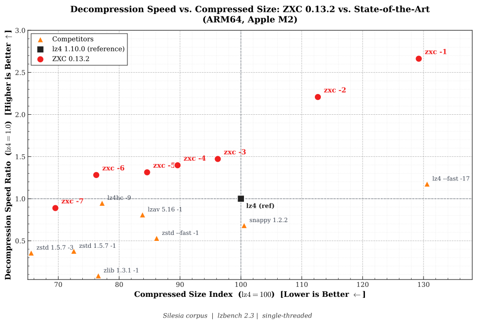
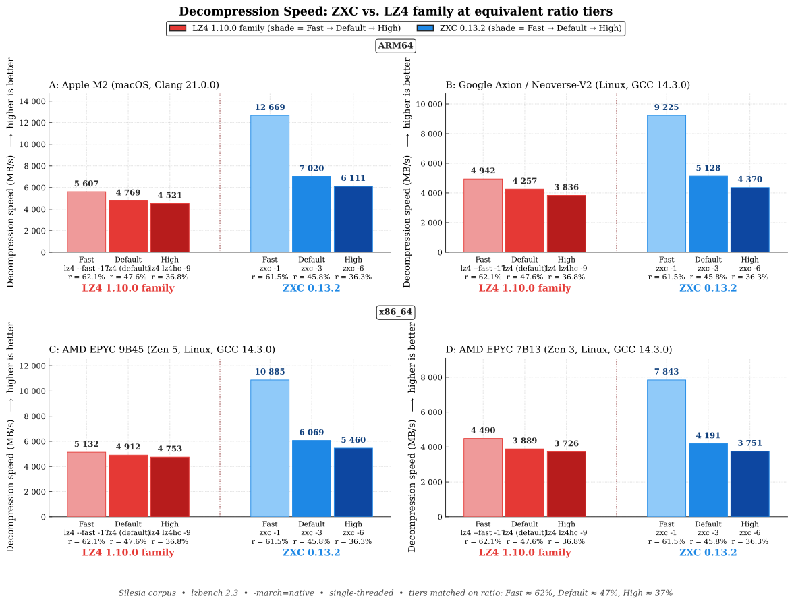

# ZXC - Asymmetric Lossless Compression Built for Ultra-Fast Decode

[](https://github.com/hellobertrand/zxc/actions/workflows/build.yml)
[](https://github.com/hellobertrand/zxc/actions/workflows/quality.yml)
[](https://github.com/hellobertrand/zxc/actions/workflows/security.yml)

<!-- [](https://snyk.io/test/github/hellobertrand/zxc) -->
[](https://oss-fuzz-build-logs.storage.googleapis.com/index.html#zxc)
[](https://sonarcloud.io/summary/overall?id=hellobertrand_zxc)
[](https://codecov.io/github/hellobertrand/zxc)
[](https://scorecard.dev/viewer/?uri=github.com/hellobertrand/zxc)
[](LICENSE)

ZXC is a lossless compression **C library** (with official Rust, Python, Node.js, and Go bindings). It trades compression speed for maximum decode throughput — the appropriate trade-off whenever data is **compressed once and read many times**: content delivery, embedded systems, FOTA (Firmware Over-The-Air) updates, game assets, and app bundles. It runs on all major architectures (`x86_64`, `ARM64`, `ARMv7`, `ARMv6`, `RISC-V`, `POWER`, `s390x`, `i386`) with hand-tuned SIMD paths, and shows particularly strong gains on modern ARM cores (Apple Silicon, AWS Graviton, Google Axion) thanks to a bitstream layout tuned for their deep pipelines.

## TL;DR

- **Faster decode than LZ4, at a smaller size.** 9–48% faster decode at the default level (best on ARM64), rising to up to 2.3× in the speed-optimized tier, always at an equal-or-better compression ratio. See the [benchmarks](#benchmarks).
- **Independently verified.** Merged into [lzbench](https://github.com/inikep/lzbench) (@inikep) and [TurboBench](https://github.com/powturbo/TurboBench) (@powturbo); every benchmark below is reproducible against 70+ codecs.
- **Cross-platform.** x86_64, ARM64, ARMv7, ARMv6, RISC-V, POWER (ppc64el), s390x, i386, with hand-tuned SIMD (SSE2/AVX2/AVX-512 on x86, NEON on ARMv8+).
- **Built for "Write Once, Read Many."** Compress once at build time, decompress millions of times at run time.
- **Production-grade.** Continuously fuzzed by Google [OSS-Fuzz](https://github.com/google/oss-fuzz), ASan/UBSan/Valgrind-clean, SLSA-signed releases, thread-safe API, BSD-3-Clause.
- **Seekable.** Built-in seek table for O(1) random-access decompression.
- **Broadly packaged.** Conan, vcpkg, Homebrew, Winget and Rust/Python/Node packages.

## Quick start

```bash
# Install (pick your package manager)
brew install zxc
conan install --requires="zxc/[*]"     # or: vcpkg install zxc

# Compress once, decompress fast
zxc -5 assets.tar assets.tar.zxc
zxc -d assets.tar.zxc assets.tar
```

> **Independently verified:** ZXC is merged into both major open-source compression benchmark suites — [lzbench](https://github.com/inikep/lzbench) (master, by @inikep) and [TurboBench](https://github.com/powturbo/TurboBench) (master, by @powturbo). Every number in this README is reproducible with either tool, alongside 70+ other codecs.

## Design Philosophy: Asymmetric Efficiency

Traditional codecs force a trade-off between **symmetric speed** (LZ4) and **archival density** (Zstd). **ZXC takes a third path: asymmetric efficiency.**

The encoder does the heavy lifting upfront — match selection, optimal parsing, statistics tuning — to emit a bitstream structured for the instruction pipelining and branch prediction of modern CPUs (particularly ARMv8). Complexity is **offloaded from the decoder to the encoder**, which is exactly the trade-off WORM workloads want.

*   **Build time:** you compress only once (on CI/CD).
*   **Run time:** you decompress millions of times (on every user's device). **ZXC respects this asymmetry.**

[👉 **Read the Technical Whitepaper**](docs/WHITEPAPER.md)


## Benchmarks

To ensure consistent performance, benchmarks are automatically executed on every commit via GitHub Actions.
We monitor metrics on both **x86_64** (Linux) and **ARM64** (Apple Silicon M2) runners to track compression speed, decompression speed, and ratios.

*(See the [latest benchmark logs](https://github.com/hellobertrand/zxc/actions/workflows/benchmark.yml))*

*Decompression Speed vs Compressed Size — ARM64 Apple M2*




### 1. Mobile & Client: Apple Silicon (M2)
*Scenario: Game Assets loading, App startup.*

| Target | ZXC vs Competitor | Decompression Speed | Ratio | Verdict |
| :--- | :--- | :--- | :--- | :--- |
| **1. Max Speed** | **ZXC -1** vs *LZ4 --fast* | **12,699 MB/s** vs 5,607 MB/s **2.26x Faster** | **61.5** vs 62.2 **Smaller** (-0.7%) | **ZXC** leads in raw throughput. |
| **2. Standard** | **ZXC -3** vs *LZ4 Default* | **7,020 MB/s** vs 4,769 MB/s **1.47x Faster** | **45.8** vs 47.6 **Smaller** (-1.8%) | **ZXC** outperforms LZ4 in read speed and ratio. |
| **3. Density** | **ZXC -6** vs *LZ4HC -9* | **6,111 MB/s** vs 4,521 MB/s **1.35x Faster** | **36.3** vs 36.8 **Smaller** (-0.5%) | **ZXC** beats LZ4HC on both decode speed and ratio. |
| **4. Ultra** | **ZXC -7** vs *zstd -1* | **4,240 MB/s** vs 1,803 MB/s **2.35x Faster** | **33.1** vs 34.5 **Smaller** (-1.4%) | **ZXC -7** bridges the gap between LZ4HC and `zstd -1` — smaller output, ~2.4x faster decode. |

### 2. Cloud Server: Google Axion (ARM Neoverse V2)
*Scenario: High-throughput Microservices, ARM Cloud Instances.*

| Target | ZXC vs Competitor | Decompression Speed | Ratio | Verdict |
| :--- | :--- | :--- | :--- | :--- |
| **1. Max Speed** | **ZXC -1** vs *LZ4 --fast* | **9,225 MB/s** vs 4,942 MB/s **1.87x Faster** | **61.5** vs 62.2 **Smaller** (-0.7%) | **ZXC** leads in raw throughput. |
| **2. Standard** | **ZXC -3** vs *LZ4 Default* | **5,128 MB/s** vs 4,257 MB/s **1.20x Faster** | **45.8** vs 47.6 **Smaller** (-1.8%) | **ZXC** outperforms LZ4 in read speed and ratio. |
| **3. Density** | **ZXC -6** vs *LZ4HC -9* | **4,370 MB/s** vs 3,836 MB/s **1.14x Faster** | **36.3** vs 36.8 **Smaller** (-0.5%) | **ZXC** beats LZ4HC on both decode speed and ratio. |
| **4. Ultra** | **ZXC -7** vs *zstd -1* | **3,000 MB/s** vs 1,645 MB/s **1.82x Faster** | **33.1** vs 34.5 **Smaller** (-1.4%) | **ZXC -7** bridges the gap between LZ4HC and `zstd -1` — smaller output, ~1.8x faster decode. |

### 3. Build Server: x86_64 (AMD EPYC 9B45 / Zen 5)
*Scenario: CI/CD Pipelines compatibility.*

| Target | ZXC vs Competitor | Decompression Speed | Ratio | Verdict |
| :--- | :--- | :--- | :--- | :--- |
| **1. Max Speed** | **ZXC -1** vs *LZ4 --fast* | **10,885 MB/s** vs 5,132 MB/s **2.12x Faster** | **61.5** vs 62.2 **Smaller** (-0.7%) | **ZXC** achieves higher throughput. |
| **2. Standard** | **ZXC -3** vs *LZ4 Default* | **6,069 MB/s** vs 4,912 MB/s **1.24x Faster** | **45.8** vs 47.6 **Smaller** (-1.8%) | **ZXC** offers improved speed and ratio. |
| **3. Density** | **ZXC -6** vs *LZ4HC -9* | **5,460 MB/s** vs 4,753 MB/s **1.15x Faster** | **36.3** vs 36.8 **Smaller** (-0.5%) | **ZXC** now beats LZ4HC on both decode speed and ratio. |
| **4. Ultra** | **ZXC -7** vs *zstd -1* | **4,080 MB/s** vs 1,862 MB/s **2.19x Faster** | **33.1** vs 34.5 **Smaller** (-1.4%) | **ZXC -7** bridges the gap between LZ4HC and `zstd -1` — smaller output, ~2.2x faster decode. |

### 4. Production Server: x86_64 (AMD EPYC 7B13 / Zen 3)
*Scenario: Mainstream cloud workloads (AWS c6a, Azure HBv3, GCP n2d).*

| Target | ZXC vs Competitor | Decompression Speed | Ratio | Verdict |
| :--- | :--- | :--- | :--- | :--- |
| **1. Max Speed** | **ZXC -1** vs *LZ4 --fast* | **7,843 MB/s** vs 4,490 MB/s **1.75x Faster** | **61.5** vs 62.2 **Smaller** (-0.7%) | **ZXC** holds a strong lead on the legacy x86 pipeline. |
| **2. Standard** | **ZXC -3** vs *LZ4 Default* | **4,191 MB/s** vs 3,889 MB/s **1.08x Faster** | **45.8** vs 47.6 **Smaller** (-1.8%) | **ZXC** delivers faster decode and smaller output. |
| **3. Density** | **ZXC -6** vs *LZ4HC -9* | **3,751 MB/s** vs 3,726 MB/s (decode within 1%) | **36.3** vs 36.8 **Smaller** (-0.5%) | **ZXC** now edges ahead of `LZ4HC -9` on decode and wins on ratio. |
| **4. Ultra** | **ZXC -7** vs *zstd -1* | **2,675 MB/s** vs 1,337 MB/s **2.00x Faster** | **33.1** vs 34.5 **Smaller** (-1.4%) | **ZXC -7** bridges the gap between LZ4HC and `zstd -1` — smaller output, ~2x faster decode. |

*Decompression Speed: ZXC vs LZ4 family at equivalent ratio tiers, across 4 CPUs (Fast ≈ 62%, Default ≈ 47%, High ≈ 37%)*




*Effective Throughput : Ratio-Normalized Decode across ARM64 and x86 (decode x 100 / ratio%, LZ4 baseline = 1.00x)*


> **What is Effective Throughput?**
>
> Raw decode speed misses half the picture: in real workloads (asset streaming, container pulls, microservice payloads), the decoder is fed by a compressed-byte source - disk, network, inter-core - whose bandwidth is the bottleneck. The right question is *how much original data is delivered per MB of compressed input*.
>
> Formula: `Effective (MB/s) = Decode × 100 / Ratio (%)`: combines decode speed and ratio in one number. **Every ZXC level from -1 to -6 sits above LZ4** on every architecture, peaking at **2.0x on Apple Silicon** and ranging **1.12x–1.74x** on x86 and ARM cloud platforms. The density-optimized ULTRA level -7 trades decode throughput for ratio.

### Benchmark ARM64 (Apple Silicon M2)

Benchmarks were conducted using lzbench 2.3 (from @inikep), compiled with Clang 21.0.0 using *MOREFLAGS="-march=native"* on macOS Tahoe 26 (`macos-26-xlarge`). The reference hardware is an Apple M2 processor (ARM64). All performance metrics reflect single-threaded execution on the standard Silesia Corpus and the benchmark made use of [silesia.tar](https://github.com/DataCompression/corpus-collection/tree/main/Silesia-Corpus), which contains tarred files from the Silesia compression corpus.

| Compressor name         | Compression| Decompress.| Compr. size | Ratio | Filename |
| ---------------         | -----------| -----------| ----------- | ----- | -------- |
| memcpy                  | 52803 MB/s | 52776 MB/s |   211947520 |100.00 | 1 files|
| **zxc 0.13.2 -1**           |   880 MB/s | **12699 MB/s** |   130356147 | **61.50** | 1 files|
| **zxc 0.13.2 -2**           |   591 MB/s | **10529 MB/s** |   113633866 | **53.61** | 1 files|
| **zxc 0.13.2 -3**           |   252 MB/s |  **7020 MB/s** |    97051444 | **45.79** | 1 files|
| **zxc 0.13.2 -4**           |   174 MB/s |  **6663 MB/s** |    90392857 | **42.65** | 1 files|
| **zxc 0.13.2 -5**           |   103 MB/s |  **6264 MB/s** |    85341256 | **40.27** | 1 files|
| **zxc 0.13.2 -6**           |  12.8 MB/s |  **6111 MB/s** |    76914247 | **36.29** | 1 files|
| **zxc 0.13.2 -7**           |  8.72 MB/s |  **4240 MB/s** |    70141304 | **33.09** | 1 files|
| lz4 1.10.0              |   812 MB/s |  4769 MB/s |   100880800 | 47.60 | 1 files|
| lz4 1.10.0 --fast -17   |  1351 MB/s |  5607 MB/s |   131732802 | 62.15 | 1 files|
| lz4hc 1.10.0 -9         |  48.3 MB/s |  4521 MB/s |    77884448 | 36.75 | 1 files|
| lzav 5.16 -1            |   685 MB/s |  3863 MB/s |    84577911 | 39.91 | 1 files|
| snappy 1.2.2            |   879 MB/s |  3258 MB/s |   101415443 | 47.85 | 1 files|
| zstd 1.5.7 --fast --1   |   724 MB/s |  2532 MB/s |    86916294 | 41.01 | 1 files|
| zstd 1.5.7 -1           |   645 MB/s |  1803 MB/s |    73193704 | 34.53 | 1 files|
| zstd 1.5.7 -3           |   393 MB/s |  1702 MB/s |    66133500 | 31.20 | 1 files|
| zlib 1.3.2 -1           |   150 MB/s |   411 MB/s |    77259029 | 36.45 | 1 files|


### Benchmark ARM64 (Google Axion Neoverse-V2)

Benchmarks were conducted using lzbench 2.3 (from @inikep), compiled with GCC 14.3.0 using *MOREFLAGS="-march=native"* on 64-bit Linux. The reference hardware is a Google Axion (Neoverse-V2) processor on a **Google Cloud C4A** instance (ARM64, 1 thread per core). All performance metrics reflect single-threaded execution on the standard Silesia Corpus and the benchmark made use of [silesia.tar](https://github.com/DataCompression/corpus-collection/tree/main/Silesia-Corpus), which contains tarred files from the Silesia compression corpus.

| Compressor name         | Compression| Decompress.| Compr. size | Ratio | Filename |
| ---------------         | -----------| -----------| ----------- | ----- | -------- |
| memcpy                  | 24014 MB/s | 23977 MB/s |   211947520 |100.00 | 1 files|
| **zxc 0.13.2 -1**           |   868 MB/s |  **9225 MB/s** |   130356147 | **61.50** | 1 files|
| **zxc 0.13.2 -2**           |   588 MB/s |  **7671 MB/s** |   113633866 | **53.61** | 1 files|
| **zxc 0.13.2 -3**           |   241 MB/s |  **5128 MB/s** |    97051444 | **45.79** | 1 files|
| **zxc 0.13.2 -4**           |   167 MB/s |  **4868 MB/s** |    90392857 | **42.65** | 1 files|
| **zxc 0.13.2 -5**           |  98.8 MB/s |  **4545 MB/s** |    85341256 | **40.27** | 1 files|
| **zxc 0.13.2 -6**           |  11.5 MB/s |  **4370 MB/s** |    76914247 | **36.29** | 1 files|
| **zxc 0.13.2 -7**           |  7.72 MB/s |  **3000 MB/s** |    70141304 | **33.09** | 1 files|
| lz4 1.10.0              |   731 MB/s |  4257 MB/s |   100880800 | 47.60 | 1 files|
| lz4 1.10.0 --fast -17   |  1281 MB/s |  4942 MB/s |   131732802 | 62.15 | 1 files|
| lz4hc 1.10.0 -9         |  43.2 MB/s |  3836 MB/s |    77884448 | 36.75 | 1 files|
| lzav 5.16 -1            |   656 MB/s |  2913 MB/s |    84577911 | 39.91 | 1 files|
| snappy 1.2.2            |   755 MB/s |  2293 MB/s |   101415443 | 47.85 | 1 files|
| zstd 1.5.7 --fast --1   |   604 MB/s |  2289 MB/s |    86916294 | 41.01 | 1 files|
| zstd 1.5.7 -1           |   523 MB/s |  1645 MB/s |    73193704 | 34.53 | 1 files|
| zstd 1.5.7 -3           |   325 MB/s |  1519 MB/s |    66133500 | 31.20 | 1 files|
| zlib 1.3.2 -1           |   115 MB/s |   388 MB/s |    77259029 | 36.45 | 1 files|


### Benchmark x86_64 (AMD EPYC 9B45)

Benchmarks were conducted using lzbench 2.3 (from @inikep), compiled with GCC 14.3.0 using *MOREFLAGS="-march=native"* on 64-bit Linux. The reference hardware is an AMD EPYC 9B45 processor on a **Google Cloud C4D** instance (x86_64, SMT disabled — 1 thread per core). All performance metrics reflect single-threaded execution on the standard Silesia Corpus and the benchmark made use of [silesia.tar](https://github.com/DataCompression/corpus-collection/tree/main/Silesia-Corpus), which contains tarred files from the Silesia compression corpus.

| Compressor name         | Compression| Decompress.| Compr. size | Ratio | Filename |
| ---------------         | -----------| -----------| ----------- | ----- | -------- |
| memcpy                  | 26293 MB/s | 26381 MB/s |   211947520 |100.00 | 1 files|
| **zxc 0.13.2 -1**           |   872 MB/s | **10885 MB/s** |   130356147 | **61.50** | 1 files|
| **zxc 0.13.2 -2**           |   592 MB/s |  **9649 MB/s** |   113633866 | **53.61** | 1 files|
| **zxc 0.13.2 -3**           |   239 MB/s |  **6069 MB/s** |    97051444 | **45.79** | 1 files|
| **zxc 0.13.2 -4**           |   166 MB/s |  **5766 MB/s** |    90392857 | **42.65** | 1 files|
| **zxc 0.13.2 -5**           |  99.2 MB/s |  **5437 MB/s** |    85341256 | **40.27** | 1 files|
| **zxc 0.13.2 -6**           |  12.6 MB/s |  **5460 MB/s** |    76914247 | **36.29** | 1 files|
| **zxc 0.13.2 -7**           |  8.65 MB/s |  **4080 MB/s** |    70141304 | **33.09** | 1 files|
| lz4 1.10.0              |   774 MB/s |  4912 MB/s |   100880800 | 47.60 | 1 files|
| lz4 1.10.0 --fast -17   |  1287 MB/s |  5132 MB/s |   131732802 | 62.15 | 1 files|
| lz4hc 1.10.0 -9         |  45.6 MB/s |  4753 MB/s |    77884448 | 36.75 | 1 files|
| lzav 5.16 -1            |   680 MB/s |  3470 MB/s |    84577911 | 39.91 | 1 files|
| snappy 1.2.2            |   758 MB/s |  2086 MB/s |   101512076 | 47.89 | 1 files|
| zstd 1.5.7 --fast --1   |   658 MB/s |  2392 MB/s |    86916294 | 41.01 | 1 files|
| zstd 1.5.7 -1           |   602 MB/s |  1862 MB/s |    73193704 | 34.53 | 1 files|
| zstd 1.5.7 -3           |   361 MB/s |  1700 MB/s |    66133500 | 31.20 | 1 files|
| zlib 1.3.2 -1           |   134 MB/s |   396 MB/s |    77259029 | 36.45 | 1 files|


### Benchmark x86_64 (AMD EPYC 7B13)

Benchmarks were conducted using lzbench 2.3 (from @inikep), compiled with GCC 14.3.0 using *MOREFLAGS="-march=native"* on 64-bit Linux. The reference hardware is an AMD EPYC 7B13 64-Core processor on a **Google Cloud C2D** instance (x86_64, SMT disabled — 1 thread per core). All performance metrics reflect single-threaded execution on the standard Silesia Corpus and the benchmark made use of [silesia.tar](https://github.com/DataCompression/corpus-collection/tree/main/Silesia-Corpus), which contains tarred files from the Silesia compression corpus.

| Compressor name         | Compression| Decompress.| Compr. size | Ratio | Filename |
| ---------------         | -----------| -----------| ----------- | ----- | -------- |
| memcpy                  | 23809 MB/s | 24169 MB/s |   211947520 |100.00 | 1 files|
| **zxc 0.13.2 -1**           |   720 MB/s |  **7843 MB/s** |   130356147 | **61.50** | 1 files|
| **zxc 0.13.2 -2**           |   482 MB/s |  **6540 MB/s** |   113633866 | **53.61** | 1 files|
| **zxc 0.13.2 -3**           |   204 MB/s |  **4191 MB/s** |    97051444 | **45.79** | 1 files|
| **zxc 0.13.2 -4**           |   142 MB/s |  **4030 MB/s** |    90392857 | **42.65** | 1 files|
| **zxc 0.13.2 -5**           |  85.1 MB/s |  **3897 MB/s** |    85341256 | **40.27** | 1 files|
| **zxc 0.13.2 -6**           |  10.5 MB/s |  **3751 MB/s** |    76914247 | **36.29** | 1 files|
| **zxc 0.13.2 -7**           |  7.06 MB/s |  **2675 MB/s** |    70141304 | **33.09** | 1 files|
| lz4 1.10.0              |   641 MB/s |  3889 MB/s |   100880800 | 47.60 | 1 files|
| lz4 1.10.0 --fast -17   |  1112 MB/s |  4490 MB/s |   131732802 | 62.15 | 1 files|
| lz4hc 1.10.0 -9         |  37.1 MB/s |  3726 MB/s |    77884448 | 36.75 | 1 files|
| lzav 5.16 -1            |   464 MB/s |  2960 MB/s |    84577911 | 39.91 | 1 files|
| snappy 1.2.2            |   665 MB/s |  1738 MB/s |   101512076 | 47.89 | 1 files|
| zstd 1.5.7 --fast --1   |   486 MB/s |  1774 MB/s |    86916294 | 41.01 | 1 files|
| zstd 1.5.7 -1           |   445 MB/s |  1337 MB/s |    73193704 | 34.53 | 1 files|
| zstd 1.5.7 -3           |   233 MB/s |  1204 MB/s |    66133500 | 31.20 | 1 files|
| zlib 1.3.2 -1           |   107 MB/s |   359 MB/s |    77259029 | 36.45 | 1 files|

---

## Installation

ZXC is packaged across major ecosystems and kept current by their maintainers:

[](https://repology.org/project/zxc/versions)
[](https://repology.org/project/zxc/versions)
[](https://repology.org/project/zxc/versions)
[](https://repology.org/project/zxc/versions)
[](https://repology.org/project/zxc/versions)

[](https://crates.io/crates/zxc-compress)
[](https://pypi.org/project/zxc-compress)
[](https://www.npmjs.com/package/zxc-compress)

### Option 1: Download Release (GitHub)

1.  Go to the [Releases page](https://github.com/hellobertrand/zxc/releases).
2.  Download the archive matching your architecture (replace `<version>` with the release, e.g. `0.13.2`):

    **macOS:**
    *   `zxc-<version>-macos-arm64.tar.gz` (NEON optimizations included).

    **Linux:**
    *   `zxc-<version>-linux-arm64.tar.gz` (NEON optimizations included).
    *   `zxc-<version>-linux-x86_64.tar.gz` (Runtime dispatch for AVX2/AVX512).

    **Windows:**
    *   `zxc-<version>-windows-x86_64.zip` (Runtime dispatch for AVX2/AVX512).
    *   `zxc-<version>-windows-arm64.zip` (NEON optimizations included).

3.  Verify, then extract. Every archive is signed via SLSA build provenance; the SHA-256 of each asset is also shown directly on the GitHub release page:
    ```bash
    # Authenticity + integrity in one shot (SLSA — recommended)
    gh attestation verify zxc-<version>-linux-x86_64.tar.gz --repo hellobertrand/zxc

    # Extract
    tar -xzf zxc-<version>-linux-x86_64.tar.gz
    sudo cp -r zxc-<version>-linux-x86_64/* /usr/local/
    ```

    Each archive contains a versioned top-level directory with:
    ```
    bin/zxc                          # CLI binary
    include/                         # C headers (zxc.h, zxc_buffer.h, ...)
    lib/libzxc.a                     # Static library
    lib/pkgconfig/libzxc.pc          # pkg-config support
    lib/cmake/zxc/zxcConfig.cmake    # CMake find_package(zxc) support
    ```

4.  Use in your project:

    **CMake:**
    ```cmake
    find_package(zxc REQUIRED)
    target_link_libraries(myapp PRIVATE zxc::zxc_lib)
    ```

    **pkg-config:**
    ```bash
    cc myapp.c $(pkg-config --cflags --libs libzxc) -o myapp
    ```

### Option 2: vcpkg

**Classic mode:**
```bash
vcpkg install zxc
```

**Manifest mode** (add to `vcpkg.json`):
```json
{
  "dependencies": ["zxc"]
}
```

Then in your CMake project:
```cmake
find_package(zxc CONFIG REQUIRED)
target_link_libraries(myapp PRIVATE zxc::zxc_lib)
```

### Option 3: Conan

You also can download and install zxc using the [Conan](https://conan.io/) package manager:

```bash
    conan install -r conancenter --requires="zxc/[*]" --build=missing
```

Or add to your `conanfile.txt`:
```ini
[requires]
zxc/[*]
```

The zxc package in Conan Center is kept up to date by
[ConanCenterIndex](https://github.com/conan-io/conan-center-index) contributors.
If the version is out of date, please create an issue or pull request on the Conan Center Index repository.

### Option 4: Homebrew

```bash
brew install zxc
```

The formula is maintained in [homebrew-core](https://formulae.brew.sh/formula/zxc).

### Option 5: Meson Subproject

zxc ships a native `meson.build`, so any Meson project can pull it in as a
subproject or via [WrapDB](https://mesonbuild.com/Wrapdb-projects.html).

**1. Create `subprojects/zxc.wrap`:**
```ini
[wrap-git]
url = https://github.com/hellobertrand/zxc.git
revision = head
depth = 1

[provide]
libzxc = libzxc_dep
```

**2. Use the dependency in your `meson.build`:**
```meson
zxc_dep = dependency('libzxc', fallback : ['zxc', 'libzxc_dep'])
executable('myapp', 'main.c', dependencies : zxc_dep)
```

**3. Build:**
```bash
meson setup build
meson compile -C build
```

When consumed as a subproject, only the library is built (CLI and tests are
skipped automatically).

### Option 6: CMake Subproject (vendored)

zxc can be vendored directly into a CMake build, either as a git submodule with
`add_subdirectory()` or through `FetchContent`:

```cmake
include(FetchContent)
FetchContent_Declare(zxc
    GIT_REPOSITORY https://github.com/hellobertrand/zxc.git
    GIT_TAG        v0.13.1
)
FetchContent_MakeAvailable(zxc)

target_link_libraries(myapp PRIVATE zxc::zxc_lib)
```

`zxc::zxc_lib` is the same target name the installed package exports, so
switching between a vendored copy and `find_package(zxc)` needs no other
change.

When zxc is not the top-level project it builds the library only: the CLI, the
tests, `-march=native`, LTO and the install rules all default to off, so the
embedding project keeps full control of its own CTest registration and install
set. Any of them can still be turned back on explicitly (`-DZXC_BUILD_CLI=ON`,
`-DZXC_NATIVE_ARCH=ON`, `-DZXC_INSTALL=ON`, ...). `-march=native` is also
ignored whenever CMake is cross-compiling, since it would encode the build
host's ISA.

Compiler flags follow the same rule. Vendored, zxc adds nothing to what it
inherits from the parent: the optimisation level comes from the build type, and
the warning level (`-Wall -Wextra`, `/W3`) and code generation policy
(`-fomit-frame-pointer`, `-fstrict-aliasing`, `-ffunction-sections`,
`-fdata-sections` and the matching dead-strip link options) are the embedding
project's to set. An embedder that builds with frame pointers for its profiler,
its own aliasing rules or a quiet build log keeps them. A configure-time warning
fires if neither a build type nor an optimisation flag is set, since zxc would
then be built unoptimised.

Third-party code is vendored, never probed: `rapidhash.h` comes from the copy in
the tree unless `-DZXC_USE_SYSTEM_RAPIDHASH=ON` asks for a system one, so a
build cannot silently pick up a header from the host.

### Option 7: Winget

**Requirements:** Windows 10 1709 (or later)

Use winget to install the zxc CLI: 

```ps1
winget install hellobertrand.zxc
```

### Option 8: Building from Source (CMake)

**Requirements:** CMake (3.14+), C17 Compiler (Clang/GCC/MSVC).

```bash
git clone https://github.com/hellobertrand/zxc.git
cd zxc
cmake -B build -DCMAKE_BUILD_TYPE=Release
cmake --build build --parallel

# Run tests
ctest --test-dir build -C Release --output-on-failure

# CLI usage
./build/zxc --help

# Install library, headers, and CMake/pkg-config files
sudo cmake --install build
```

#### CMake Options

| Option | Default (standalone) | Default (vendored) | Description |
|--------|----------------------|--------------------|-------------|
| `BUILD_SHARED_LIBS` | OFF | OFF | Build shared libraries instead of static (`libzxc.so`, `libzxc.dylib`, `zxc.dll`) |
| `ZXC_NATIVE_ARCH` | ON | OFF | Enable `-march=native` for maximum performance |
| `ZXC_ENABLE_LTO` | ON | OFF | Enable Link-Time Optimization (LTO) |
| `ZXC_PGO_MODE` | OFF | OFF | Profile-Guided Optimization mode (`OFF`, `GENERATE`, `USE`) |
| `ZXC_BUILD_CLI` | ON | OFF | Build command-line interface |
| `ZXC_BUILD_TESTS` | ON | OFF | Build unit tests |
| `ZXC_INSTALL` | ON | OFF | Generate install rules (headers, pkg-config, CMake package) |
| `ZXC_ENABLE_COVERAGE` | OFF | OFF | Enable code coverage generation (disables LTO/PGO) |
| `ZXC_DISABLE_SIMD` | OFF | OFF | Disable hand-written SIMD paths (AVX2/AVX512/NEON) |
| `ZXC_USE_SYSTEM_RAPIDHASH` | OFF | OFF | Use a system-installed `rapidhash.h` instead of the vendored copy |

"Vendored" is a build where zxc is not the top-level project (`add_subdirectory()`,
`FetchContent`): the embedding project then keeps control of its own compiler flags,
test registration and install set.

```bash
# Build shared library
cmake -B build -DBUILD_SHARED_LIBS=ON

# Portable build (without -march=native)
cmake -B build -DZXC_NATIVE_ARCH=OFF

# Library only (no CLI, no tests)
cmake -B build -DZXC_BUILD_CLI=OFF -DZXC_BUILD_TESTS=OFF

# Code coverage build
cmake -B build -DZXC_ENABLE_COVERAGE=ON

# Disable explicit SIMD code paths (compiler auto-vectorisation is unaffected)
cmake -B build -DZXC_DISABLE_SIMD=ON
```

#### Profile-Guided Optimization (PGO)

PGO uses runtime profiling data to optimize branch layout, inlining decisions, and code placement.

**Step 1 - Build with instrumentation:**
```bash
cmake -B build -DCMAKE_BUILD_TYPE=Release -DZXC_PGO_MODE=GENERATE
cmake --build build --parallel
```

**Step 2 - Run a representative workload to collect profile data:**
```bash
# Run the test suite (exercises all block types and compression levels)
./build/zxc_test

# Or compress/decompress representative data
./build/zxc -b your_data_file
```

**Step 3 - (Clang only) Merge raw profiles:**
```bash
# Clang generates .profraw files that must be merged before use
llvm-profdata merge -output=build/pgo/default.profdata build/pgo/*.profraw
```
> GCC uses a directory-based format and does not require this step.

**Step 4 - Rebuild with profile data:**
```bash
cmake -B build -DCMAKE_BUILD_TYPE=Release -DZXC_PGO_MODE=USE
cmake --build build --parallel
```

### Packaging Status

[](https://repology.org/project/zxc/versions)

---

## Compression Levels

*   **Level 1, 2 (Fast):** Optimized for real-time assets (Gaming, UI).
*   **Level 3, 4 (Balanced):** A strong middle-ground offering efficient compression speed and a ratio superior to LZ4.
*   **Level 5 (Compact):** A good choice for Embedded and Firmware. Better compression than LZ4 and significantly faster decoding than Zstd.
*   **Level 6 (Density):** Beats LZ4HC on both axes — better ratio *and* matching-or-faster decode — while staying in the multi-GB/s decode class. Best for Archival and write-once / read-many workloads where compression time is amortized over many reads.
*   **Level 7 (Ultra):** Maximum density. Deep parse plus Huffman-coded literals *and* tokens (11-bit codes) push the ratio past `zstd -1` while decoding several times faster than it. Choose it when storage or bandwidth dominates but decode must remain fast; compression is the slowest tier.

## Block Size Tuning

The default block size is **512 KB**, tuned for bulk/archival workloads where ratio and decompression throughput matter most. For **memory-constrained or streaming use cases**, **256 KB blocks** halve the per-context memory footprint at a small cost in ratio and decompression speed.

**Why larger blocks help:** Each block starts with a cold hash table, so the LZ match-finder has no history and produces more literals until the table warms up. Doubling the block size halves the number of cold-start penalties, improving both ratio and decompression speed.

| Block Size | cctx memory | dctx memory | Ratio (level -3) | Decompression gain vs 256 KB |
|:----------:|:-----------:|:-----------:|:----------------:|:----------------------------:|
| 256 KB | ~1.03 MB | ~256 KB | 46.36% | — |
| 512 KB *(default)* | ~1.78 MB | ~512 KB | 45.81% *(−0.55 pp)* | +1% to +8% depending on CPU |

```bash
# CLI — fall back to 256 KB blocks (e.g. embedded / streaming)
zxc -B 256K -5 input_file output_file

# API
zxc_compress_opts_t opts = {
    .level      = ZXC_LEVEL_COMPACT,
    .block_size = 256 * 1024,
};
```

**Guideline:** Stick with 512 KB (default) for bulk compression pipelines, CI/CD asset packaging, and high-throughput servers. Use 256 KB (`-B 256K`) for streaming, embedded, or memory-constrained environments.

---

## In-Place Decompression

When the whole archive already lives in RAM (a firmware image, a game asset, a FOTA payload), ZXC can decompress **inside a single buffer** — no separate output allocation. You place the compressed archive flush-right in a buffer, and ZXC decodes left-to-right into the same memory. Because a ZXC block never expands, the write cursor provably never overtakes the read cursor given a one-block safety margin, so peak memory drops from *compressed + decompressed* to roughly *decompressed* alone.

```c
// One allocation instead of two.
size_t need = zxc_decompress_inplace_bound(archive, archive_size);   // reads header+footer
uint8_t* buf = malloc(need);
memcpy(buf + (need - archive_size), archive, archive_size);          // archive flush-right
int64_t n = zxc_decompress_inplace(buf, need, archive_size, NULL);   // decode into buf[0..]
// buf[0 .. n) now holds the decompressed data
```

The required margin is one block, the accumulated per-block framing overhead, the trailing framing the encoder writes after the last block (EOF block, seek table, footer), and the wild-copy tail (`block_size + nblocks x (12-16 B) + ~2 KB`) — about **1 %** overhead on a large archive; always size the buffer via `zxc_decompress_inplace_bound` rather than the formula. An undersized buffer is rejected with `ZXC_ERROR_DST_TOO_SMALL`, never silent corruption. This is a library/API capability: it targets embedded/firmware integrators.

---

## Dictionary Compression

For workloads compressed in **small blocks** (4 KB–128 KB), a pre-trained dictionary dramatically improves compression ratio. Because the dictionary prefills the LZ77 sliding window at the *start of each block*, the benefit is per-block: a block only has its own preceding bytes as history, so the smaller the block, the more it leans on the dictionary for representative patterns. This applies whether the input is a single small payload or a large payload split into many small blocks — any time the block size is small enough that early bytes would otherwise lack history to match against.

**Typical use cases:** JSON API responses, small game assets, structured logs, key-value store records, RPC messages, and any large but homogeneous corpus compressed in small blocks for random access (e.g. seekable archives).

### Training a dictionary

```bash
# Train a dictionary from a corpus of similar files.
# Without -o the dictionary is written as ./dictionary_<dict_id>.zxd.
zxc --train samples/*.json

# Choose the output file explicitly with -o:
zxc --train -o corpus.zxd samples/*.json

# Or point -o at a directory: the dictionary is saved as dictionary_<dict_id>.zxd
# inside it (the dict_id embeds in the name), e.g. dicts/dictionary_bc46eec1.zxd
zxc --train -o dicts/ samples/*.json
```

```c
// C API
const void* samples[] = { buf1, buf2, buf3 };
size_t sizes[] = { len1, len2, len3 };
uint8_t dict[32768];
int64_t dict_sz = zxc_train_dict(samples, sizes, 3, dict, sizeof(dict));
```

### Compressing with a dictionary

```bash
# CLI — the same dictionary is required to decompress (pass it with -D)
zxc -z -D corpus.zxd input.json
zxc -d -D corpus.zxd input.json.zxc
```

```c
// C API — compression
zxc_compress_opts_t copts = {
    .level = ZXC_LEVEL_DEFAULT,
    .dict = dict_content,
    .dict_size = dict_sz,
};
int64_t compressed_size = zxc_compress(src, src_size, dst, dst_cap, &copts);

// C API — decompression (same dictionary required)
zxc_decompress_opts_t dopts = {
    .dict = dict_content,
    .dict_size = dict_sz,
};
int64_t original_size = zxc_decompress(compressed, comp_size, out, out_cap, &dopts);
```

The dictionary is stored as an external `.zxd` file and referenced by a 32-bit ID (`dict_id`) in the ZXC file header. The **same dictionary is required to decompress** and must be supplied explicitly with `-D` — there is no auto-lookup. Decompressing an archive that needs a dictionary without supplying one returns `ZXC_ERROR_DICT_REQUIRED`; supplying the wrong one returns `ZXC_ERROR_DICT_MISMATCH`. Training to a directory names the file `dictionary_<dict_id>.zxd`. See [FORMAT.md](docs/FORMAT.md) §12 for the full specification.

---

## Usage

### 1. CLI

The CLI is perfect for benchmarking or manually compressing assets.

```bash
# Basic Compression (Level 3 is default)
zxc -z input_file output_file

# High Compression (Level 5)
zxc -z -5 input_file output_file

# Seekable Archive (enables O(1) random-access decompression)
zxc -z -S input_file output_file

# -z for compression can be omitted
zxc input_file output_file

# as well as output file; it will be automatically assigned to input_file.zxc
zxc input_file

# Decompression
zxc -d compressed_file output_file

# When installed, "unzxc" is an alias for "zxc -d"
unzxc compressed_file output_file

# Benchmark Mode (Testing speed on your machine)
zxc -b input_file
```

#### Using with `tar`

ZXC works as a drop-in external compressor for `tar` (reads stdin, writes stdout, returns 0 on success):

```bash
# GNU tar (Linux)
tar -I 'zxc -5' -cf archive.tar.zxc data/
tar -I 'zxc -d' -xf archive.tar.zxc

# bsdtar (macOS)
tar --use-compress-program='zxc -5' -cf archive.tar.zxc data/
tar --use-compress-program='zxc -d' -xf archive.tar.zxc

# Pipes (universal)
tar cf - data/ | zxc > archive.tar.zxc
zxc -d < archive.tar.zxc | tar xf -
```

### 2. API

ZXC provides a **thread-safe API** with two usage patterns. Parameters are passed through dedicated options structs, making call sites self-documenting and forward-compatible.

#### Buffer API (In-Memory)
```c
#include "zxc.h"

// Compression
uint64_t bound = zxc_compress_bound(src_size);
zxc_compress_opts_t c_opts = {
    .level            = ZXC_LEVEL_DEFAULT,
    .checksum_enabled = 1,
    /* .block_size = 0 -> 512 KB default */
};
int64_t compressed_size = zxc_compress(src, src_size, dst, bound, &c_opts);

// Decompression
zxc_decompress_opts_t d_opts = { .checksum_enabled = 1 };
int64_t decompressed_size = zxc_decompress(src, src_size, dst, dst_capacity, &d_opts);
```

#### Stream API (Files, Multi-Threaded)
```c
#include "zxc.h"

// Compression (auto-detect threads, level 3, checksum on)
zxc_compress_opts_t c_opts = {
    .n_threads        = 0,               // 0 = auto
    .level            = ZXC_LEVEL_DEFAULT,
    .checksum_enabled = 1,
    /* .block_size = 0 -> 512 KB default */
};
int64_t bytes_written = zxc_stream_compress(f_in, f_out, &c_opts);

// Decompression
zxc_decompress_opts_t d_opts = { .n_threads = 0, .checksum_enabled = 1 };
int64_t bytes_out = zxc_stream_decompress(f_in, f_out, &d_opts);
```

#### Reusable Context API (Low-Latency / Embedded)

For tight loops (e.g. filesystem plug-ins) where per-call `malloc`/`free`
overhead matters, use opaque reusable contexts.
Options are **sticky** - settings from `zxc_create_cctx()` are reused when
passing `NULL`:
```c
#include "zxc.h"

zxc_compress_opts_t opts = { .level = 3, .checksum_enabled = 0 };
zxc_cctx* cctx = zxc_create_cctx(&opts);   // allocate once, settings remembered
zxc_dctx* dctx = zxc_create_dctx();        // allocate once

// reuse across many blocks - NULL reuses sticky settings:
int64_t csz = zxc_compress_cctx(cctx, src, src_sz, dst, dst_cap, NULL);
int64_t dsz = zxc_decompress_dctx(dctx, dst, csz, out, src_sz, NULL);

zxc_free_cctx(cctx);
zxc_free_dctx(dctx);
```

**Features:**
- Caller-allocated buffers with explicit bounds
- Thread-safe (stateless)
- Configurable block sizes (4 KB – 2 MB, powers of 2)
- Multi-threaded streaming (auto-detects CPU cores)
- Optional checksum validation
- Reusable contexts for high-frequency call sites
- Seekable archives: optional seek table for O(1) random-access decompression (`.seekable = 1`)

**[👉 See complete examples and advanced usage](docs/EXAMPLES.md)**

## Language Bindings

[](https://crates.io/crates/zxc-compress)
[](https://pypi.org/project/zxc-compress)
[](https://www.npmjs.com/package/zxc-compress)

Official wrappers maintained in this repository:

| Language | Package Manager | Install Command | Documentation | Author |
|----------|-----------------|-----------------|---------------|--------|
| **Rust** | [`crates.io`](https://crates.io/crates/zxc-compress) | `cargo add zxc-compress` | [README](wrappers/rust/zxc/README.md) | [@hellobertrand](https://github.com/hellobertrand) |
| **Python**| [`PyPI`](https://pypi.org/project/zxc-compress) | `pip install zxc-compress` | [README](wrappers/python/README.md) | [@nuberchardzer1](https://github.com/nuberchardzer1) |
| **Node.js**| [`npm`](https://www.npmjs.com/package/zxc-compress) | `npm install zxc-compress` | [README](wrappers/nodejs/README.md) | [@hellobertrand](https://github.com/hellobertrand) |
| **Go** | `go get` | `go get github.com/hellobertrand/zxc/wrappers/go` | [README](wrappers/go/README.md) | [@hellobertrand](https://github.com/hellobertrand) |
| **WASM** | Build from source | `emcmake cmake -B build-wasm && cmake --build build-wasm` | [README](wrappers/wasm/README.md) | [@hellobertrand](https://github.com/hellobertrand) |

Community-maintained bindings:

| Language | Package Manager | Install Command | Repository | Author |
| -------- | --------------- | --------------- | ---------- | ------ |
| **Go** | pkg.go.dev | `go get github.com/meysam81/go-zxc` | <https://github.com/meysam81/go-zxc> | [@meysam81](https://github.com/meysam81) |
| **Nim** | nimble | `nimble install zxc` | <https://github.com/openpeeps/zxc-nim> | [@georgelemon](https://github.com/georgelemon) |
| **Free Pascal** | Build from source | Clone the repository | <https://github.com/Xelitan/Free-Pascal-port-of-ZXC-compressor-decompressor> | [@Xelitan](https://github.com/Xelitan) |

## Format & Conformance

The ZXC on-disk wire format is fully specified in [`docs/FORMAT.md`](docs/FORMAT.md) (format version 7), so any third party can build an independent, interoperable decoder.

> **Upgrading?** The current format is **v7** — Huffman entropy sections in the new PivCo layout (faster SIMD-merge decode), Huffman-coded tokens and 11-bit codes at level 7. Like the v5→v6 change, this is a deliberate clean break: v7 tools reject v6 archives (see [`docs/MIGRATION.md`](docs/MIGRATION.md) to convert).

Two complementary, byte-frozen suites guard that format:

* **Decoder conformance** — [`conformance/`](conformance/README.md) ships public reference vectors: `valid/*.zxc` streams paired with their expected decompressed output, plus `invalid/*.zxc` streams that a correct decoder **must** reject. Point your own decoder at them to prove interoperability — no dependency on this implementation. Run locally via the `conformance` CTest.
* **Wire-format stability** — [`tests/format/`](tests/format/README.md) pins the exact bytes the encoder emits for every block type and integrity field. A dedicated CI job ([`golden.yml`](.github/workflows/golden.yml)) fails on any single-byte drift, so a format change can only ever be deliberate.

The distinction: conformance freezes decoder *behaviour* (`decode(x) == expected`), while the golden suite freezes the encoder's *bytes*. Together they make the format both interoperable and stable.

## Safety & Quality
* **Unit Tests**: Comprehensive test suite with CTest integration.
* **Continuous Fuzzing**: Enrolled in Google [OSS-Fuzz](https://github.com/google/oss-fuzz), which fuzzes five harnesses (roundtrip, decompress, streaming, seekable, dictionary) around the clock. The same harnesses run under ClusterFuzzLite (ASan + UBSan) on every pull request touching the library.
* **Static Analysis**: Checked with Cppcheck & Clang Static Analyzer.
* **CodeQL Analysis**: GitHub Advanced Security scanning for vulnerabilities.
* **Snyk**: Continuous security and code analysis for dependencies and source.
* **Code Coverage**: Automated tracking with Codecov integration.
* **Dynamic Analysis**: Validated with Valgrind and ASan/UBSan in CI pipelines.
* **Safe API**: Explicit buffer capacity is required for all operations.


## License & Credits

**ZXC** Copyright © 2025-2026, Bertrand Lebonnois and contributors.
Licensed under the **BSD 3-Clause License**. See LICENSE for details.

**Third-Party Components:**
- **rapidhash** by Nicolas De Carli (MIT) - Used for high-speed, platform-independent checksums.
