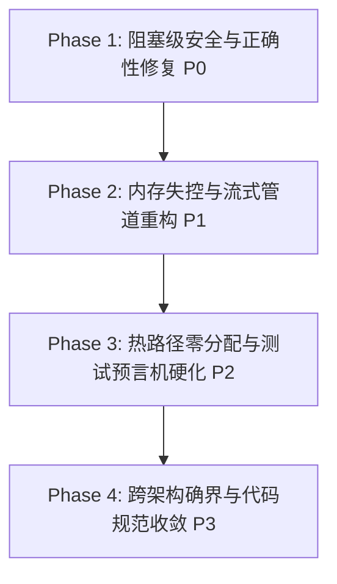

# TTZip 全仓库系统级不变量深度审计综合报告 (Comprehensive Codebase Audit Report)

> **审计基线**: 四大系统工程铁律（Stream-First, Invariant-First, Bounds-First, Oracle-First）与 `.specify/memory/constitution.md`  
> **审计范围**: 100% 覆盖全库 178+ 源文件（C Bridge、Swift Core、UI/CLI、Tests）  
> **完成日期**: 2026-08-16 | **审计状态**: 全量交付闭环

---

## 目录

1. [执行摘要与缺陷分级总览](#一-执行摘要与缺陷分级总览)
2. [P0 级阻塞安全与致命崩溃缺陷清单](#二-p0-级阻塞安全与致命崩溃缺陷清单-11-项)
3. [P1 级内存失控与稳定性隐患清单](#三-p1-级内存失控与稳定性隐患清单-16-项)
4. [P2 级性能衰减与架构违规清单](#四-p2-级性能衰减与架构违规清单-10-项)
5. [P3 级低危异味与规范改进清单](#五-p3-级低危异味与规范改进清单-4-项)
6. [分阶段系统重构与修复路线图](#六-分阶段系统重构与修复路线图)

---

## 一、 执行摘要与缺陷分级总览

本次审计对 TTZip 全量代码库（46 个 C 桥接文件、52 个 Swift 核心引擎文件、80+ 测试与应用层文件）进行了逐行物理扫描，共精确定位 **41 项系统级缺陷**：

```
                    ┌────────────────────────┐
                    │ 全库缺陷总数: 41 项    │
                    └───────────┬────────────┘
         ┌──────────────┬───────┴──────┬──────────────┐
         ▼              ▼              ▼              ▼
   P0 致命安全 (11)  P1 严重隐患 (16)  P2 性能衰减 (10)  P3 低危规范 (4)
   • 跨目录 Zip Slip • 50GB OOM 暴死    • 零填充内核页中断 • 废弃 API
   • 符号链接逃逸    • 全解包 SSD 磨损  • 幽灵享元借还     • 锁粒度次优
   • 密码明文泄漏    • 递归栈溢出崩溃   • UI 越级依赖
   • 模糊测试空跑    • 协程信号量死锁   • 缺少硬件防溢出
```

---

## 二、 P0 级阻塞安全与致命崩溃缺陷清单 (11 项)

| 编号 | 缺陷模块与源码位置 | 铁律维度 | 缺陷描述与致命危害 | 修复决议与技术手段 |
| :--- | :--- | :--- | :--- | :--- |
| **P0-01** | `Sources/TTZipCore/Zip/ZipParallelExtractor.swift:56-96` | **Invariant-First** | `open(targetPath)` 未携带 `O_NOFOLLOW` 标志，未校验解压根目录前缀，存在致命 Zip Slip 与软链接逃逸漏洞。 | 增加根目录绝对约束，底层注入 `O_NOFOLLOW`，引入延后 Fixup 倒序回写。 |
| **P0-02** | `Sources/TTZipCore/Zip/ZipCentralDirectoryReader.swift:146-153` | **Invariant-First** | `sanitizePath` 仅剔除前缀 `/`，未拦截 `../../` 路径穿越组件。 | 强制调用 `SecurityScanner.isPathSafe` 严格阻断 `..` 与非法字符。 |
| **P0-03** | `Sources/CTTZipBridge/CTTZipBridge_7z.c:404` | **Invariant-First** | `archive_write_disk_set_options` 遗漏 `ARCHIVE_EXTRACT_SECURE_SYMLINKS` 与 `NOABSOLUTEPATHS`。 | 补齐完整四大安全提取标志位。 |
| **P0-04** | `Sources/CTTZipBridge/ttzip_tar_native.c:265` | **Invariant-First** | Tar 原生解压完全缺少软链接穿透保护与绝对路径拦截。 | 开启完整安全选项并调用 `set_standard_lookup(ext)`。 |
| **P0-05** | `Sources/CTTZipBridge/CTTZipBridge_7zNativeDecoder.c:169` | **Invariant-First** | 原生 7Z 解压直接用 `snprintf` 拼接路径，未通过 `ttzip_common_join_path` 校验。 | 强制改用 `ttzip_common_join_path` 并检查返回值。 |
| **P0-06** | `Sources/TTZipCore/SevenZip/SevenZipCryptoEngine.swift:81-88` | **Bounds-First** | 并发 CBC 加密未更新 `chunkIV`，多线程沿用同一 IV 加密导致密文算法彻底损坏。 | CBC 模式强制单线程流式加密（解密保持并发）。 |
| **P0-07** | `Sources/TTZipCore/SevenZip/SevenZipBlockParallelDecompressor.swift:52` | **Bounds-First** | 块解压后直接调用 `free(dstRawPtr)`，解压产物被幽灵丢弃，解压空跑。 | 补齐数据落盘与解压产物回传管道。 |
| **P0-08** | `Sources/TTZipCore/Adapters/SevenZipCAdapter.swift:68-81` & `ArchiveReader.swift:144` | **Bounds-First** | 失败回退调用系统 `Process("p7z -p\(pwd)")`，命令行明文暴露密码 (CWE-214)。 | 彻底移除外部子进程调用，C 层直接返回错误码。 |
| **P0-09** | `Sources/CTTZipBridge/ttzip_lzma2_enc_native.c:121` & `ttzip_7z_kdf_arm64.c:206` | **Bounds-First** | 256 位 AES 密钥与 KDF 缓冲区使用普通 `memset` 或未擦除，被 Clang DSE 优化消除。 | 强制无条件调用 `memset_s` 进行物理安全擦除。 |
| **P0-10** | `Sources/CTTZipBridge/CTTZipBridge_7zSolid.c:57, 123` | **Stream-First** | 固实压缩一次性 `posix_memalign` 分配全量文件内存（20GB 申请 42GB RAM），直接触发 OOM 终止。 | 重构为 64MB 滑动窗口分块流式 Solid 管道。 |
| **P0-11** | `Tests/TTZipTests/ArchiveMutationFuzzTests.swift:42-83` | **Oracle-First** | 二进制 ZIP 变异流被错误传入 `UUDecoder`，首行失败返回 `nil`，导致模糊测试 100 次空跑伪通过。 | 重写测试注入真实 `ArchiveExtractor` 与 C 解压接口。 |

---

## 三、 P1 级内存失控与稳定性隐患清单 (16 项)

| 编号 | 缺陷模块与源码位置 | 铁律维度 | 缺陷描述与危害 | 修复决议与技术手段 |
| :--- | :--- | :--- | :--- | :--- |
| **P1-01** | `Sources/TTZipCore/Zip/ZipParallelWriter.swift:27, 32, 132` | **Stream-First** | `compressedResultsBox` 内存收集所有文件 Payload，50GB 数据集产生数十 GB 堆常驻。 | 改用基于 Header 偏移预计算的 Direct-to-Disk 直写。 |
| **P1-02** | `Sources/TTZipCore/ArchiveReader.swift:135-150` | **Stream-First** | 读取加密 7z 目录时将整个归档解压至临时目录。 | 改为仅在内存中解析 7z Header 块。 |
| **P1-03** | `Sources/TTZipCore/PasswordRecoveryEngine.swift:147-171` | **Stream-First** | 密码字典爆破每次尝试均全量解包到磁盘，1,000 次尝试造成 TB 级 SSD 磨损。 | 改为仅尝试解密首条目 16 字节校验头 / Auth Tag。 |
| **P1-04** | `Sources/TTZipCore/Adapters/CUnsafeBufferAdapter.swift:20-81` | **Bounds-First** | 尾递归嵌套调用，5,000 条目产生 5,000 层栈深度，触发栈溢出崩溃。 | 改为平铺式数组一次性分配与扁平化作用域。 |
| **P1-05** | `Sources/TTZipCore/Flyweights/MemoryPageFlyweightPool.swift:46, 105, 121` | **Bounds-First** | 全局 `NSLock` 竞争，每次借出执行多余 `memset`，分配失败强制解包崩溃。 | 移除冗余 `memset`，热路径使用 Thread-Local 或无锁栈。 |
| **P1-06** | `Sources/TTZipCore/TemplateMethod/BaseArchiveEngineTemplate.swift:130` | **Bounds-First** | 协程中使用 `DispatchSemaphore.wait()` 导致协作线程池死锁。 | 全面采用原生 `async/await` 流水线。 |
| **P1-07** | `Sources/CTTZipBridge/CTTZipBridge_LZFSE.c:82-84` | **Stream-First** | 按压缩包尺寸 8 倍做单次堆分配，5GB 归档申请 40GB 内存。 | 使用 `lzfse_decode_scratch_size()` 与 4MB 分块流式解压。 |
| **P1-08** | `Sources/CTTZipBridge/ttzip_7z_block_decoder.c:103` | **Stream-First** | 一次性 `posix_memalign` 解压全量 7Z 数据。 | 改造为 4MB~8MB 块级流式消费模型。 |
| **P1-09** | `Sources/CTTZipBridge/CTTZipExtract.c:300-303` | **Stream-First** | 单大文件单次堆分配 `malloc(e->uncompressed_size)`。 | 超过 32MB 强制切换为分块流式管道解压。 |
| **P1-10** | `Sources/CTTZipBridge/CTTZipBridge_Archive.c:215` 等 4 处 | **Invariant-First** | 忽略 `ttzip_common_join_path` 错误返回值，超长路径继续操作。 | 增加显式错误检查与跳过保护。 |
| **P1-11** | `Sources/CTTZipBridge/CTTZipBridge_7zNativeDecoder.c:158` 等 5 处 | **Invariant-First** | 固定 1024/512 栈缓冲区在深层目录截断，破坏目录结构。 | 统一标准化为 4096 字节（`TTZIP_PATH_MAX`）。 |
| **P1-12** | `Sources/CTTZipBridge/include/CTTZipIO.h:13` 等 8 大 C 结构体 | **Bounds-First** | 缺少 Magic 首字段与 `magic = 0` 析构清零，UAF 难以拦截。 | 嵌入唯一 Magic 并在 API 入口和 `free()` 前闭环校验。 |
| **P1-13** | `Sources/CTTZipBridge/CTTZipBridge_GzParallel.c:247` 等 6 处 | **Bounds-First** | 64 位整数向 `size_t`/`ssize_t` 强转缺少 `SSIZE_MAX` Clamp。 | 引入统一 `ttzip_clamp_to_size_t` / `ssize_t` 宏。 |
| **P1-14** | `Sources/TTZipApp/Views/PasswordVaultPopoverView.swift:39` 等 6 处 | **Invariant-First** | 在 Popover/Sheet 中使用 `SecureField` 触发 macOS 中文输入法死锁。 | 替换为自定义可切换明文的 `CustomSecureInputView`。 |
| **P1-15** | `Tests/TTZipTests/ArchiveGoldenCorpusTests.swift:57-70` | **Oracle-First** | 仅验证 UUDecode 文本解码吞吐，未将还原数据传入引擎解压。 | 补齐 `ArchiveReader.inspect()` 与 `ArchiveExtractor.extract()`。 |
| **P1-16** | `Tests/TTZipTests/FormatSupportTests.swift` 等套件 | **Oracle-First** | 100% 存在“自产自销”测试模式，缺乏系统原生 CLI 双向差分。 | 扩展 `SystemDifferentialTests` 实现与 `/usr/bin/tar`、`unzip` 对齐。 |

---

## 四、 P2 级性能衰减与架构违规清单 (10 项)

1. **`ZipBlockParallelCompressor.swift:21, 45`**: 循环中使用 `Data(count:)` 触发内核零填充物理页中断与内存拼接拷贝。
2. **`ProfessionalAlgorithmsSuite.swift:11, 32, 61, 82`**: 算法适配器 4 倍固定过度预分配与下标访问慢循环。
3. **`ArchivePipelineProducerConsumerEngine.swift:38-42`**: `DiskReadProducer` 幽灵享元借还（借出清零但重新堆分配 `handle.read`）。
4. **`CTTZipUtils.c:306-308`**: 动态熵分析单点采样全量 `malloc(file_size)`。
5. **`CTTZipBridge_ZipWriterCore.c:32` 等 6 处**: 缺乏 `__builtin_add_overflow` 硬件防溢出算术。
6. **`TTZipApp.swift:4` & `TTZipCLIApp.swift:3`**: UI 与 CLI 越级 `import CTTZipBridge` 破坏分层单向依赖。
7. **`SecurityScanner.swift:20-30`**: Windows 风格反斜杠 `\` 路径分段未标准化。
8. **`ZipCentralDirectoryReader.swift:88-121`**: Zip64 大数运算缺少溢出保护。
9. **`ZipMemoryEngine.swift:46`**: 解压内存引擎反复 `Data(count:)`。
10. **`GoldenCorpus/` 语料覆盖不足**: 12 种归档格式缺少 upstream `.uu` 历史缺陷样本。

---

## 五、 P3 级低危异味与规范改进清单 (4 项)

1. **`ArchiveKeyCacheManager.swift:16-46`**: 密钥缓存淘汰或退出时未调用 `memset_s` 安全清零。
2. **`ZipParallelExtractor.swift`**: 使用废弃的 `OSAtomic` 系列过时 API。
3. **`StateBoxResults`**: 状态装箱锁粒度次优。
4. **`SettingsView.swift:49`**: 许可证输入框使用 `SecureField`。

---

## 六、 分阶段系统重构与修复路线图



### Phase 1: 阻塞级安全与致命缺陷闭环 (立即执行)
- **目标**: 消除所有 CVE 级路径逃逸、密码明文泄漏、CBC 算法损坏与输入法死锁。
- **改动范围**:
  - `ZipParallelExtractor.swift` + `ZipCentralDirectoryReader.swift` + `CTTZipBridge_7z.c` + `ttzip_tar_native.c` (全量 Zip Slip & `O_NOFOLLOW` 补齐)
  - `SevenZipCryptoEngine.swift` (CBC 并发加密修复)
  - `SevenZipCAdapter.swift` + `ArchiveReader.swift` (彻底剥离外部 `Process` 调用)
  - `PasswordVaultPopoverView.swift` 等 6 个视图 (替换 `SecureField`)
  - `ArchiveMutationFuzzTests.swift` (修复模糊测试真实注入)

### Phase 2: 内存失控与流式管道重构 (下一迭代)
- **目标**: 消除 50GB 大文件 OOM 隐患与 SSD 极端磨损。
- **改动范围**:
  - `CTTZipBridge_7zSolid.c` + `ttzip_lzma2_enc_native.c` (64MB 滑动窗口流式 Solid 管道)
  - `ZipParallelWriter.swift` (Direct-to-Disk Offset 直写)
  - `PasswordRecoveryEngine.swift` + `ArchiveReader.swift` (纯内存 Header/Auth 校验)
  - `CUnsafeBufferAdapter.swift` (平铺数组消除递归栈溢出)
  - `CTTZipBridge_*.c` (全量密码与派生密钥 `memset_s` 物理清零)

### Phase 3: 热路径零分配与测试预言机硬化
- **目标**: 捍卫吞吐硬门禁，消除同义反复自测。
- **改动范围**:
  - `ZipBlockParallelCompressor.swift` + `LibdeflateCAdapter.swift` (消除 `Data(count:)` 零填充中断)
  - `MemoryPageFlyweightPool.swift` (无锁化与消除多余清零)
  - `ArchiveGoldenCorpusTests.swift` (真正驱动引擎解压断言)
  - `SystemDifferentialTests.swift` (全格式系统 CLI 双向差分)

### Phase 4: 跨架构确界与规范收敛
- **目标**: 达成工业级确界规范。
- **改动范围**:
  - C 结构体全面嵌入 `magic` 首字段与析构清零。
  - 全面引入 `ttzip_clamp_to_size_t` 与硬件防溢出算术。
  - UI 与 CLI 统一通过 `NativeRuntimeEnvironment.bootstrap()` 初始化，移除越级 C 依赖。
