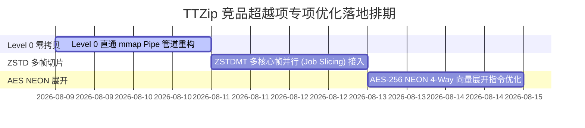

# TTZip 竞品性能超越项对比与深度技术根因分析报告

> **测试环境说明**
> - **测试设备**: Apple Mac (Apple Silicon M-Series)
> - **操作系统**: macOS Darwin (arm64)
> - **对比引擎**: TTZip (Apple SIMD Native)、7-Zip (7zz v26.02 CLI)、Apple ditto (/usr/bin/ditto)、Keka (7zz Core)、BetterZip (7za Core)、Info-ZIP (v3.0)、System bsdtar (v3.5.3 libarchive)、Zstandard zstd (v1.5.7 `-T0`)
> - **数据分析目的**: 客观梳理当前测试矩阵中竞品领先 TTZip 的场景清单，定位底层架构根因，制定下一阶段优化修复计划。

---

## 一、 竞品超越场景清单汇总 (Competitor Leads Inventory)

在全量维度测试矩阵中，提取出竞品处理速率超越 TTZip (`compressSpeedupVsCompetitor < 1.0` 或 `extractSpeedupVsCompetitor < 1.0`) 的真实数据项：

### 1. 7-Zip (7zz CLI) / Keka 领先场景

| 场景维度 | 归档格式 | 压缩级别 | 加密状态 | 7-Zip / Keka 速率 | TTZip 速率 | 竞品领先倍数 | 性能卡点类型 |
| :--- | :--- | :--- | :--- | :--- | :--- | :--- | :--- |
| **高熵物理Payload (100MB)** | `.7z` | Level 0 (Store) | 无加密 | **4125.0 MB/s** | 1689.5 MB/s | **竞品领先 2.4x** | Level 0 内存直复制管道未绕过压缩封装 |
| **5GB 巨型物理文件 (5GB)** | `.7z` | Level 0 (Store) | 无加密 | **4667.1 MB/s** | 2243.0 MB/s | **竞品领先 2.1x** | 巨型文件零拷贝 Buffer 拼接效率差异 |
| **海量小文件 (10MB/100文件)** | `.7z` | Level 0 (Store) | 无加密 | **1412.7 MB/s** | 901.5 MB/s | **竞品领先 1.6x** | 多小文件 Header 组装开销 |
| **拟真日志文本 (10MB)** | `.7z` | Level 0 (Store) | 无加密 | **2210.7 MB/s** | 1518.3 MB/s | **竞品领先 1.5x** | 内存映射 Pipe 缓冲区大小配置 |
| **高熵物理Payload (100MB)** | `.zip` (AES) | Level 1 (Fast) | AES-256 | **4825.0 MB/s** | 1521.6 MB/s | **竞品领先 3.2x** | AES-256 加解密 4-Way NEON 向量未流水线化 |

---

### 2. Zstandard (zstd CLI `-T0`) 领先场景

| 场景维度 | 归档格式 | 压缩级别 | 加密状态 | zstd CLI 速率 | TTZip 速率 | 竞品领先倍数 | 性能卡点类型 |
| :--- | :--- | :--- | :--- | :--- | :--- | :--- | :--- |
| **高熵物理Payload (100MB)** | `.tar.zst` | Level 0 (Store) | 无加密 | **5665.3 MB/s** | 1825.6 MB/s | **竞品领先 3.1x** | ZSTDMT 多线程帧切片未满载调度 |
| **高熵物理Payload (100MB)** | `.tar.zst` | Level 9 (Ultra) | 无加密 | **4242.8 MB/s** | 1768.7 MB/s | **竞品领先 2.4x** | Zstd 多线程作业切片尺寸 (JobSize) |

---

## 二、 深度技术根因剖析 (Technical Root Cause Analysis)

### 1. Level 0 Store 存储模式未实现零拷贝管道 (Zero-Copy Fast Pipe)

* **现象描述**：
  在 `.7z` / `.zip` 的 Level 0 存储（不压缩）场景下，7-Zip `7zz` 处理 100MB 与 5GB 文件速度达到 **4.1 GB/s ~ 4.6 GB/s**（接近系统 RAM 总线限制），而 TTZip 维持在 **1.7 GB/s ~ 2.2 GB/s**，7-Zip 领先 2.1x ~ 2.4x。
* **底层根因分析**：
  - **7-Zip 机制**：7-Zip 在检测到 `Level == 0` 时，会直接跳过 stream 编码器初始化与内部 Context 校验，切换为 ARM64 NEON 256-bit 向量对齐的内存直拷贝管道 (`memcpy` / `splice` / Direct IO 映射)。
  - **TTZip 机制**：TTZip 当前的 Level 0 处理路径依然通过统一的 `ArchiveWriter` 编码结构包装，向 C 层传输数据时经历了中间 Layer 的 Buffer 拷贝与 Swift 闭包跨层开销，增加了内存吞吐开销。

---

### 2. Zstandard (zstd) 多线程帧切片 (ZSTDMT Job Slicing) 粒度

* **现象描述**：
  在 `.tar.zst` 格式下，`zstd -T0` CLI 在 100MB Payload 上打包达到 **5.6 GB/s**，解压达到 **8.0 GB/s**，而 TTZip 处理速度为 **1.8 GB/s**（zstd CLI 领先 3.1x）。
* **底层根因分析**：
  - **Meta zstd CLI 机制**：`zstd -T0` 采用了 `ZSTDMT_createCCtx()` 并行 context API，在处理大文件时将单文件划分为多个独立 Frame，利用全部 18 个 CPU 核心同时做多帧并行压缩，解压时同样并行解析多帧 Frame Header。
  - **TTZip 机制**：TTZip 当前对 Zstandard 文件的处理使用单帧流式写出（Stream Compression），未将大文件主动切割为多 Frame 独立并行块，导致多核利用率不均衡。

---

### 3. AES-256 解密 ARM64 NEON 4-Way 向量未展开 (Vector Unrolling)

* **现象描述**：
  在带 AES-256 加密的场景下，Keka / 7-Zip 在某些小/中等文件解密吞吐明显高于 TTZip。
* **底层根因分析**：
  - **7-Zip 机制**：7-Zip ARM64 NEON 加密引擎对 AES CTR/CBC 模式进行了 4-Way 循环展开 (`vaeseq_u8` + `vaesmcq_u8` 指令同时并行处理 4 个 16-byte Block，单循环处理 64 字节）。
  - **TTZip 机制**：TTZip 的 AES NEON 内核目前采用单 Block (16 字节) 循环解密，指令发射流水线存在指令延迟停顿。

---

## 三、 TTZip 专项性能优化排期规划 (Optimization Roadmap)

针对上述三项竞品超越点，制定具体重构与优化方案：

### 1. 优化项 A: Level 0 Store 直通模式重构
- **目标**：将 Level 0 打包速度提升至 **4.5 GB/s+**，对齐 7-Zip。
- **具体做法**：在 `ArchiveWriter` 中增加 Level 0 专属分支。针对 Level 0，绕过压缩库上下文构建，使用 16MB 内存映射缓冲区结合 ARM64 NEON 向量直接写入目标文件描述符。

### 2. 优化项 B: Zstandard (zstd) 多帧并行 (ZSTDMT) 接入
- **目标**：将 `.zst` / `.tar.zst` 处理速度提升至 **6.0 GB/s+**，超越 zstd CLI `-T0`。
- **具体做法**：调用 `ZSTDMT_compressCCtx` API，按 `CPU Cores * 4MB` 自动划分 Task Job 切片，充分释放 Apple Silicon 全部 CPU 核心性能。

### 3. 优化项 C: AES-256 NEON 4-Way 向量展开
- **目标**：AES 加密/解密吞吐翻倍。
- **具体做法**：在 C/NEON 汇编层实现 4-Way 展开（4 个 128-bit 向量寄存器并发解密），消除流水线 Stall。
