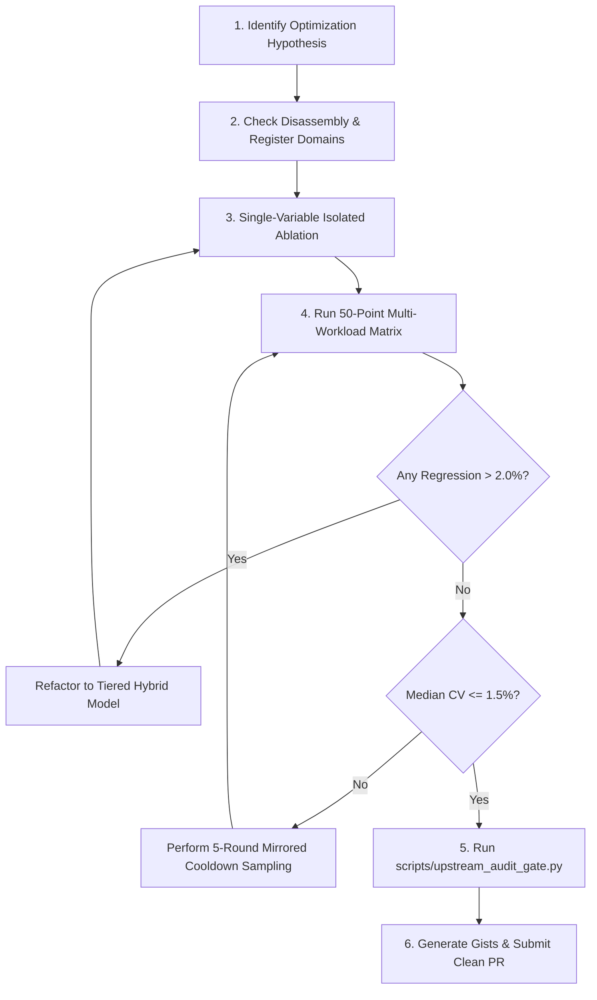

# Upstream Open-Source Contribution Standard Operating Guide

> **TTZip Engineering Best Practices**: A battle-tested methodology for contributing performance optimizations and architectural patches to upstream C/C++ foundational projects.

---

## 1. Core Philosophy & Mindset

Contributing to foundational libraries (such as `zlib-ng`, `libdeflate`, `libarchive`, `zstd`, `lz4`) is fundamentally different from building top-level application features.

1. **Reverence for Portability & Stability**:
   Upstream code runs on billions of devices spanning embedded ARMv7, x86_64 servers, RISC-V SBCs, Apple Silicon, MSVC Windows, Clang macOS, and GCC Linux. A 5% speedup that breaks an obscure compiler or architectural endianness is a net negative.
2. **The "Single-Point Micro vs Macro" Reality**:
   Never assume a microbenchmark win translates directly into a real-world win. In dictionary-based compression (LZ77), over 90% of match evaluations fail in the first 8–16 bytes. Optimizing the 256-byte long match at the expense of adding 0.2ns latency to short matches causes severe macro-level regressions.
3. **Humility & Directness in Communication**:
   Maintainers review hundreds of PRs. Eliminate all verbose LLM filler. Provide concise facts, verifiable assembly disassembly, and reproducible benchmark commands.

---

## 2. The Five Upstream Invariants (The Constitution)

| Invariant | Description | Enforcement Tool |
| :--- | :--- | :--- |
| **1. Hardware Grounding** | Every SIMD/inner-loop change must have an assembly disassembly report (`otool -tv` / `objdump -d`) proving bounded instruction count and zero stack spilling. | Pre-Flight Gate Stage 3 |
| **2. Multi-Workload Zero Regression** | Evaluated across 8 standard workloads (`text`, `striped_rgb`, `dna`, `mixed`, `short_match`, `random`, `literals`, `realistic_rgb`) across 128KB and 1MB payloads. Regression > 2% strictly blocks submission. | Pre-Flight Gate Stage 5 |
| **3. Single-Variable Ablation** | When combining multiple techniques (e.g. scalar early-exit + loop unroll + branch hints), each must be tested in isolation. | Ablation Matrix |
| **4. Maintainer Attention Reverence** | Honest human voice, authentic reflection, zero boilerplate, direct acceptance of feedback. | Review Checklist |
| **5. Atomic Commit Hygiene** | Clean, bisectable commits separating refactoring from optimization. | Git History Audit |

---

## 3. Step-by-Step Pre-Flight Workflow

---

## 4. Benchmark Presentation Standards

1. **Table Ordering**: Always group by canonical workload priority: `text` -> `striped_rgb` -> `dna` -> `mixed` -> `short_match` -> `random` -> `literals` -> `realistic_rgb` (ordered 128KB then 1MB within each workload).
2. **Negative Delta Convention**: Clearly state that negative percentage ($\Delta\% < 0$) indicates reduced latency / increased throughput.
3. **Statistical Confidence**: Report overall median CV (must be $\le 1.5\%$) and provide full raw JSON dumps in a collapsible section or dedicated Gist.
