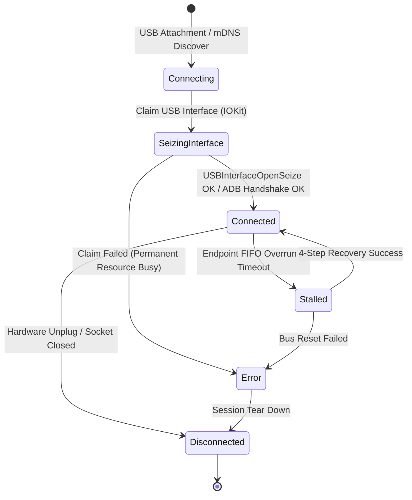
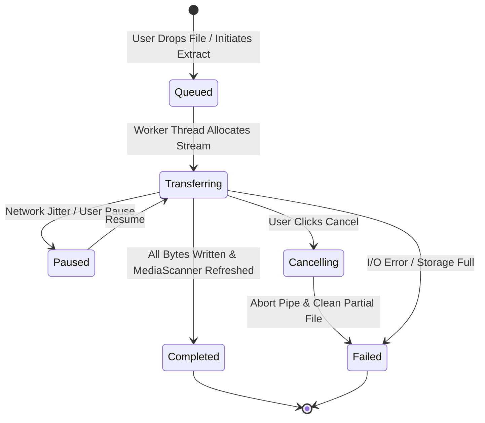

# Data Model: Android Device Management

**Feature Branch**: `001-android-device-management`
**Date**: 2026-09-13
**Status**: Completed

---

## 1. Entity Definitions & Schemas

### 1.1 `AndroidDevice`
Represents an active or detected Android physical or wireless device connected to the host system.

| Field | Type | Required | Description |
| :--- | :--- | :--- | :--- |
| `device_id` | `String` | Yes | Unique identifier (e.g. `usb:05ac:1234:ABCDEF` or `wifi:192.168.1.50:5555`) |
| `display_name` | `String` | Yes | Human-readable name (e.g. "Pixel 8 Pro", "Samsung Galaxy S24") |
| `vendor_id` | `u16` | Yes | USB Vendor ID (or 0 for network devices) |
| `product_id` | `u16` | Yes | USB Product ID (or 0 for network devices) |
| `serial_number` | `String` | Yes | Hardware serial number or ADB device serial |
| `connection_type` | `ConnectionType` | Yes | Protocol channel: `UsbMtp`, `UsbAdb`, `WirelessAdb` |
| `status` | `DeviceStatus` | Yes | Current lifecycle state: `Connecting`, `Connected`, `SeizingInterface`, `Stalled`, `Disconnected`, `Error` |
| `storage_partitions` | `Vec<StoragePartition>` | Yes | Array of mounted logical storage volumes |

### 1.2 `StoragePartition`
Represents a logical storage partition reported by the device (e.g., Internal Storage, SD Card).

| Field | Type | Required | Description |
| :--- | :--- | :--- | :--- |
| `partition_id` | `String` | Yes | Partition identifier (MTP 32-bit StorageID string or mount path) |
| `display_name` | `String` | Yes | Display label (e.g. "Internal Storage", "SanDisk SD Card") |
| `total_bytes` | `u64` | Yes | Total storage capacity in bytes |
| `available_bytes` | `u64` | Yes | Available free space in bytes |
| `root_path` | `String` | Yes | Root path (e.g. `/` for MTP, `/storage/emulated/0` for ADB) |
| `is_removable` | `bool` | Yes | True if removable media (SD card, OTG USB) |

### 1.3 `AndroidVfsNode`
Represents a file or directory node in the remote virtual file system hierarchy.

| Field | Type | Required | Description |
| :--- | :--- | :--- | :--- |
| `path` | `String` | Yes | Full normalized path from partition root |
| `name` | `String` | Yes | Base file or directory name |
| `entry_type` | `VfsEntryType` | Yes | `File`, `Directory`, `Symlink`, `RestrictedDirectory` |
| `size_bytes` | `u64` | Yes | File size in bytes (0 for directories) |
| `modified_timestamp` | `u64` | Yes | Last modification time (Unix epoch seconds) |
| `object_handle` | `Option<u32>` | No | MTP 32-bit ObjectHandle if communicating via MTP |
| `is_restricted` | `bool` | Yes | True if protected by Android 11+ Scoped Storage (e.g. `/Android/data`) |

### 1.4 `TransferJob`
Represents an ongoing or completed read, write, or direct decompression operation.

| Field | Type | Required | Description |
| :--- | :--- | :--- | :--- |
| `job_id` | `String` | Yes | UUID string uniquely identifying the transfer task |
| `direction` | `TransferDirection` | Yes | `MacToAndroid`, `AndroidToMac`, `DirectPipelineExtract` |
| `source_path` | `String` | Yes | Local or remote source path |
| `destination_path` | `String` | Yes | Local or remote destination directory |
| `total_bytes` | `u64` | Yes | Total byte count of files to transfer |
| `transferred_bytes` | `u64` | Yes | Number of bytes written so far |
| `current_speed_bps`| `u64` | Yes | Rolling throughput in bytes per second |
| `status` | `TransferStatus` | Yes | `Queued`, `Transferring`, `Paused`, `Cancelling`, `Completed`, `Failed` |
| `error_message` | `Option<String>` | No | Failure description if status is `Failed` |

---

## 2. Enums & Strong Types

```rust
#[derive(Debug, Clone, Copy, PartialEq, Eq)]
pub enum ConnectionType {
    UsbMtp,
    UsbAdb,
    WirelessAdb,
}

#[derive(Debug, Clone, Copy, PartialEq, Eq)]
pub enum DeviceStatus {
    Connecting,
    SeizingInterface,
    Connected,
    Stalled,
    Disconnected,
    Error,
}

#[derive(Debug, Clone, Copy, PartialEq, Eq)]
pub enum VfsEntryType {
    File,
    Directory,
    Symlink,
    RestrictedDirectory,
}

#[derive(Debug, Clone, Copy, PartialEq, Eq)]
pub enum TransferDirection {
    MacToAndroid,
    AndroidToMac,
    DirectPipelineExtract,
}

#[derive(Debug, Clone, Copy, PartialEq, Eq)]
pub enum TransferStatus {
    Queued,
    Transferring,
    Paused,
    Cancelling,
    Completed,
    Failed,
}
```

---

## 3. Lifecycle State Machines

### 3.1 Device Connection State Machine



### 3.2 File Transfer Job State Machine



---

## 4. Validation Rules & Invariants

1. **Path Sanitization (Zip-Slip Invariant)**: All paths destined for Android storage must pass `path_sanitizer::sanitize_relative_path` to strip leading slashes, null bytes, `../` traversing sequences, and invalid FAT32/ext4 filename characters.
2. **Resident Memory Bound (Stream-First Invariant)**: The buffer capacity allocated for any `TransferJob` must not exceed 64MB of host RAM. Large files are streamed using contiguous 64KB micro-buffers without accumulating in heap memory.
3. **Storage Pre-flight Check**: Before dispatching a `TransferJob`, `StoragePartition.available_bytes` must be evaluated against `TransferJob.total_bytes`. If `total_bytes > available_bytes`, the job must be aborted immediately with an `InsufficientDeviceStorage` error before writing any data.
4. **Restricted Directory Protection**: When `connection_type == UsbMtp`, attempts to create or delete files inside paths matching `/Android/data/*` or `/Android/obb/*` are preemptively blocked at the VFS layer with an explicit user prompt to switch to the high-speed debugging channel.
