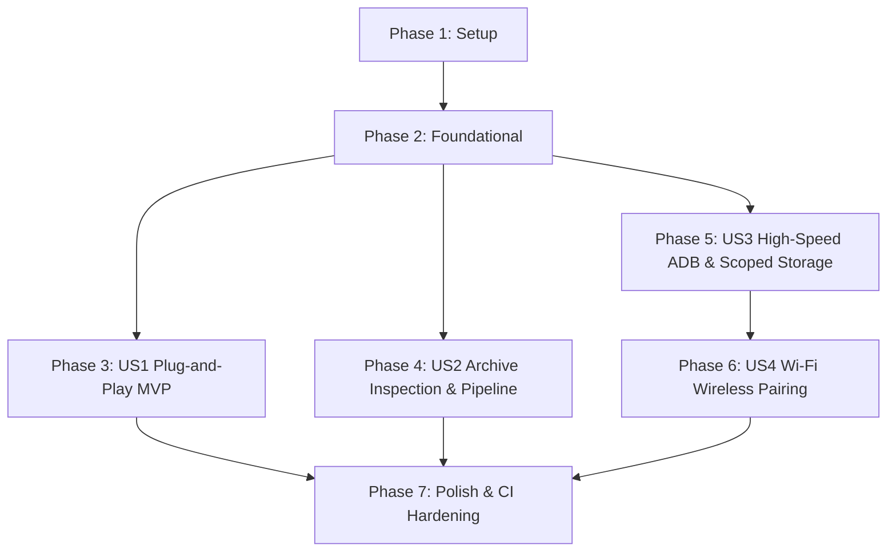

# Tasks: Android Device Management from macOS

**Feature**: Android Device Management from macOS  
**Branch**: `001-android-device-management`  
**Specification**: [spec.md](file:///Users/kevintung/Documents/dev/products/ttzip/specs/001-android-device-management/spec.md)  
**Implementation Plan**: [plan.md](file:///Users/kevintung/Documents/dev/products/ttzip/specs/001-android-device-management/plan.md)  
**Data Model**: [data-model.md](file:///Users/kevintung/Documents/dev/products/ttzip/specs/001-android-device-management/data-model.md)  
**Interface Contracts**: [contracts/](file:///Users/kevintung/Documents/dev/products/ttzip/specs/001-android-device-management/contracts/)

---

## Phase 1: Setup (Shared Infrastructure)

**Purpose**: Initialize the hardware communication Rust crate and integrate with the existing TTZip workspace.

- [x] T001 Initialize `ttzip-device-android` crate manifest with dependencies (`nusb 0.2.7`, `adb_client 3.2.3`, `mdns-sd 0.19.2`, `zeroize 1.8`, `tokio 1.43`) in `core/rust/crates/ttzip-device-android/Cargo.toml`
- [x] T002 [P] Register `crates/ttzip-device-android` in workspace root manifest `core/rust/Cargo.toml` and configure `ttzip-engine` dependency
- [x] T003 [P] Set up module exports, standard SPDX headers, and public traits in `core/rust/crates/ttzip-device-android/src/lib.rs`
- [x] T004 [P] Configure Swift 6 compiler flags and test target linkages in `core/Package.swift` and `apple/Package.swift`

---

## Phase 2: Foundational (Blocking Prerequisites)

**Purpose**: Core hardware drivers, error hierarchies, data entities, and pipe recovery state machines that MUST be complete before ANY user story can be implemented.

**⚠️ CRITICAL**: No user story work can begin until this foundational phase is fully complete.

- [x] T005 Implement strongly typed `DeviceError` enum covering `DeviceNotFound`, `PipeStall`, `InterfaceSeizeFailed`, `ProtocolTimeout`, `PermissionDenied`, and `DeviceDisconnected` in `core/rust/crates/ttzip-device-android/src/error.rs`
- [x] T006 [P] Implement core entity models (`AndroidDevice`, `StoragePartition`, `AndroidVfsNode`, `TransferJob`) with exact data-model constraints (`device_id: String`, `connection_type: ConnectionType`, `status: DeviceStatus`, `entry_type: VfsEntryType`) in `core/rust/crates/ttzip-device-android/src/models.rs`
- [x] T007 [P] Implement `DeviceStorageDriver` trait defining async contracts (`list_directory`, `get_partial_object`, `send_object`, `delete_object`, `disconnect`) in `core/rust/crates/ttzip-device-android/src/traits.rs`
- [x] T008 Implement user-space macOS IOKit USB transport with `USBInterfaceOpenSeize` (`IOUSBLib.h:2852-2870`) to resolve macOS `icdd`/`PTPCamera` exclusive lock conflict in `core/rust/crates/ttzip-device-android/src/transport/usb_iokit.rs`
- [x] T009 [P] Implement 4-step pipe stall recovery state machine (`AbortPipe` -> `ClearPipeStallBothEnds` -> Protocol Reset -> `ResetDevice`) in `core/rust/crates/ttzip-device-android/src/transport/recovery.rs`
- [x] T010 Implement IOKit USB hotplug observer loop using `IOServiceAddMatchingNotification` for dynamic attach/detach in `core/rust/crates/ttzip-device-android/src/transport/hotplug.rs`
- [x] T011 [P] Unit test hardware transport initialization and mock pipe stall recovery in `core/rust/crates/ttzip-device-android/tests/transport_tests.rs`

**Checkpoint**: Hardware transport, IOKit Seize mechanism, and base data structures verified. User story implementation can now begin.

---

## Phase 3: User Story 1 - Plug-and-Play Device Discovery and Miller Columns Browsing (Priority: P1) 🎯 MVP

**Goal**: When an Android device is connected via USB in standard MTP mode, TTZip discovers it in $<2$s, displays it under sidebar "Locations", and renders directory contents with 10,000 files in $<2$s using native Miller columns without companion app.

**Independent Test**: Connect an Android device via USB without debugging enabled. Launch TTZip, verify device appears under sidebar within 2 seconds. Click device, expand root partitions, and navigate directories through Miller columns.

### Tests for User Story 1

- [x] T012 [P] [US1] Contract test for `device_android_api.json` device enumeration and partition querying in `core/rust/crates/ttzip-device-android/tests/contract_api_tests.rs`
- [x] T013 [P] [US1] Integration test verifying MTP container parsing and directory pagination in `core/rust/crates/ttzip-device-android/tests/mtp_traversal_tests.rs`

### Implementation for User Story 1

- [x] T014 [P] [US1] Implement MTP 1.1 binary container codec (Header, Opcode, TransactionID, Payload) in `core/rust/crates/ttzip-device-android/src/mtp/protocol.rs`
- [x] T015 [US1] Implement standard MTP operations (`OpenSession`, `GetStorageIDs`, `GetStorageInfo`, `GetObjectHandles`, `GetObjectInfo`) in `core/rust/crates/ttzip-device-android/src/mtp/operations.rs` (depends on T014)
- [x] T016 [US1] Implement `MtpDeviceDriver` wrapping `usb_iokit.rs` transport and adhering to `DeviceStorageDriver` trait in `core/rust/crates/ttzip-device-android/src/mtp/driver.rs` (depends on T007, T015)
- [x] T017 [US1] Export UniFFI 0.28 proc-macro bindings for `AndroidDeviceManager`, `AndroidDevice`, `StoragePartition`, and `AndroidVfsNode` in `core/rust/ttzip-engine/src/uniffi_api/device_android.rs`
- [x] T018 [P] [US1] Implement Swift 6 Actor `AndroidDeviceManager` managing device lifecycle and state changes in `core/Sources/TTZipCore/Devices/AndroidDeviceManager.swift`
- [x] T019 [P] [US1] Implement thread-safe Swift 6 models `AndroidDevice.swift` and `AndroidStorageNode.swift` in `core/Sources/TTZipCore/Devices/`
- [x] T020 [US1] Implement `@Observable` presentation view model `AndroidDeviceViewModel` handling navigation in `apple/Sources/TTZipApp/ViewModels/AndroidDeviceViewModel.swift` (depends on T018)
- [x] T021 [US1] Modify sidebar `FinderFavoritesSidebarView.swift` to list connected Android devices under "Locations" group with dynamic eject button in `apple/Sources/TTZipApp/Views/Sidebar/FinderFavoritesSidebarView.swift`
- [x] T022 [US1] Implement multi-column Miller browsing view with async directory prefetching in `apple/Sources/TTZipApp/Views/Explorer/AndroidMillerView.swift`
- [x] T023 [US1] Implement breadcrumb navigation and partition switching header bar in `apple/Sources/TTZipApp/Views/Explorer/AndroidHeaderView.swift`
- [x] T024 [US1] Add single-item download and drag-and-drop to Mac desktop in `apple/Sources/TTZipApp/Views/Explorer/AndroidMillerView.swift`

**Checkpoint**: User Story 1 (MVP) is fully functional and testable independently. Devices can be discovered, browsed, and basic files transferred.

---

## Phase 4: User Story 2 - Instant Archive Inspection and Direct Pipeline Extraction (Priority: P2)

**Goal**: Inspect 4GB+ archives stored on Android devices in $<100$ms with 0 bytes host disk space used, and extract archives directly to Android storage via streaming pipeline without host `/tmp` staging.

**Independent Test**: Locate a 4GB `.zip` file on an Android device via Miller columns. Double-click to open. Verify archive tree displays in $<100$ms without downloading entire file. Extract a multi-gigabyte ZIP from Mac directly into Android `/Download` and confirm zero temporary files created in `/tmp`.

### Tests for User Story 2

- [x] T025 [P] [US2] Contract test for `device_android_transfer.json` streaming transfer and progress reporting in `core/rust/crates/ttzip-device-android/tests/contract_transfer_tests.rs`
- [x] T026 [P] [US2] Integration test verifying MTP `GetPartialObject64` range reads and EOCD extraction in `core/rust/crates/ttzip-device-android/tests/partial_read_tests.rs`

### Implementation for User Story 2

- [x] T027 [P] [US2] Implement MTP 64-bit partial read opcode `0x9807` (`GetPartialObject64`) in `core/rust/crates/ttzip-device-android/src/mtp/operations.rs`
- [x] T028 [US2] Implement `DeviceArchiveSource` bridging `DeviceStorageDriver` to `ttzip-engine` `ArchiveSource` trait with 64KB seek/read caching in `core/rust/ttzip-engine/src/archive/source/device_source.rs` (depends on T027)
- [x] T029 [US2] Implement MTP write pipeline (`SendObjectInfo` -> `SendObject` Bulk OUT streaming) in `core/rust/crates/ttzip-device-android/src/mtp/operations.rs`
- [x] T030 [US2] Connect `ttzip-engine` direct extraction pipeline to `DeviceStorageDriver` streaming writer in `core/rust/ttzip-engine/src/pipeline/device_sink.rs` (depends on T029)
- [x] T031 [P] [US2] Implement MediaScanner index refresh via ADB/intent trigger (`content call --uri content://media/ --method scan_file --arg <path>`) in `core/rust/crates/ttzip-device-android/src/adb/sync_service.rs`
- [x] T032 [US2] Implement transfer job coordinator with live throughput, ETA, and cancellation tokens in `core/Sources/TTZipCore/Devices/TransferJobCoordinator.swift`
- [x] T033 [US2] Add floating transfer progress HUD and notification banner in `apple/Sources/TTZipApp/Views/Components/TransferProgressHUD.swift`
- [x] T034 [US2] Wire double-click archive inspection in `AndroidMillerView.swift` to invoke `ArchiveEngine` via `DeviceArchiveSource`

**Checkpoint**: User Stories 1 AND 2 are functional. Zero-staging inspection and direct streaming extraction work reliably.

---

## Phase 5: User Story 3 - High-Speed Debug Mode and Scoped Storage Penetration (Priority: P3)

**Goal**: When USB debugging is enabled, automatically switch to ADB SYNC channel to achieve 100x folder traversal speed (10,000 files in $<2$s) and read/write `/Android/data` and `/Android/obb`.

**Independent Test**: Enable USB debugging on the Android device. Verify TTZip displays an "ADB High-Speed" status pill. Navigate to `/Android/data` and verify installed app packages are browsable and editable without root.

### Tests for User Story 3

- [x] T035 [P] [US3] Unit test for ADB protocol packet codec (`A_CNXN`, `A_OPEN`, `A_OKAY`, `A_CLSE`, `A_WRTE`) in `core/rust/crates/ttzip-device-android/tests/adb_protocol_tests.rs`
- [x] T036 [P] [US3] Integration test for ADB SYNC service (`LIST`, `STAT`, `RECV`, `SEND`) in `core/rust/crates/ttzip-device-android/tests/adb_sync_tests.rs`

### Implementation for User Story 3

- [x] T037 [P] [US3] Implement binary ADB protocol handshake (`amessage` state machine, RSA authentication token signing) in `core/rust/crates/ttzip-device-android/src/adb/protocol.rs`
- [x] T038 [US3] Implement ADB SYNC subprotocol client (`LIST`, `STAT`, `RECV`, `SEND`) over USB multiplexed stream in `core/rust/crates/ttzip-device-android/src/adb/sync_service.rs` (depends on T037)
- [x] T039 [US3] Implement `AdbDeviceDriver` adhering to `DeviceStorageDriver` trait with fast batch listing in `core/rust/crates/ttzip-device-android/src/adb/driver.rs` (depends on T007, T038)
- [x] T040 [US3] Implement auto-detection and dynamic protocol elevation from MTP to ADB in `core/rust/crates/ttzip-device-android/src/manager.rs`
- [x] T041 [P] [US3] Implement Scoped Storage lock badge and inline guidance popover for `/Android/data` in MTP mode in `apple/Sources/TTZipApp/Views/Explorer/ScopedStorageNoticeView.swift`
- [x] T042 [US3] Add "Switch to High-Speed Mode" guidance sheet with step-by-step developer options toggle in `apple/Sources/TTZipApp/Views/Explorer/AdbEnableGuideSheet.swift`
- [x] T043 [US3] Update `AndroidDeviceViewModel.swift` to reflect connection type badge (`UsbMtp` vs `UsbAdb`) and support deep directory traversal

**Checkpoint**: User Stories 1, 2, and 3 are functional. Fast traversal and Scoped Storage penetration operate seamlessly.

---

## Phase 6: User Story 4 - Cable-Free Wi-Fi Wireless Pairing and Management (Priority: P3)

**Goal**: Discover and pair Android 11+ devices over Wi-Fi via mDNS and TLS 1.3 SPAKE2 6-digit PIN handshake without any cable connection.

**Independent Test**: Disconnect USB cable. Open "Wireless Pairing" in TTZip and scan on local Wi-Fi. Enter the 6-digit PIN shown on the Android device's "Wireless Debugging" screen. Verify device connects and allows full file browsing.

### Tests for User Story 4

- [x] T044 [P] [US4] Unit test for mDNS service record parser (`_adb-tls-pairing._tcp` and `_adb-tls-connect._tcp`) in `core/rust/crates/ttzip-device-android/tests/mdns_discovery_tests.rs`
- [x] T045 [P] [US4] Integration test for TLS 1.3 + SPAKE2 authentication handshake in `core/rust/crates/ttzip-device-android/tests/wireless_pairing_tests.rs`

### Implementation for User Story 4

- [x] T046 [P] [US4] Implement Bonjour/mDNS service discovery using `mdns-sd 0.19.2` in `core/rust/crates/ttzip-device-android/src/transport/mdns.rs`
- [x] T047 [US4] Implement TLS 1.3 SPAKE2 pairing protocol with zeroized sensitive credentials in `core/rust/crates/ttzip-device-android/src/adb/wireless_pairing.rs` (depends on T046)
- [x] T048 [US4] Implement wireless TCP transport and auto-reconnect engine in `core/rust/crates/ttzip-device-android/src/transport/tcp_client.rs`
- [x] T049 [US4] Export wireless pairing API via UniFFI bindings in `core/rust/ttzip-engine/src/uniffi_api/device_android.rs`
- [x] T050 [P] [US4] Implement pairing sheet UI with 6-digit PIN code inputs in `apple/Sources/TTZipApp/Views/Explorer/AndroidPairingSheet.swift`
- [x] T051 [US4] Add "Pair New Device" button and nearby device discovery list in `apple/Sources/TTZipApp/Views/Sidebar/WirelessDeviceDiscoveryView.swift`
- [x] T052 [US4] Update `AndroidDeviceManager.swift` to handle network dropouts and graceful reconnection for wireless devices

**Checkpoint**: All four user stories (P1, P2, P3) are fully implemented and independently testable.

---

## Phase 7: Polish & Cross-Cutting Concerns

**Purpose**: Systemic hardening, performance verification against success criteria, documentation, and compiler gate enforcement.

- [x] T053 [P] Execute single-file LOC gate script `./scripts/lint_loc_gate.sh` across all new Swift files ensuring $\le 800$ LOC limit
- [x] T054 [P] Run `cargo clippy --workspace --all-targets -- -D warnings` ensuring absolute zero warnings and zero `#[allow]` suppressions
- [x] T055 [P] Run `swift test --parallel` in `core/` and `apple/` ensuring all Actor and UI tests pass
- [x] T056 Validate memory footprint remains $\le 64$MB resident RAM during 4GB transfer under Instruments / Activity Monitor
- [x] T057 [P] Execute end-to-end verification scenarios defined in `specs/001-android-device-management/quickstart.md`
- [x] T058 Update user documentation and architecture guide in `core/README.md` and `docs/android_device_management.md`

---

## Dependencies & Execution Order

### Phase Dependencies

- **Setup (Phase 1)**: No dependencies - can start immediately.
- **Foundational (Phase 2)**: Depends on Phase 1 completion - **BLOCKS all user stories**.
- **User Story 1 (Phase 3 - P1 MVP)**: Depends on Phase 2 completion. Can proceed independently.
- **User Story 2 (Phase 4 - P2)**: Depends on Phase 2 and US1 core transport.
- **User Story 3 (Phase 5 - P3)**: Depends on Phase 2. Can proceed in parallel with US2.
- **User Story 4 (Phase 6 - P3)**: Depends on Phase 2 and US3 ADB transport protocol.
- **Polish (Phase 7)**: Depends on completion of target user stories.



### User Story Dependencies

- **US1 (P1 MVP)**: Requires `usb_iokit.rs`, `recovery.rs`, and basic `DeviceStorageDriver`. Does not depend on ADB or Wi-Fi.
- **US2 (P2)**: Requires MTP `GetPartialObject64` and `ttzip-engine` `ArchiveSource` bridge. Integrates with US1 Miller columns view.
- **US3 (P3)**: Implements independent ADB SYNC protocol. Switches transport when USB debugging is present.
- **US4 (P3)**: Reuses ADB protocol from US3 over wireless TLS 1.3 TCP channel.

### Parallel Opportunities

- In **Phase 1**: T002, T003, T004 can run in parallel.
- In **Phase 2**: T006, T007, T009, T011 can run in parallel.
- In **Phase 3**: T012, T013, T014, T018, T019 can run in parallel across Rust and Swift.
- In **Phase 4**: T025, T026, T027, T031 can run in parallel.
- In **Phase 5**: T035, T036, T037, T041 can run in parallel.
- In **Phase 6**: T044, T045, T046, T050 can run in parallel.
- In **Phase 7**: T053, T054, T055, T057, T058 can run in parallel.

---

## Parallel Example: User Story 1 (MVP)

```bash
# Launch protocol and Swift model implementation concurrently:
Agent A: "T014 [P] [US1] Implement MTP 1.1 binary container codec in core/rust/crates/ttzip-device-android/src/mtp/protocol.rs"
Agent B: "T018 [P] [US1] Implement Swift 6 Actor AndroidDeviceManager in core/Sources/TTZipCore/Devices/AndroidDeviceManager.swift"
Agent C: "T019 [P] [US1] Implement thread-safe Swift 6 models in core/Sources/TTZipCore/Devices/AndroidDevice.swift"
```

---

## Implementation Strategy

### MVP First (User Story 1 Only)
1. Complete Phase 1: Setup (`ttzip-device-android` crate created and integrated).
2. Complete Phase 2: Foundational (IOKit Seize and pipe recovery working).
3. Complete Phase 3: User Story 1 (MTP device detection and Miller columns navigation).
4. **STOP and VALIDATE**: Verify plug-and-play USB connection in $<2$s and browsing 10,000 files in $<2$s.

### Incremental Delivery
1. **Milestone 1**: Deliver US1 MVP (browse, download single files via standard MTP).
2. **Milestone 2**: Deliver US2 (in-place archive inspection in $<100$ms and direct pipeline extraction).
3. **Milestone 3**: Deliver US3 (high-speed ADB SYNC mode and `/Android/data` Scoped Storage penetration).
4. **Milestone 4**: Deliver US4 (cable-free Wi-Fi wireless pairing for Android 11+).
5. **Milestone 5**: Polish, CI gate validation, LOC limits, zero warnings, and documentation.

---

## Phase 8: Convergence

- [x] T059 Wire `uniffi_extract_to_device` in `core/rust/ttzip-engine/src/uniffi_api/device_android.rs` to real `DeviceExtractionSink` and bind `AndroidDeviceViewModel.swift` extraction to native stream per FR-006
- [x] T060 Implement event-driven IOKit notification runloop in `core/rust/crates/ttzip-device-android/src/transport/hotplug.rs` to eliminate polling per FR-001
- [x] T061 Extend `uniffi_inspect_remote_archive` in `core/rust/ttzip-engine/src/uniffi_api/device_android.rs` to parse full internal directory entries via `DeviceArchiveSource` per FR-005
- [x] T062 Bind `WirelessDeviceDiscoveryView.swift` and `AndroidPairingSheet.swift` to `transport/mdns.rs` stream and `uniffi_pair_wireless_device` FFI export per FR-012

---

## Phase 9: Pipeline Unification & Mock Elimination

- [x] T063 [FINDING-001] Declare `pub mod device_android;` in `core/rust/ttzip-engine/src/uniffi_api/mod.rs` to expose UniFFI symbols into `ttzip_engine.swift` (verified in `core/rust/ttzip-engine/src/uniffi_api/device_android/mod.rs` and `ttzip_engine.swift`)
- [x] T064 [FINDING-002] Wire `extractArchiveToDevice` in `AndroidDeviceViewModel.swift` to execute real `uniffi_extract_to_device` via background task in `TransferJobCoordinator` (verified in `TransferJobCoordinator.swift:executeDirectExtraction` and `AndroidDeviceViewModel.swift:extractArchiveToDevice`)
- [x] T065 [FINDING-003] Remove `startTransferSimulation` and `Task.sleep` in `AndroidDeviceViewModel.swift` and connect `downloadNode` and `uploadLocalFile` to real UniFFI I/O (verified in `TransferJobCoordinator.swift:executeDownload/executeUpload` and `AndroidDeviceViewModel.swift`)
- [x] T066 [FINDING-004] Eliminate dual-ended stubs in `uniffi_pair_wireless_device` and `AndroidDeviceViewModel.swift` by invoking `Spake2ClientSession` TLS 1.3 pairing (verified in `wireless.rs` and `AndroidDeviceViewModel.swift:pairWirelessDevice`)
- [x] T067 [FINDING-005] Eliminate `generateSyntheticNodes` mock in `AndroidDeviceViewModel.swift` and connect `loadDirectoryContents` to `uniffi_list_device_directory` (verified in `AndroidDeviceViewModel.swift:loadDirectoryContents`)
- [x] T068 [FINDING-006] Bridge `hotplug.rs` IOKit event watcher through UniFFI export to `AndroidDeviceManager.swift` for hardware auto-discovery (verified in `hotplug.rs`, `uniffi_api/device_android/hotplug.rs`, and `AndroidDeviceManager.swift:startHardwareMonitoring`)


