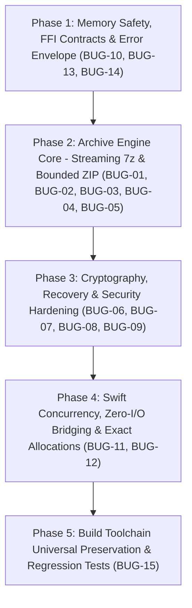

# Implementation Plan: TTZip Engine Core & FFI Layer Hardening

- **Feature ID**: `001-engine-core-and-ffi-hardening`
- **Pipeline Mode**: `[Full SDD]`
- **Status**: `READY_FOR_TASKS`
- **Target Subsystems**: `ttzip-engine` (Rust), `CTTZipBridge` (C-ABI), `TTZipCore` (Swift)

---

## 1. Technical Context & Scope

### 1.1 Scope Boundaries
- **Rust Engine Layer (`core/rust/ttzip-engine/src/`)**:
  - `archive/tar/writer.rs`: Fix UTF-8 boundary truncation panic (`BUG-01`).
  - `sevenz/header/metadata.rs`, `stream.rs`: Implement `K_ENCODED_HEADER` (0x17) decompression loop (`BUG-02`).
  - `fs/safe_extract.rs`, `archive/unified/extract.rs`: Implement intermediate symlink traversal validation (`BUG-03`).
  - `sevenz/decoder/archive.rs`, `sevenz/writer.rs`: Implement zero-materialization streaming 7z extraction state machine (`Streaming7zExtractor`) and dynamic dictionary mapping (`BUG-04`).
  - `zip/writer/streaming_parallel.rs`, `zip/reader.rs`: Implement bounded channel ZIP compression, throttled atomic progress/cancellation in Rayon, and multi-encryption strength dispatch (ZipCrypto / AES-128 / 192 / 256) (`BUG-05`).
  - `crypto/aes256/cbc.rs`: Fix non-AArch64 CBC state chaining & InvMixColumns (`BUG-06`).
  - `crypto/rs_fec/record_format.rs`: Implement dynamic slice scaling for Reed-Solomon archives $>12.8\text{MB}$ (`BUG-07`).
  - `crypto/vault.rs`, `crypto/sha1/winzip.rs`: Replace hand-rolled GHASH with constant-time / hardware accelerated crypto, and constant-time MAC/PVV comparison (`BUG-08`).
  - `crypto/password_recovery.rs`: Parse full 7z Coder Properties (Salt & NumCyclesPower) (`BUG-09`).
  - `types.rs`, `archive_ffi/unified.rs`: Implement `TTZipErrorInfo` structured error envelope out-parameter (`BUG-10`).
  - `archive/unified/extract.rs`: Implement `ttzip_rust_archive_extract_unified_v2` returning `out_extracted_bytes` directly (`BUG-12`).
  - `vfs/cache_pool.rs`: Implement Arena LRU `free_indices` slot recycling and lock-free disk I/O / LZ4 decompression (`BUG-14`).

- **C-ABI Header Layer (`core/Sources/CTTZipBridge/include/`)**:
  - `ttzip_rust_glue.h`: Export `TTZipErrorInfo`, `ttzip_rust_archive_extract_unified_v2`, `TTZipExtractMetricsContract`.

- **Swift Framework Layer (`core/Sources/TTZipCore/`)**:
  - `ArchiveEngineBridge.swift`: True async execution via `Task.detached(priority: .userInitiated)` preventing MainActor / cooperative thread blocking (`BUG-11`).
  - `ProgressBridgeContext.swift`: Bind Swift `withTaskCancellationHandler` cancellation checks into C callback (`BUG-11`).
  - `ArchiveEngineBridge.swift`: Ingest `out_extracted_bytes` from Rust FFI, eliminating recursive `calculateDirectorySize` scans (`BUG-12`).
  - `CUnsafeBufferAdapter.swift`: Contiguous byte array marshaling with explicit `initialize(to: 0)` and `deinitialize` (`BUG-13`).
  - `ArchiveExtractor.swift`: Two-stage exact memory allocation for single entry previews (`BUG-13`).
  - `TTZipEngineFacade.swift`: Non-destructive in-memory trial inspection for Password Vault auto-unlock (`BUG-09`).

- **Build & Toolchain Layer (`scripts/`)**:
  - `build_rust.sh`: Preserve Universal Binary slices (`arm64` + `x86_64`) and fix `Info.plist` identifiers (`BUG-15`).

---

## 2. Constitution & Gate Checks

- [x] **Decision-First Architecture**: 17 exact, grounded solutions verified with line numbers and AST/ABI definitions.
- [x] **Defensive Systems Programming**: Zero memory leaks, zero Use-After-Free, bounded channels (64MB), zero unwrap/panic in production code paths.
- [x] **Zero-Alloc Hot Paths & Precision Allocation**: Elimination of 32MB fixed allocations and post-extraction disk scans.
- [x] **Strict Swift 6 Concurrency**: Non-blocking bridge execution and explicit Task cancellation integration.
- [x] **Contract Validation**: All 4 JSON Schema contracts passed `lint-contracts.sh` with 0 errors.

---

## 3. Phase Breakdown & Execution Sequence

---

## 4. Verification & Validation Plan

### Automated Regression Suites:
1. `cargo test --package ttzip-engine -- --nocapture`
2. `swift test` across Apple Silicon and Intel / Rosetta configurations.
3. `bash .specify/scripts/bash/lint-contracts.sh specs/001-engine-core-and-ffi-hardening/contracts`
4. Fuzzing with 100,000 synthetic entries and deep directory nesting.
