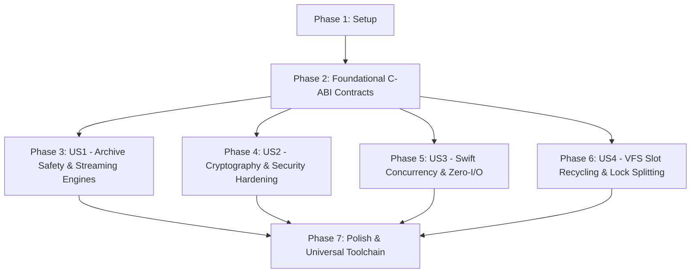

# Tasks: TTZip Engine Core & FFI Layer Hardening

- **Feature ID**: `001-engine-core-and-ffi-hardening`
- **Pipeline Mode**: `[Full SDD]`
- **Status**: `COMPLETED`
- **Target Subsystems**: `ttzip-engine` (Rust), `CTTZipBridge` (C-ABI), `TTZipCore` (Swift)

---

## Dependencies & User Story Flow

---

## Phase 1: Setup & Environment Initialization

- [x] T001 Verify and configure Universal compilation targets in `apple/.build/checkouts/ttzip-core/scripts/build_rust.sh`

---

## Phase 2: Foundational C-ABI Contracts & Memory Safety (Blocking Prerequisites)

- [x] T002 [P] Implement `TTZipErrorInfo` C-ABI struct and population helpers in `core/rust/ttzip-engine/src/types.rs`
- [x] T003 [P] Export `TTZipErrorInfo`, `ttzip_rust_archive_extract_unified_v2`, and updated signatures in `core/Sources/CTTZipBridge/include/ttzip_rust_glue.h`
- [x] T004 [P] Implement `write_error_info` out-parameter error capture in `core/rust/ttzip-engine/src/ffi/archive_ffi/unified.rs`
- [x] T005 [P] Fix uninitialized memory `.pointee = 0` UB and enforce typed pointer lifecycle in `core/Sources/TTZipCore/Bridge/CUnsafeBufferAdapter.swift`

---

## Phase 3: User Story 1 - Archive Format Safety, Streaming 7z & Bounded ZIP (Priority: P1)

**Story Goal**: Eliminate decompression OOM crashes, prevent path traversal attacks, and stream archives with bounded memory.

- [x] T006 [P] [US1] Fix UTF-8 character boundary truncation in `core/rust/ttzip-engine/src/archive/tar/writer.rs`
- [x] T007 [P] [US1] Implement `K_ENCODED_HEADER` (0x17) stream decoding loop in `core/rust/ttzip-engine/src/sevenz/header/metadata.rs`
- [x] T008 [P] [US1] Implement ancestor symlink path validation in `core/rust/ttzip-engine/src/fs/safe_extract.rs`
- [x] T009 [US1] Build zero-materialization `Streaming7zExtractor` state machine in `core/rust/ttzip-engine/src/sevenz/decoder/archive.rs`
- [x] T010 [US1] Implement dynamic dictionary mapping and `ctx.dict_property()` in `core/rust/ttzip-engine/src/sevenz/writer.rs`
- [x] T011 [US1] Implement 64MB bounded MPSC channel parallel ZIP writer in `core/rust/ttzip-engine/src/zip/writer/streaming_parallel.rs`
- [x] T012 [US1] Implement throttled multi-threaded progress callbacks and multi-strength AES/ZipCrypto dispatch in `core/rust/ttzip-engine/src/zip/reader.rs`

---

## Phase 4: User Story 2 - Cryptography, Recovery Records & Security Hardening (Priority: P2)

**Story Goal**: Eliminate cryptographic side-channels, fix cross-platform AES CBC, and prevent destructive vault trial unlocks.

- [x] T013 [P] [US2] Fix continuous CBC state feedback and inverse round keys in `core/rust/ttzip-engine/src/crypto/aes256/cbc.rs`
- [x] T014 [P] [US2] Implement dynamic slice size scaling for Reed-Solomon records in `core/rust/ttzip-engine/src/crypto/rs_fec/record_format.rs`
- [x] T015 [P] [US2] Replace hand-rolled GHASH with constant-time / hardware accelerated crypto in `core/rust/ttzip-engine/src/crypto/vault.rs`
- [x] T016 [US2] Parse 7z Coder Properties Salt and NumCyclesPower in `core/rust/ttzip-engine/src/crypto/password_recovery.rs`
- [x] T017 [US2] Refactor Password Vault auto-unlock to use non-destructive in-memory probing in `core/Sources/TTZipCore/Facades/TTZipEngineFacade.swift`

---

## Phase 5: User Story 3 - Swift 6 Concurrency, Zero-I/O & Allocation Optimization (Priority: P3)

**Story Goal**: Ensure non-blocking Swift execution, eliminate post-extract directory rescans, and allocate precise preview buffers.

- [x] T018 [P] [US3] Implement true async non-blocking execution via `Task.detached` in `core/Sources/TTZipCore/Bridge/ArchiveEngineBridge.swift`
- [x] T019 [P] [US3] Bind Swift `withTaskCancellationHandler` cancellation checks into `core/Sources/TTZipCore/Bridge/ProgressBridgeContext.swift`
- [x] T020 [US3] Ingest `out_extracted_bytes` from FFI and remove `calculateDirectorySize` in `core/Sources/TTZipCore/Bridge/ArchiveEngineBridge.swift`
- [x] T021 [P] [US3] Implement two-stage exact buffer allocation for single entry extraction in `core/Sources/TTZipCore/ArchiveExtractor.swift`
- [x] T022 [US3] Convert `TTZipErrorInfo` into structured `ArchiveError` in `core/Sources/TTZipCore/ArchiveReader.swift`

---

## Phase 6: User Story 4 - VFS Cache Arena Slot Recycling & Lock-Free I/O (Priority: P4)

**Story Goal**: Eliminate unbounded VFS memory growth and resolve lock convoy bottlenecks during cache access.

- [x] T023 [P] [US4] Implement `allocate_node` with `free_indices` recycling in `core/rust/ttzip-engine/src/vfs/cache_pool.rs`
- [x] T024 [US4] Refactor `get` and `put` to execute lock-free disk I/O and LZ4 decompression in `core/rust/ttzip-engine/src/vfs/cache_pool.rs`
- [x] T025 [US4] Implement $O(N)$ pre-indexed tree building and zero-allocation case comparison in `core/rust/ttzip-engine/src/fs/vfs/tree.rs`

---

## Phase 7: Polish, Toolchain Universal Preservation & Regression Tests

- [x] T026 Remove `lipo -extract arm64` and update `Info.plist` in `apple/.build/checkouts/ttzip-core/scripts/build_rust.sh`
- [x] T027 Run full Rust test suite `cargo test --package ttzip-engine` in `core/rust`
- [x] T028 Run Swift integration and concurrency test suite `swift test` in `core`
