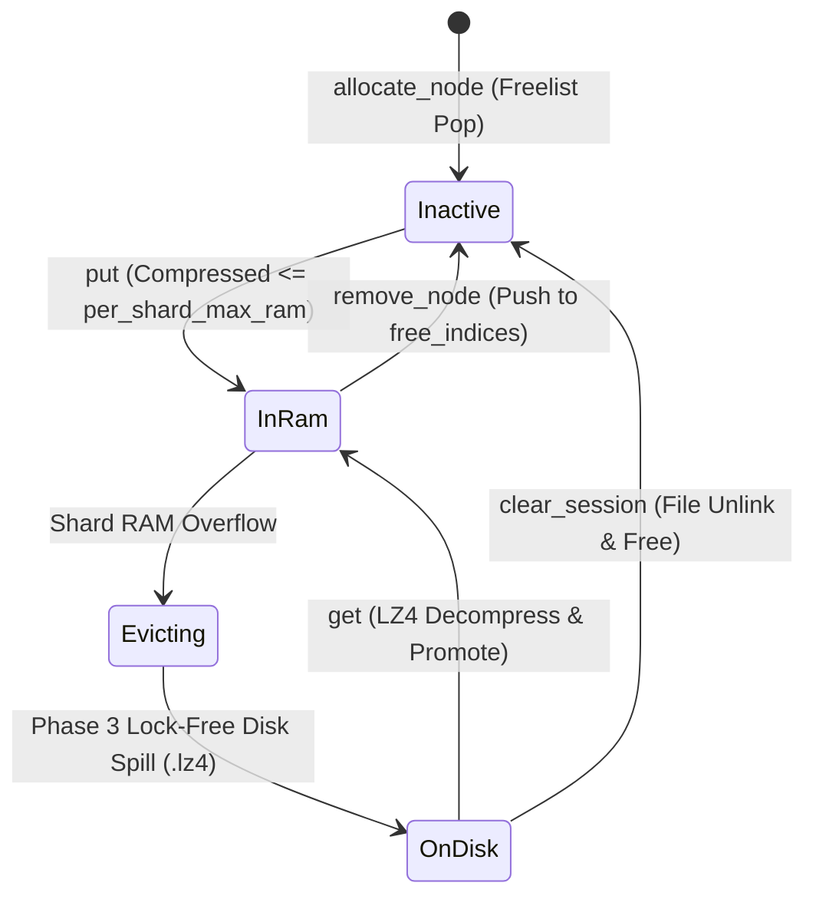

# Data Model: Systemic Quality, FFI Hardening, and VFS Concurrency

- **Feature ID**: `003-systemic-quality-and-architecture-governance`
- **Target Subsystems**: `ttzip-engine` (Rust), `CTTZipBridge` (C-ABI), `TTZipCore` (Swift)

---

## 1. C-ABI Data Structures & Memory Layouts

### 1.1 `TTZipErrorInfo` (Structured Stack Error Propagation)

```c
// Total size: 784 bytes, 8-byte aligned
typedef struct TTZipErrorInfo {
    TTZipStatus status;       // offset: 0, size: 4 bytes (Error code enum)
    int32_t error_code;       // offset: 4, size: 4 bytes (System/POSIX error code)
    char message[512];        // offset: 8, size: 512 bytes (UTF-8 diagnostic detail)
    char entry_path[256];     // offset: 520, size: 256 bytes (Failing archive entry path)
    uint64_t offset;          // offset: 776, size: 8 bytes (Physical stream byte offset)
} TTZipErrorInfo;
```

### 1.2 Swift Ergonomic Extension (`TTZipErrorInfo+Extensions.swift`)

```swift
extension TTZipErrorInfo {
    public static var zeroed: TTZipErrorInfo {
        var info = TTZipErrorInfo()
        info.status = TTZIP_STATUS_OK
        info.error_code = 0
        info.offset = 0
        return info
    }

    public var errorDescription: String {
        withUnsafePointer(to: message) { ptr in
            ptr.withMemoryRebound(to: CChar.self, capacity: 512) { String(cString: $0) }
        }
    }

    public var failedEntryPath: String {
        withUnsafePointer(to: entry_path) { ptr in
            ptr.withMemoryRebound(to: CChar.self, capacity: 256) { String(cString: $0) }
        }
    }
}
```

---

## 2. VFS Cache Memory & State Machine



### 2.1 `LruNode` Layout (Arena Storage)

| Field | Type | Description |
|---|---|---|
| `key` | `String` | Cache key `session_id:chunk_index` |
| `raw_size` | `usize` | Uncompressed chunk size (bytes) |
| `compressed_size` | `usize` | LZ4 compressed payload size (bytes) |
| `in_ram` | `bool` | True if chunk resides in RAM |
| `ram_data` | `Option<Arc<[u8]>>` | Shared immutable zero-copy compressed bytes |
| `disk_path` | `Option<PathBuf>` | Path to `.lz4` disk spill file if evicted from RAM |
| `access_time` | `u64` | Monotonic nanosecond timestamp |
| `prev` | `Option<usize>` | Intrusive LRU arena previous index |
| `next` | `Option<usize>` | Intrusive LRU arena next index |
| `active` | `bool` | True if slot is live; False if slot is available in `free_indices` |
