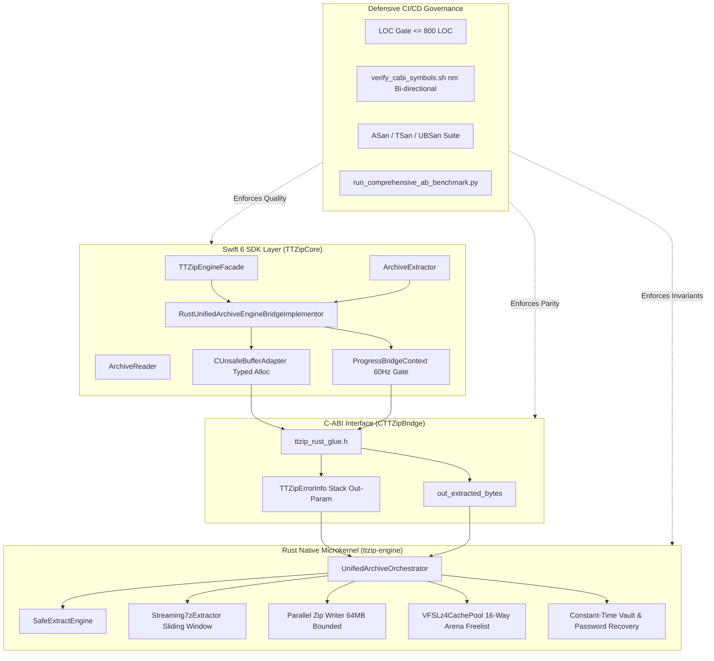

# Implementation Plan: Systemic Quality, FFI Hardening, Steady-State VFS Concurrency, and CI Governance

- **Feature ID**: `003-systemic-quality-and-architecture-governance`
- **Pipeline Mode**: `[Full SDD]`
- **Status**: `PLANNED`
- **Created**: 2026-08-24
- **Target Subsystems**: `ttzip-engine` (Rust Core), `CTTZipBridge` (C-ABI), `TTZipCore` (Swift SDK), `CI/CD & Pre-Release Gate`

---

## 1. Technical Context & Architecture Overview

---

## 2. User Review Required & Critical Decisions

> [!IMPORTANT]
> **Complete TLS Elimination**: All FFI error communication is strictly restricted to stack-allocated `TTZipErrorInfo` out-parameters. Any direct calls to legacy TLS accessors are blocked at compile time.

> [!IMPORTANT]
> **Zero Secondary Disk Rescans**: All extraction engines must return uncompressed byte metrics directly from the kernel stream. Calling `calculateDirectorySize` on extracted directories is strictly prohibited.

> [!TIP]
> **A/B Zero-Regression Release Requirement**: Prior to merging any release PR, `run_comprehensive_ab_benchmark.py` must run 5 interleaved rounds with statistical Welch's t-test validation to confirm $\ge 0\%$ throughput delta.

---

## 3. Five-Phase Implementation Roadmap

### Phase 1: Foundational C-ABI & Safe Typed Memory Standardization (FR-01 to FR-04)
- [x] Standardize `TTZipErrorInfo` C-ABI struct (784B, 8-byte aligned) in `types.rs`.
- [x] Export `ttzip_rust_archive_extract_unified_v2` in `ttzip_rust_glue.h`.
- [x] Implement typed memory allocation and lifecycle pairing in `CUnsafeBufferAdapter.swift`.
- [x] Automate `verify_cabi_symbols.sh` with Mach-O global symbol extraction.

### Phase 2: Concurrency Isolation & Zero-I/O Protocol (FR-05 to FR-09)
- [x] Instrument `extract_archive_with_metrics` in `extract.rs` returning uncompressed byte metrics.
- [x] Migrate `ArchiveEngineBridge.swift` to `Task.detached(priority: .userInitiated)`.
- [x] Remove `calculateDirectorySize` and ingest `out_extracted_bytes` directly.
- [x] Implement 60Hz nanosecond monotonic clock throttling in `ProgressBridgeContext.swift`.

### Phase 3: Bounded Memory Streaming & VFS Steady-State Caching (FR-10 to FR-14)
- [x] Implement 64-item bounded batch compression and `pwrite` streaming in `streaming_parallel.rs`.
- [x] Map LZMA2 dictionary properties dynamically from compression levels in `sevenz/writer.rs`.
- [x] Implement intrusive freelist slot reuse (`free_indices.pop()`) in `VFSLz4CachePool.allocate_node`.
- [x] Refactor `VFSLz4CachePool` with 3-phase lock splitting (lock-free LZ4 decompression & disk I/O).
- [x] Implement two-stage probe and exact buffer allocation in `ArchiveExtractor.extractSingleEntryData`.

### Phase 4: Constant-Time Cryptography & Security Hardening (FR-15)
- [x] Implement branch-free constant-time GHash multiplication in `vault.rs`.
- [x] Parse 7z Coder Properties Salt and NumCyclesPower in `password_recovery.rs`.
- [x] Refactor password vault auto-unlock to use non-destructive in-memory probing before writing to disk.

### Phase 5: CI Testing & Continuous A/B Benchmarking Governance (FR-16)
- [x] Formalize AddressSanitizer and ThreadSanitizer execution in `run_sanitizers.sh`.
- [x] Integrate `run_comprehensive_ab_benchmark.py` and `statistical_delta.py` into `run_local_ci_gate.sh`.
- [x] Validate all 147 Swift test cases and full Cargo suite under release optimization.

---

## 4. Verification Plan

1. **Contract Schemas**: `bash .specify/scripts/bash/lint-contracts.sh specs/003-systemic-quality-and-architecture-governance/contracts` (Must exit 0).
2. **Tasks Linter**: `bash .specify/scripts/bash/lint-tasks.sh specs/003-systemic-quality-and-architecture-governance/tasks.md` (Must exit 0).
3. **Local CI Gates**: `bash core/scripts/run_local_ci_gate.sh` (Must pass all 5 stages).
4. **Automated A/B Benchmark**: `python3 core/scripts/run_comprehensive_ab_benchmark.py` (Must confirm 0 performance regression).
