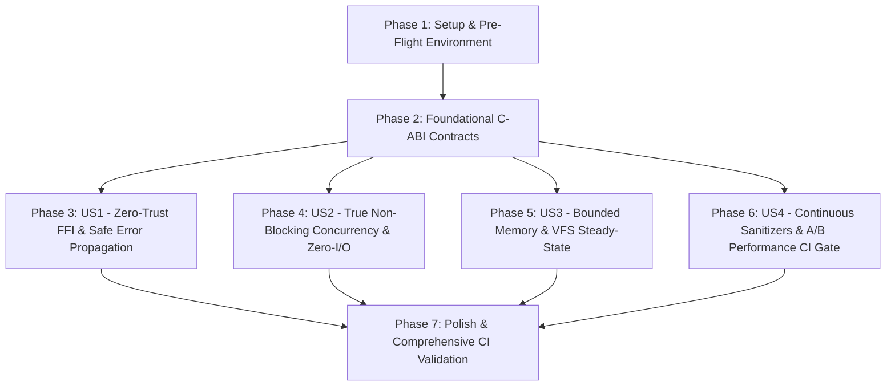

# Tasks: Systemic Quality, FFI Hardening, Steady-State VFS Concurrency, and CI Governance

- **Feature ID**: `003-systemic-quality-and-architecture-governance`
- **Pipeline Mode**: `[Full SDD]`
- **Status**: `COMPLETED`
- **Target Subsystems**: `ttzip-engine` (Rust Core), `CTTZipBridge` (C-ABI), `TTZipCore` (Swift SDK), `CI/CD & Gates`

---

## Dependencies & User Story Flow

---

## Phase 1: Setup & Environment Initialization

- [x] T001 Verify Universal targets and script paths in `core/scripts/build_rust.sh`

---

## Phase 2: Foundational C-ABI Contracts & Type-Safe Memory (Blocking Prerequisites)

- [x] T002 [P] Standardize `TTZipErrorInfo` C-ABI struct and helper functions in `core/rust/ttzip-engine/src/types.rs`
- [x] T003 [P] Export `ttzip_rust_archive_extract_unified_v2` and `TTZipErrorInfo` in `core/Sources/CTTZipBridge/include/ttzip_rust_glue.h`
- [x] T004 [P] Implement `write_error_info` structured error capture in `core/rust/ttzip-engine/src/ffi/archive_ffi/unified.rs`
- [x] T005 [P] Enforce typed memory allocation and paired deinitialization in `core/Sources/TTZipCore/Bridge/CUnsafeBufferAdapter.swift`

---

## Phase 3: User Story 1 - Zero-Trust Cross-Language FFI & Safe Error Handling (Priority: P1)

**Story Goal**: Eliminate TLS error pointers, prevent thread-hopping dangling references, and enforce bi-directional symbol parity.

- [x] T006 [P] [US1] Remove legacy TLS accessors `ttzip_rust_last_error_message` and `ttzip_rust_clear_last_error` in `core/rust/ttzip-engine/src/ffi/runtime.rs`
- [x] T007 [P] [US1] Add ergonomic `TTZipErrorInfo` decoding extensions in `core/Sources/TTZipCore/Bridge/TTZipErrorInfo+Extensions.swift`
- [x] T008 [US1] Update `ArchiveReader.swift` to decode structured error info from `TTZipErrorInfo` instead of TLS pointers
- [x] T009 [P] [US1] Upgrade `core/scripts/verify_cabi_symbols.sh` to enforce bidirectional `nm -gU` Mach-O global symbol bijection

---

## Phase 4: User Story 2 - True Non-Blocking Concurrency & Zero-I/O Direct Metrics (Priority: P1)

**Story Goal**: Eliminate post-extraction directory scans and cooperative thread pool starvation while maintaining 60Hz UI updates.

- [x] T010 [P] [US2] Implement `extract_archive_with_metrics` returning exact uncompressed bytes in `core/rust/ttzip-engine/src/archive/unified/extract.rs`
- [x] T011 [US2] Ingest `out_extracted_bytes` directly and eliminate `calculateDirectorySize` in `core/Sources/TTZipCore/Bridge/ArchiveEngineBridge.swift`
- [x] T012 [P] [US2] Wrap all blocking FFI entrypoints with `Task.detached(priority: .userInitiated)` in `core/Sources/TTZipCore/Bridge/ArchiveEngineBridge.swift`
- [x] T013 [P] [US2] Implement 60Hz nanosecond monotonic clock throttling with keyframe guarantee in `core/Sources/TTZipCore/Bridge/ProgressBridgeContext.swift`
- [x] T014 [US2] Connect cooperative cancellation tokens across Swift and Rust Rayon loops in `core/Sources/TTZipCore/TaskExecutionHandle.swift`

---

## Phase 5: User Story 3 - Bounded Memory Streaming & Steady-State VFS Cache Arena (Priority: P2)

**Story Goal**: Prevent decompression memory spikes ($O(N)$ RAM blowup) and maintain steady-state VFS cache memory with zero-leak slot recycling.

- [x] T015 [P] [US3] Implement 64-item bounded batch compression and `pwrite` in `core/rust/ttzip-engine/src/zip/writer/streaming_parallel.rs`
- [x] T016 [P] [US3] Map dynamic LZMA2 dictionary property according to compression level in `core/rust/ttzip-engine/src/sevenz/writer.rs`
- [x] T017 [US3] Implement sliding-window solid block decompression with early termination in `core/rust/ttzip-engine/src/sevenz/decoder/archive.rs`
- [x] T018 [P] [US3] Implement intrusive freelist slot reuse (`free_indices.pop()`) in `core/rust/ttzip-engine/src/vfs/cache_pool.rs`
- [x] T019 [US3] Refactor `VFSLz4CachePool` with `Arc<[u8]>` zero-copy snapshots and 3-phase lock splitting in `core/rust/ttzip-engine/src/vfs/cache_pool.rs`
- [x] T020 [P] [US3] Implement two-stage probe and exact buffer allocation in `core/Sources/TTZipCore/ArchiveExtractor.swift`

---

## Phase 6: User Story 4 - Continuous Sanitizer, Constant-Time Crypto & A/B Performance CI Governance (Priority: P2)

**Story Goal**: Eliminate side-channel timing leaks, automate sanitizer diagnostics, and enforce zero-regression A/B performance gates.

- [x] T021 [P] [US4] Implement branch-free constant-time GHash multiplication in `core/rust/ttzip-engine/src/crypto/vault.rs`
- [x] T022 [P] [US4] Parse 7z Coder Properties Salt and NumCyclesPower in `core/rust/ttzip-engine/src/crypto/password_recovery.rs`
- [x] T023 [US4] Refactor Password Vault auto-unlock to use non-destructive in-memory probing in `core/Sources/TTZipCore/Facades/TTZipEngineFacade.swift`
- [x] T024 [P] [US4] Formalize AddressSanitizer, ThreadSanitizer, and UBSan configurations in `core/scripts/run_sanitizers.sh`
- [x] T025 [US4] Integrate `run_comprehensive_ab_benchmark.py` and `statistical_delta.py` into `core/scripts/run_local_ci_gate.sh`

---

## Phase 7: Polish, Universal Toolchain & Full Regression Verification

- [x] T026 Build universal static library and verify Xcode framework in `core/scripts/build_rust.sh`
- [x] T027 Run full Cargo test suite `cargo test -p ttzip-engine` in `core/rust`
- [x] T028 Run Swift integration and strict concurrency suite `swift test --package-path core`
- [x] T029 Execute 5-round automated A/B benchmark `python3 core/scripts/run_comprehensive_ab_benchmark.py`
