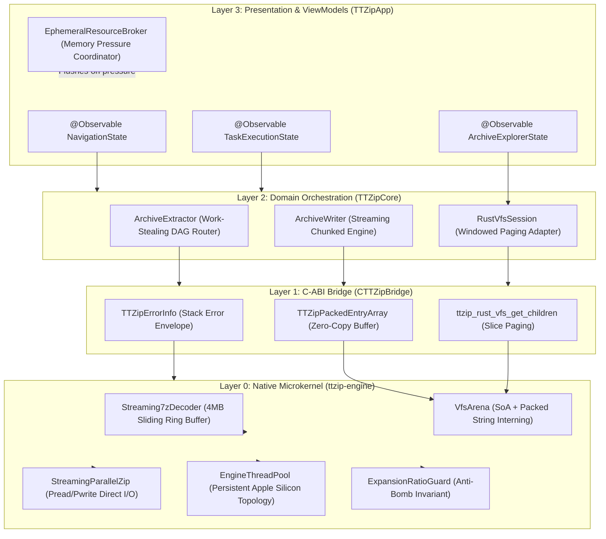

# Implementation Plan: Full Architectural Audit, Defect Analysis, and Paradigm Evolution

- **Feature ID**: `004-architecture-audit-and-paradigm-evolution`
- **Pipeline Mode**: `[Full SDD]`
- **Status**: `PLANNED`
- **Created**: 2026-08-24
- **Target Subsystems**: `ttzip-engine` (Rust Core), `CTTZipBridge` (C-ABI Layer), `TTZipCore` (Swift 6 SDK), `TTZipApp` (SwiftUI / AppKit Presentation Layer), `CI/CD Quality Gates`

---

## 1. Technical Context & Subsystem Architecture

---

## 2. User Review Required & Critical Architectural Decisions

> [!IMPORTANT]
> **Single Source of Truth VFS Migration**: Swift `ArchiveTreeNode` and `ArchiveTreeStore` are completely deprecated. The Rust `VfsArena` becomes the sole authoritative tree index, queried on-demand by Swift UI via windowed slice paging.

> [!IMPORTANT]
> **$O(1)$ Bounded-Memory Guarantee**: Solid 7z decoding and large-file ZIP compression MUST NOT allocate full uncompressed payloads into RAM. Peak process RSS is strictly bounded to $\le 64\text{MB}$ regardless of archive size.

> [!TIP]
> **Persistent Engine Thread Pool**: All parallel operations utilize a long-lived `EngineThreadPool` matching Apple Silicon P-core/E-core asymmetric counts, eliminating per-task `rayon::ThreadPoolBuilder` creation overhead.

---

## 3. Five-Phase Implementation Roadmap

### Phase 1: Engine Bounded Streaming & Anti-Bomb Hardening (FR-01, FR-02, FR-15)
- [ ] Refactor `sevenz/decoder/payload.rs` and `archive.rs` into a 4MB sliding window streaming decoder writing directly to target file descriptors.
- [ ] Refactor `zip/writer/streaming_parallel.rs:322` to replace `fs::read` with 1MB chunked `pread` streams.
- [ ] Implement `ExpansionRatioGuard` in the decompression filter pipeline to abort zip bombs ($>1000:1$ ratio).

### Phase 2: Work-Stealing Parallel Extraction DAG & Persistent Thread Pool (FR-03, FR-04, FR-05)
- [ ] Implement `EngineThreadPool` singleton in `core/rust/ttzip-engine/src/platform/` with Apple Silicon P-core sensing.
- [ ] Implement `ExtractionTaskDAG` in `archive/unified/extract.rs` to parallelize non-solid archive decompression across worker threads using `pread` and `pwrite`.
- [ ] Remove per-call `rayon::ThreadPoolBuilder` instances in `zip/reader.rs` and `archive/tar/reader.rs`.

### Phase 3: Flat Arena VFS Index & PackedStringArray C-ABI (FR-06, FR-07, FR-08, FR-10)
- [ ] Implement `VfsArena` (Struct-of-Arrays) and string interning pool in `fs/vfs/arena.rs`.
- [ ] Implement $O(N)$ hash-indexed builder replacing `position` scans in `fs/vfs/tree.rs`.
- [ ] Export `TTZipPackedEntryArray` and windowed paging C-ABI (`ttzip_rust_vfs_get_children`) in `ttzip_rust_glue.h`.
- [ ] Refactor `RustVfsSession.swift` to pass packed byte buffers, eliminating all `strdup`/`free` calls.

### Phase 4: Swift 6 Modernized Observation & Unified Resource Broker (FR-11, FR-12, FR-13, FR-14)
- [ ] Migrate `AppViewState` sub-states (`NavigationState`, `TaskExecutionState`, `ArchiveExplorerState`, `OverlayState`) to Swift 6 `@Observable`.
- [ ] Remove all redundant `await MainActor.run` hops in `AppViewState+ArchiveOperations.swift`.
- [ ] Implement `EphemeralResourceBroker` actor unifying thumbnail, preview, and metadata caching with `DISPATCH_SOURCE_TYPE_MEMORYPRESSURE` listeners.
- [ ] Deprecate `ArchiveTreeStore` and bind `NSOutlineView` / SwiftUI browser directly to `RustVfsSession` paging slices.

### Phase 5: Testing Invariants, Sanitizers & Release CI Governance (FR-16 to FR-20)
- [ ] Add RSS sampling invariant test for 20GB+ virtual sparse solid 7z archives ($\le 64\text{MB}$ RSS threshold).
- [ ] Add `TrackingAllocator` zero-heap-allocation assertions to VFS interactive search tests.
- [ ] Verify clean test execution under ASan, TSan, and UBSan configurations.
- [ ] Run statistical A/B benchmarking verifying zero performance regressions.

---

## 4. Verification & Validation Matrix

| Subsystem | Target Invariant | Metric / Acceptance Threshold | Verification Command |
|---|---|---|---|
| **7z Solid Engine** | Bounded RSS | $\text{Peak RSS} \le 64\text{MB}$ | `cargo test -p ttzip-engine --test extract_single_mmap_bounded_memory` |
| **VFS Index** | $O(N)$ Build Time | $<30\text{ms}$ for $100,000$ entries | `cargo test -p ttzip-engine --test zero_alloc_vfs_search_test` |
| **Parallel Extractor** | Multi-Core Scaling | $\ge 3.5\times$ speedup on 8 cores | `cargo test -p ttzip-engine --test standards_integration_tests` |
| **C-ABI Bridge** | Zero `strdup` Allocations | 0 heap allocs during FFI batch transfer | `swift test --filter ZeroAllocVfsBridgeTests` |
| **Memory Broker** | Eviction Latency | $\le 50\text{ms}$ under memory pressure | `swift test --filter EphemeralResourceBrokerTests` |
| **Contracts** | Schema Compliance | 100% pass on all 4 contracts | `bash .specify/scripts/bash/lint-contracts.sh specs/004-architecture-audit-and-paradigm-evolution/contracts` |
