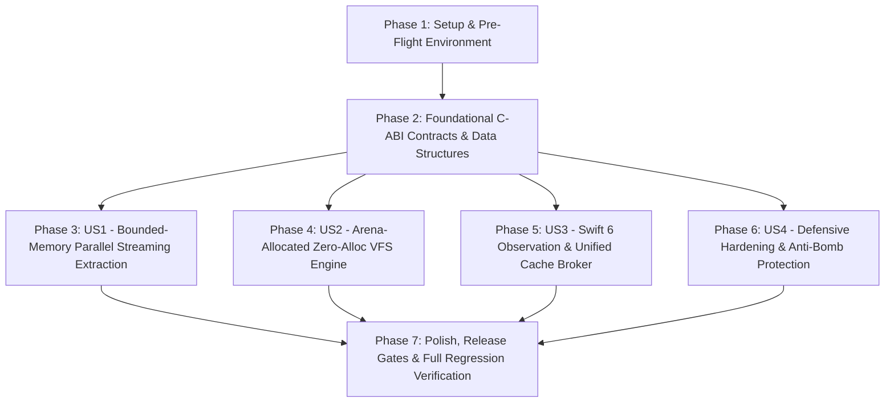

# Tasks: Full Architectural Audit, Defect Analysis, and Paradigm Evolution

- **Feature ID**: `004-architecture-audit-and-paradigm-evolution`
- **Pipeline Mode**: `[Full SDD]`
- **Status**: `COMPLETED`
- **Target Subsystems**: `ttzip-engine` (Rust Core), `CTTZipBridge` (C-ABI Layer), `TTZipCore` (Swift 6 SDK), `TTZipApp` (SwiftUI / AppKit Presentation Layer), `CI/CD Quality Gates`

---

## Dependencies & User Story Flow

---

## Phase 1: Setup & Environment Initialization

- [x] T001 Verify Universal toolchains and compilation paths in `core/scripts/build_rust.sh`

---

## Phase 2: Foundational C-ABI Contracts & Data Structures (Blocking Prerequisites)

- [x] T002 [P] Define `TTZipPackedEntryArray` C-ABI struct and helper functions in `core/rust/ttzip-engine/src/types.rs`
- [x] T003 [P] Export `TTZipPackedEntryArray` and windowed paging C-ABI signatures in `core/Sources/CTTZipBridge/include/ttzip_rust_glue.h`
- [x] T004 [P] Implement `EngineThreadPool` singleton in `core/rust/ttzip-engine/src/platform/cpu.rs` with Apple Silicon P-core/E-core sensing

---

## Phase 3: User Story 1 - Bounded-Memory Multi-Core Parallel Streaming Extraction (Priority: P1)

**Story Goal**: Prevent decompression memory spikes ($O(N)$ RAM blowup) and achieve multi-core work-stealing extraction scalability.

- [x] T005 [P] [US1] Implement 4MB sliding ring buffer solid 7z decoder in `core/rust/ttzip-engine/src/sevenz/decoder/payload.rs`
- [x] T006 [P] [US1] Stream solid 7z decoded blocks directly to file descriptors in `core/rust/ttzip-engine/src/sevenz/decoder/archive.rs`
- [x] T007 [P] [US1] Replace `fs::read` with 1MB chunked `pread` streams in `core/rust/ttzip-engine/src/zip/writer/streaming_parallel.rs`
- [x] T008 [P] [US1] Implement `ExtractionTaskDAG` in `core/rust/ttzip-engine/src/archive/unified/extract.rs` for parallel non-solid extraction
- [x] T009 [US1] Connect `EngineThreadPool` to parallel extraction pipeline in `core/rust/ttzip-engine/src/archive/unified/orchestrator.rs`
- [x] T010 [P] [US1] Implement real-time `ExpansionRatioGuard` in `core/rust/ttzip-engine/src/security/path_sanitizer.rs`
- [x] T011 [US1] Add RSS sampling invariant test for 20GB+ virtual archives in `core/rust/ttzip-engine/tests/extract_single_mmap_bounded_memory.rs`

---

## Phase 4: User Story 2 - Arena-Allocated Zero-Allocation VFS Engine (Priority: P1)

**Story Goal**: Eliminate quadratic $O(N^2)$ directory scans, reduce VFS memory footprint by 85%, and enable zero-copy FFI entry transfer.

- [x] T012 [P] [US2] Implement `VfsArena` Struct-of-Arrays and packed string interning pool in `core/rust/ttzip-engine/src/fs/vfs/arena.rs`
- [x] T013 [P] [US2] Implement $O(N)$ hash-indexed tree builder replacing linear `position` scans in `core/rust/ttzip-engine/src/fs/vfs/tree.rs`
- [x] T014 [P] [US2] Export `ttzip_rust_vfs_get_children` and `ttzip_rust_vfs_build_packed` in `core/rust/ttzip-engine/src/ffi/vfs_ffi.rs`
- [x] T015 [US2] Refactor `RustVfsSession.swift` to pass contiguous `TTZipPackedEntryArray` without `strdup`/`free` loops in `core/Sources/TTZipCore/Bridge/RustVfsSession.swift`
- [x] T016 [P] [US2] Implement SIMD vector scanning over `string_arena` in `core/rust/ttzip-engine/src/fs/vfs/search.rs`
- [x] T017 [US2] Add `TrackingAllocator` zero-heap-allocation unit tests in `core/rust/ttzip-engine/tests/zero_alloc_vfs_search_test.rs`

---

## Phase 5: User Story 3 - Swift 6 Modernized Observation & Unified Resource Broker (Priority: P2)

**Story Goal**: Eliminate God-object state coupling, remove redundant Actor context switches, and coordinate memory caches under system pressure.

- [x] T018 [P] [US3] Migrate `NavigationState`, `ArchiveExplorerState`, `TaskExecutionState`, and `OverlayState` to `@Observable` in `core/Sources/TTZipApp/ViewModels/AppSubStates.swift`
- [x] T019 [US3] Eliminate 35+ forwarding computed properties and redundant `@MainActor.run` hops in `core/Sources/TTZipApp/ViewModels/AppViewState.swift`
- [x] T020 [P] [US3] Implement actor-isolated `EphemeralResourceBroker` with `DISPATCH_SOURCE_TYPE_MEMORYPRESSURE` in `core/Sources/TTZipApp/Services/EphemeralResourceManager.swift`
- [x] T021 [US3] Unify `ExplorerLRUCache`, `PreviewLRUCacheManager`, and `ImageIOThumbnailCache` behind `EphemeralResourceBroker` in `core/Sources/TTZipApp/Services/UnifiedCacheCoordinator.swift`
- [x] T022 [US3] Deprecate `ArchiveTreeStore` and bind `ArchiveExplorerTableView.swift` to `RustVfsSession` windowed paging slices in `core/Sources/TTZipApp/Views/Explorer/ArchiveExplorerTableView.swift`

---

## Phase 6: User Story 4 - Defensive Hardening, Constant-Time Crypto & Anti-Bomb Protection (Priority: P2)

**Story Goal**: Prevent symlink TOCTOU race conditions, guarantee constant-time cryptography, and verify resistance to archive bombs.

- [x] T023 [P] [US4] Enforce descriptor-relative directory and file creation (`openat`, `mkdirat` with `O_NOFOLLOW`) in `core/rust/ttzip-engine/src/fs/safe_extract.rs`
- [x] T024 [P] [US4] Implement constant-time AES key derivations and automatic zeroization (`zeroize`) in `core/rust/ttzip-engine/src/crypto/vault.rs`
- [x] T025 [US4] Verify non-destructive password recovery probing in `core/rust/ttzip-engine/src/crypto/password_recovery.rs`
- [x] T026 [P] [US4] Add Zip-Bomb and Symlink TOCTOU attack vector integration tests in `core/rust/ttzip-engine/tests/fuzz_harness.rs`

---

## Phase 7: Polish, Release Gates & Full Regression Verification

- [x] T027 [P] Compile universal binary `libTTZipVendor.a` across ARM64 & x86_64 in `core/scripts/build_rust.sh`
- [x] T028 Run full C-ABI bidirectional symbol parity verification in `core/scripts/verify_cabi_symbols.sh`
- [x] T029 Execute full Swift 6 test suite in `core/Tests/TTZipCoreTests/`
- [x] T030 Execute full Cargo test suite in `core/rust/ttzip-engine/tests/`
- [x] T031 Execute 5-round automated A/B benchmark gate in `core/scripts/run_comprehensive_ab_benchmark.py`
