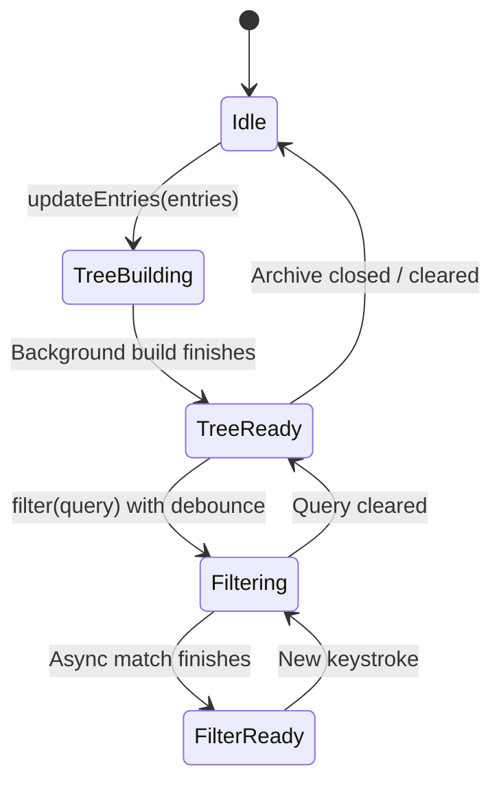

# Data Model & Architecture Entities: 前端性能深度优化

**Feature**: `004-frontend-perf-optimization`
**Date**: 2026-08-15
**Status**: Ready

## 1. Core Data Entities & Stores

### 1.1 `ArchiveTreeStore`
负责归档包内部层级目录树的异步构建、缓存与状态持有。

```swift
@MainActor
public final class ArchiveTreeStore: ObservableObject {
    @Published public private(set) var rootNodes: [ArchiveTreeNode] = []
    @Published public private(set) var isBuildingTree: Bool = false
    @Published public private(set) var filteredEntries: [ArchiveEntry] = []
    @Published public private(set) var isFiltering: Bool = false
    
    private var cachedSourceEntries: [ArchiveEntry] = []
    private var activeBuildTask: Task<[ArchiveTreeNode], Never>?
    private var activeFilterTask: Task<[ArchiveEntry], Never>?
    
    public init() {}
    
    public func updateEntries(_ entries: [ArchiveEntry]) async
    public func filter(query: String) async
    public func clear()
}
```

### 1.2 `ThrottledProgressPublisher`
负责高频任务进度通知的时间戳节流门控。

```swift
public final class ThrottledProgressPublisher: @unchecked Sendable {
    private let intervalNanoseconds: UInt64
    private let lock = NSLock()
    private var lastEmittedTimestamp: UInt64 = 0
    
    public init(maxFrequencyHz: Double = 60.0)
    public func shouldEmit(now: UInt64 = DispatchTime.now().uptimeNanoseconds) -> Bool
}
```

### 1.3 `ExplorerLRUCache<Key: Hashable, Value>`
有界、线程安全的 LRU 缓存，用于 Miller Column 磁盘扫描项。

```swift
public final class ExplorerLRUCache<Key: Hashable & Sendable, Value: Sendable>: @unchecked Sendable {
    private let capacity: Int
    private var cache: [Key: Value] = [:]
    private var order: [Key] = []
    private let lock = NSLock()
    
    public init(capacity: Int = 64)
    public func get(_ key: Key) -> Value?
    public func set(_ key: Key, value: Value)
    public func removeAll()
}
```

---

## 2. State Lifecycle & Transitions


