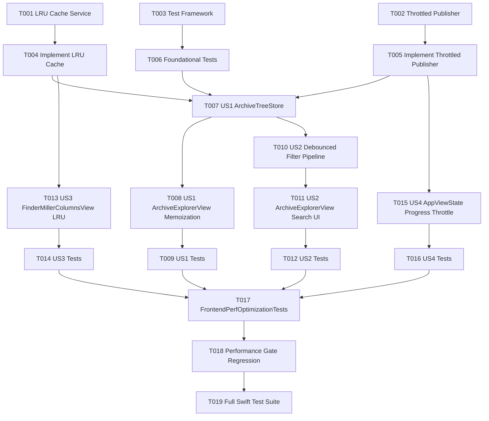

# Tasks: 前端性能深度优化 (Frontend Performance Optimization)

**Feature**: `004-frontend-perf-optimization`
**Date**: 2026-08-15
**Spec**: [spec.md](file:///Users/kevintung/Documents/dev/TTZip/specs/004-frontend-perf-optimization/spec.md) | **Plan**: [plan.md](file:///Users/kevintung/Documents/dev/TTZip/specs/004-frontend-perf-optimization/plan.md)

---

## Phase 1: Setup (Shared Infrastructure)

**Purpose**: 准备前端性能优化所需的基础服务文件与测试框架

- [x] T001 [P] 创建 LRU 缓存服务文件 `Sources/TTZipApp/Services/ExplorerLRUCache.swift`
- [x] T002 [P] 创建高频事件与进度节流调度器 `Sources/TTZipApp/Services/ThrottledProgressPublisher.swift`
- [x] T003 [P] 创建测试套件框架 `Tests/TTZipTests/FrontendPerfOptimizationTests.swift`

---

## Phase 2: Foundational (Blocking Prerequisites)

**Purpose**: 实现通用性能调度基础模块（LRU 缓存与 60Hz 门控调度器）

- [x] T004 实现 `ExplorerLRUCache` 泛型线程安全容器及容量淘汰算法在 `Sources/TTZipApp/Services/ExplorerLRUCache.swift`
- [x] T005 实现 `ThrottledProgressPublisher` 毫秒级单调时间戳门控在 `Sources/TTZipApp/Services/ThrottledProgressPublisher.swift`
- [x] T006 [P] 在 `Tests/TTZipTests/FrontendPerfOptimizationTests.swift` 中编写 `ExplorerLRUCacheTests` 与 `ThrottledProgressPublisherTests` 单元测试

**Checkpoint**: 基础通用组件就绪且通过单元测试，可并行推进各用户故事实现。

---

## Phase 3: User Story 1 - 超大归档包瞬间加载与流畅浏览 (Priority: P1) 🎯 MVP

**Goal**: 消除 `ArchiveExplorerView` 渲染期间对整棵目录树的重复同步计算，实现后台异步构建与 Memoization。

**Independent Test**: 打开包含 50,000 个条目的归档包，首屏 Native Outline View 秒级就绪，滚动/折叠/点击选择耗时 <= 8ms。

- [x] T007 [P] [US1] 实现 `ArchiveTreeStore` 状态容器与异步后台树构建逻辑在 `Sources/TTZipApp/ViewModels/ArchiveTreeStore.swift`
- [x] T008 [US1] 重构 `Sources/TTZipApp/Views/ArchiveExplorerView.swift`，移除 computed property `rootTreeNodes` 的重复计算，绑定至 `ArchiveTreeStore`
- [x] T009 [P] [US1] 编写目录树异步构建与 Memoization 测试用例在 `Tests/TTZipTests/FrontendPerfOptimizationTests.swift`

**Checkpoint**: User Story 1 独立可用，50k 条目归档首屏秒开且视图重绘零多余开销。

---

## Phase 4: User Story 2 - 海量条目搜索与实时过滤零延迟 (Priority: P2)

**Goal**: 归档内搜索引入 100ms 防抖与后台 Task 异步匹配，输入框连续打字保持 60/120 FPS 丝滑响应。

**Independent Test**: 在 20,000 条目的归档中快速连续键入长字符串，无按键吞字或界面掉帧。

- [x] T010 [US2] 在 `Sources/TTZipApp/ViewModels/ArchiveTreeStore.swift` 中实现带防抖与 Task 协作取消的 `filter(query:)` 异步搜索管线
- [x] T011 [US2] 重构 `Sources/TTZipApp/Views/ArchiveExplorerView.swift` 搜索结果呈现，接入 `ArchiveTreeStore.filteredEntries`
- [x] T012 [P] [US2] 编写搜索防抖与并发取消测试用例在 `Tests/TTZipTests/FrontendPerfOptimizationTests.swift`

**Checkpoint**: User Story 2 独立可用，海量条目搜索无任何主线程卡顿。

---

## Phase 5: User Story 3 - 多列分栏 (Miller Columns) 磁盘浏览与预加载 (Priority: P3)

**Goal**: 分栏文件浏览器接入有界 LRU 缓存与后台异步排序，消灭主线程 I/O 与无界内存膨胀。

**Independent Test**: 在层级深度 > 5 且单目录包含 5,000 个文件的目录间快速切换，命中缓存时 0ms 呈现。

- [x] T013 [US3] 重构 `Sources/TTZipApp/Views/Explorer/FinderMillerColumnsView.swift`，将无界 `cachedColumnItems` 替换为 `ExplorerLRUCache`，并将排序逻辑彻底异步化
- [x] T014 [P] [US3] 编写分栏 LRU 缓存与异步扫描测试用例在 `Tests/TTZipTests/FrontendPerfOptimizationTests.swift`

**Checkpoint**: User Story 3 独立可用，分栏浏览横向滑动与层级穿透极致轻快。

---

## Phase 6: User Story 4 - 高频任务进度与事件流驱动下的 UI 解耦 (Priority: P4)

**Goal**: 引擎高频进度推送与 `@MainActor` UI 渲染解耦，限制主线程刷新频率在 <= 60Hz。

**Independent Test**: 运行 500 个小文件极速压缩/解压，监测主线程 UI 帧率 > 55 FPS 且 CPU 占用下降 >= 50%。

- [x] T015 [US4] 在 `Sources/TTZipApp/ViewModels/AppViewState.swift` 中接入 `ThrottledProgressPublisher` 门控调度，防止高频更新冲击 RunLoop
- [x] T016 [P] [US4] 编写高频进度节流模拟测试在 `Tests/TTZipTests/FrontendPerfOptimizationTests.swift`

**Checkpoint**: User Story 4 独立可用，极速压缩任务下主界面依然保持丝滑交互。

---

## Phase 7: Polish & Validation

**Purpose**: 全量自动化单测回归与性能门禁校验

- [x] T017 [P] 运行全量 `FrontendPerfOptimizationTests` 测试套件：`swift test --filter FrontendPerfOptimizationTests`
- [x] T018 运行核心性能门禁测试：`swift test --filter XCTestPerformanceMeasureTests`，验证吞吐底线全部达标
- [x] T019 运行全量回归测试：`swift test` (525+ tests 必须 100% 通过)

---

## Dependencies & Execution Order

