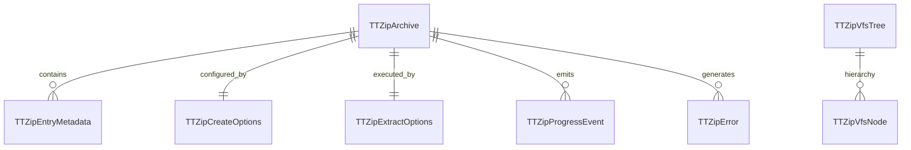
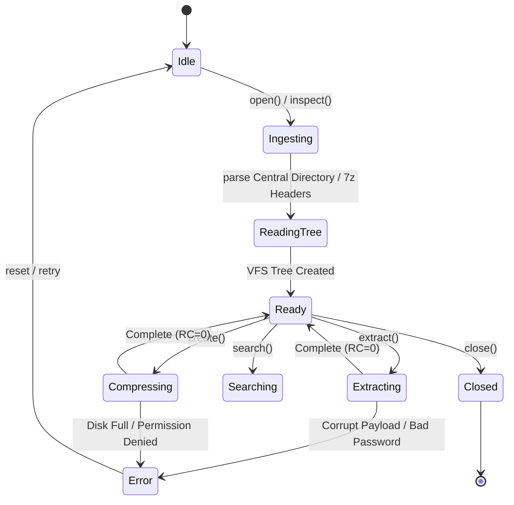

# Data Model Specification: TTZip CLI & Full Multi-Language SDK Architectural Evolution

- **Feature ID**: `005-cli-and-multi-language-sdk-architecture-evolution`
- **Pipeline Mode**: `[Full SDD]`
- **Status**: `DESIGNED`
- **Created**: 2026-08-24

---

## 1. Domain Entities & Memory Layouts

### 1.1 Canonical C-ABI 2.0 Core Entities

#### `TTZipError` (Thread-Safe Diagnostic Out-Pointer Envelope)
- **Memory Contract**: Allocated by Rust on failure; owned by caller and freed via `ttzip_free(error, TTZIP_MEM_ERROR)`.
- **Fields**:
  - `uint32_t struct_size`: Header validation (must match `sizeof(TTZipError)`).
  - `uint32_t abi_version`: Version identifier (must match `TTZIP_ABI_VERSION_2`).
  - `int32_t status_code`: Canonical numeric status code (e.g. `TTZIP_STATUS_OK = 0`, `TTZIP_STATUS_ERR_INVALID_PARAM = -1`).
  - `int32_t system_errno`: OS-level errno (e.g. `ENOENT`, `EACCES`, `ENOSPC`).
  - `uint64_t byte_offset`: Stream offset where corruption or EOF occurred.
  - `char entry_path[256]`: UTF-8 null-terminated relative archive entry path.
  - `char message[512]`: UTF-8 null-terminated human-readable diagnostic message.

#### `TTZipBufferRef` (Zero-Copy Read-Only View)
- **Fields**:
  - `const uint8_t *data`: Pointer to contiguous memory byte slice.
  - `size_t len`: Length in bytes.

#### `TTZipBufferMut` (Zero-Copy Mutable View)
- **Fields**:
  - `uint8_t *data`: Pointer to mutable memory byte slice.
  - `size_t len`: Currently populated length in bytes.
  - `size_t capacity`: Total allocated capacity in bytes.

#### `TTZipEntryMetadata` (Archive Entry Descriptor)
- **Fields**:
  - `const char *path`: UTF-8 relative path inside archive.
  - `uint64_t uncompressed_size`: Original uncompressed payload size in bytes.
  - `uint64_t compressed_size`: Compressed payload size in bytes.
  - `uint32_t crc32`: Standard IEEE 802.3 CRC-32 checksum.
  - `int64_t mtime_epoch_secs`: Modification time in seconds since Unix epoch.
  - `uint32_t mode`: POSIX file mode and permissions (e.g. `0644`, `0755`).
  - `bool is_directory`: True if directory entry.
  - `bool is_encrypted`: True if payload block is encrypted with password.
  - `uint16_t compression_method`: Numeric ID of compression codec (0=Store, 1=Deflate, 2=Brotli, 3=Zstd, 4=Snappy, 5=LZMA2, 6=LZFSE).
  - `const char *detected_encoding`: Encoding descriptor (e.g. `"UTF-8"`, `"CP437"`, `"Shift_JIS"`).

#### `TTZipCreateOptions` (Archive Packaging Parameters)
- **Fields**:
  - `uint32_t struct_size`: `sizeof(TTZipCreateOptions)`.
  - `uint32_t abi_version`: `TTZIP_ABI_VERSION_2`.
  - `int32_t format`: Target container format (1=ZIP, 2=7Z, 3=TAR, 4=TAR.GZ, 5=TAR.BZ2, 6=TAR.XZ, 7=TAR.ZST, 8=TAR.BR, 9=SNAPPY).
  - `int32_t level`: Compression level (0=Store, 1=Fastest, 3=Fast, 6=Normal, 9=Maximum, 12=Ultra).
  - `int32_t encryption`: Encryption algorithm (0=None, 1=ZipCrypto, 2=AES128, 4=AES256).
  - `const char *password`: UTF-8 null-terminated password string (or NULL).
  - `uint32_t thread_budget`: Worker thread count (0 = auto-detect Apple Silicon P-cores).
  - `uint32_t solid_block_size_mb`: Block size for 7z solid archiving (0 = standard 64MB).
  - `TTZipProgressCallback progress_callback`: Function pointer for progress telemetry.
  - `void *user_data`: Context pointer passed back into progress callback.

#### `TTZipExtractOptions` (Archive Unpacking Parameters)
- **Fields**:
  - `uint32_t struct_size`: `sizeof(TTZipExtractOptions)`.
  - `uint32_t abi_version`: `TTZIP_ABI_VERSION_2`.
  - `const char *destination_path`: Target filesystem directory path.
  - `const char *password`: Decryption password (or NULL).
  - `uint32_t thread_budget`: Worker thread budget.
  - `bool overwrite_existing`: Overwrite target files without prompting.
  - `bool preserve_permissions`: Restore POSIX permissions from archive.
  - `bool dry_run`: Test decompression and verify checksums without writing to disk.
  - `TTZipProgressCallback progress_callback`: Progress callback function pointer.
  - `void *user_data`: Context pointer for callback.

---

## 2. Multi-Language SDK Idiomatic Representations

| Language | Entry Representation | Progress Stream | Memory Management |
| :--- | :--- | :--- | :--- |
| **Swift 6** | `public struct ArchiveEntry: Sendable, Identifiable` | `AsyncStream<ArchiveProgress>` | `~Copyable PageBuffer` + Swift ARC |
| **Rust** | `pub struct ArchiveEntry` | `tokio::sync::mpsc::Receiver<Progress>` / Callback | RAII (Deterministic Drop) |
| **Python** | `class ZipInfo` / `class ArchiveEntry` | Generator / Callback | Python GC + PyBuffer Protocol |
| **Java 22+** | `public record EntryInfo(...)` | `Flow.Publisher<ArchiveProgress>` | `java.lang.foreign.Arena` (Confined) |
| **Dart** | `class TTZipEntry` | `Stream<ArchiveProgress>` | `ffi.Arena` + Finalizer |
| **C# .NET** | `public readonly record struct EntryInfo(...)` | `IAsyncEnumerable<ArchiveProgress>` | `SafeHandleZeroAlloc` + GC Pinning |
| **C++20** | `struct EntryMetadata` | `std::function<bool(Progress)>` | `std::unique_ptr<T, TTZipDeleter>` |
| **Go** | `type zipFileInfo struct` (`io/fs.FileInfo`) | `chan<- Progress` | Finalizer + Go GC |

---

## 3. State Machine & Lifecycle Transitions

