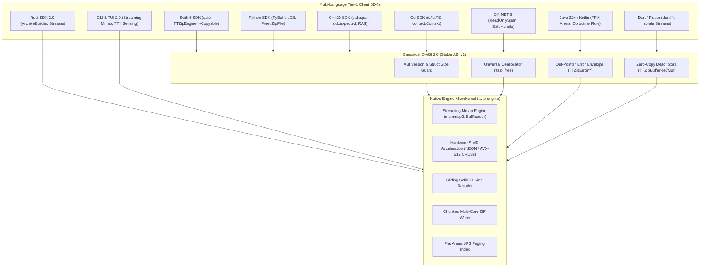

# Implementation Plan: TTZip CLI & Full Multi-Language SDK Architectural Evolution

- **Feature ID**: `005-cli-and-multi-language-sdk-architecture-evolution`
- **Pipeline Mode**: `[Full SDD]`
- **Status**: `PLANNED`
- **Created**: 2026-08-24
- **Target Subsystems**:
  - `ttzip-engine` (Rust Core Microkernel & Pure Rust Public SDK)
  - `ttzip-cabi` / `CTTZipBridge` (Canonical C-ABI 2.0 & Memory Contract)
  - `ttzip-tui` (Standalone Native Streaming CLI & Ratatui Interactive TUI)
  - `TTZipCore` (Swift 6 Strict Concurrency Actor-First SDK)
  - `ttzip-python` (PyO3 Zero-Copy Buffer Protocol & GIL-Free Python SDK)
  - **Multi-Language Tier-1 SDKs**: C++20 (`ttzip-cpp`), Go (`ttzip-go`), C#/.NET 8+ (`ttzip-dotnet`), Java 22+/Kotlin (`ttzip-jvm`), Dart/Flutter (`ttzip-dart`)

---

## 1. Technical Context & Multi-Tier Architecture

---

## 2. User Review Required & Critical Architectural Decisions

> [!IMPORTANT]
> **Zero-Subprocess Multi-Language Policy**: Shelling out to `ProcessBuilder` or `Process.run` in SDKs is strictly prohibited. Java/Kotlin uses Java 22+ FFM API (`Arena`, `MemorySegment`); Dart/Flutter uses `dart:ffi` in background `Isolate`s. CI gates will enforce zero child processes.

> [!IMPORTANT]
> **$O(1)$ Bounded Memory Redline**: `fs::read` on entire archives is abolished. Memory mapping (`memmap2`) and fixed 64KB/128KB chunk streams bound peak process RSS to $\le 64\text{MB}$ across all CLI commands and SDK operations regardless of archive file size (validated up to 50GB).

> [!IMPORTANT]
> **Canonical C-ABI 2.0 & Zero-TLS Error Model**: Thread-local error storage is replaced by explicit out-pointer error descriptors (`TTZipError **out_error`), eliminating cross-thread dangling pointers and UAFs. All 8 legacy free routines are unified under `ttzip_free(void *ptr, TTZipMemoryKind kind)`.

> [!TIP]
> **Swift 6 Strict Actor SDK 2.0**: The 4 competing abstraction tiers (Facade, Command, Pipeline, Implementor) are flattened into a single, clean `public actor TTZipEngine` accompanied by immutable `TTZipArchive` structs and `~Copyable` PageBuffers, achieving 0 `@unchecked Sendable` bypasses.

---

## 3. Six-Phase Implementation Roadmap

### Phase 1: Canonical C-ABI 2.0 & Memory Microkernel Core (FR-01, FR-10 to FR-14, FR-22 to FR-24)
- [ ] Implement `ttzip_free(void *ptr, TTZipMemoryKind kind)` in `core/rust/ttzip-engine/src/ffi/memory_ffi.rs`, deprecating 8 fragmented deallocators.
- [ ] Implement `TTZipError` out-pointer error generation in `core/rust/ttzip-engine/src/types.rs`, removing thread-local storage raw pointer returns.
- [ ] Add `uint32_t struct_size` and `uint32_t abi_version` validation headers across all C-ABI structs.
- [ ] Export `TTZipBufferRef` and `TTZipBufferMut` zero-copy descriptors in `ttzip_rust_glue.h`.
- [ ] Decouple pure Rust `ArchiveBuilder`, `ExtractBuilder`, and `ArchiveReader` from C-ABI structs in `ttzip-engine`.
- [ ] Refactor single-entry extraction (`ffi/archive_ffi/extract.rs:322`) to use `memmap2::MmapOptions` instead of `fs::read`.

### Phase 2: CLI 2.0 & Interactive TUI Overhaul (FR-01 to FR-09)
- [ ] Replace `fs::read` with `BufReader` chunking in `hash.rs:26` and `memmap2::Mmap` in `format.rs:77`, `extract.rs:40`, `state.rs:59`.
- [ ] Replace raw byte string slicing with Unicode character boundary slicing in `list.rs:96`.
- [ ] Rewrite `tree.rs:56-72` to recursively traverse `VfsTree` with an ancestor boolean stack.
- [ ] Implement full payload decompression and CRC32 verification passes in `check.rs` (`--deep`).
- [ ] Implement true ZIP EOCD comment manipulation in `comment.rs` and macOS `chflags uchg` / POSIX `chmod` in `lock.rs`.
- [ ] Align `doctor.rs` supported formats list strictly with engine capabilities.
- [ ] Refactor `bench.rs` to measure live in-memory codec throughput over standard test buffers.
- [ ] Convert TUI event loop (`event.rs:105`) to event-driven blocking with dirty-flag conditional rendering and viewport row windowing in `explorer.rs:37`.
- [ ] Add TTY detection (`is_terminal()`), CLI flags (`--dry-run`, `--include`, `--exclude`), shell completion generator (`ttzip completions [bash|zsh|fish]`), and isolated pure JSON output in `--format json` mode.

### Phase 3: Swift 6 SDK 2.0 Actor Architecture (FR-15 to FR-21)
- [ ] Fix infinite recursion in `ArchiveProtocols.swift:503-549` using non-recursive `ArchiveWriteRequest` overloads.
- [ ] Fix telemetry semantic bug in `TTZipEngineFacade.swift:609-611` to report `durationSeconds` accurately.
- [ ] Implement `OSAllocatedUnfairLock` atomic cancellation flags in `NativeComputeDispatcher.swift:58`.
- [ ] Replace `CommandHistoryManager` task linked-list chaining with a native Swift 6 `actor` serial executor.
- [ ] Refactor `ArchiveTreeNode` into an immutable value-type tree (`ArchiveDirectoryNode`) and `ArchiveEntryMetadataPool` into an `actor`, eliminating 40+ `@unchecked Sendable` bypasses.
- [ ] Fix raw pointer UAF in `RustVfsSession.swift:180-204` by value-copying `VfsNodeSummary` structs across FFI.
- [ ] Fix buffer over-read in `TTZipErrorInfo+Extensions.swift:73-84` with bounded `UnsafeRawBufferPointer` decoding.
- [ ] Flatten the 4 competing abstraction tiers into `public actor TTZipEngine` and `public struct TTZipArchive`.

### Phase 4: Python SDK 2.0 PyO3 Zero-Copy & GIL-Free Architecture (FR-25 to FR-27)
- [ ] Wrap `compress_buffer` and `decompress_buffer` in `py.allow_threads(...)` in `core/rust/ttzip-python/src/lib.rs`.
- [ ] Implement streaming Zstandard decompression fallback for frames omitting uncompressed content size.
- [ ] Adopt standard RFC 8878 / LZ4 Frame specification in Python buffer codecs.
- [ ] Implement the Python Buffer Protocol (`PyBuffer<u8>`), zero-copy `memoryview` decompression, and `zipfile.ZipFile` compatibility classes.
- [ ] Generate comprehensive `.pyi` type stubs.

### Phase 5: Multi-Language Tier-1 SDK Ecosystem (FR-28 to FR-32)
- [ ] **Java 22+ / Kotlin (`ttzip-jvm`)**: Implement true Java FFM API bindings (`Arena.ofConfined()`, `MemorySegment`, `Linker`), eliminating `ProcessBuilder` and software CRC loops. Add Kotlin Coroutines & `Flow<ArchiveProgress>`.
- [ ] **Dart / Flutter (`ttzip-dart`)**: Implement real `dart:ffi` bindings with background `Isolate` compute runner and `Stream<ArchiveProgress>`, eliminating `Process.run`.
- [ ] **C# / .NET 8 (`TTZip.NET`)**: Implement `ReadOnlySpan<byte>`, `SafeHandleZeroAlloc`, UTF-8 native marshaling, and `IAsyncEnumerable<ArchiveProgress>`.
- [ ] **C++20 (`ttzip-cpp`)**: Implement official header-only RAII library `ttzip.hpp` with `std::span`, `std::expected`, and `std::filesystem::path`.
- [ ] **Go (`ttzip-go`)**: Implement CGO wrapper exposing `io/fs.FS` virtual filesystem and `context.Context` cancellation.

### Phase 6: Cross-Language CI/CD Testing Invariants, Sanitizers & Sandbox Gates
- [ ] Add 20GB+ large-file bounded memory test ($\le 64\text{MB}$ peak RSS).
- [ ] Add multibyte UTF-8 / CJK / Emoji filename test fixtures across all SDKs and CLI.
- [ ] Add clean sandbox CI test runner verifying Java and Dart SDKs execute with zero CLI binary dependencies.
- [ ] Verify 0 leaks and 0 data races under AddressSanitizer (ASan) and ThreadSanitizer (TSan).

---

## 4. Verification & Validation Matrix

| Subsystem | Target Invariant | Acceptance Threshold | Verification Command |
|---|---|---|---|
| **CLI 2.0 Streaming** | Bounded RSS Memory | $\text{Peak RSS} \le 64\text{MB}$ on 50GB file | `cargo test -p ttzip-tui --test streaming_io_bounded_rss` |
| **CLI 2.0 UTF-8** | Multibyte Safety | 0 panics on CJK / Emoji names | `cargo test -p ttzip-tui --test unicode_path_truncation` |
| **TUI 2.0 Idle Load** | Idle CPU & Allocs | $<0.1\%$ CPU, 0 heap allocs/sec | `cargo test -p ttzip-tui --test tui_event_loop_idle_budget` |
| **C-ABI 2.0** | Universal Memory Contract | 0 leaks, 0 mismatched frees | `cargo test -p ttzip-engine --test cabi_universal_free_asan` |
| **C-ABI 2.0 Errors** | Thread-Safe Error Out-Pointers | 0 dangling TLS pointers | `cargo test -p ttzip-engine --test cabi_thread_safe_error_diagnostics` |
| **Swift 6 SDK** | Concurrency Safety | 0 `@unchecked Sendable` warnings | `swift build -Xswiftc -strict-concurrency=complete` |
| **Swift 6 Recursion** | Protocol Call Stack Depth | 0 stack overflows | `swift test --filter ArchiveProtocolDefaultRecursionTests` |
| **Python SDK** | GIL-Free Multi-Threading | Linear speedup on 16 threads | `pytest core/rust/ttzip-python/tests/test_gil_free_parallel.py` |
| **Java 22+ SDK** | Zero-Subprocess FFM | 0 `ProcessBuilder` calls, 100% native FFM | `mvn -f core/sdk/jvm/pom.xml test` |
| **Dart / Flutter** | Zero-Subprocess FFI | 0 `Process.run` calls, 100% native FFI | `dart test core/sdk/dart/test/` |
| **Contracts** | Schema Compliance | 100% pass on all 4 contracts | `bash .specify/scripts/bash/lint-contracts.sh specs/005-cli-and-multi-language-sdk-architecture-evolution/contracts` |
