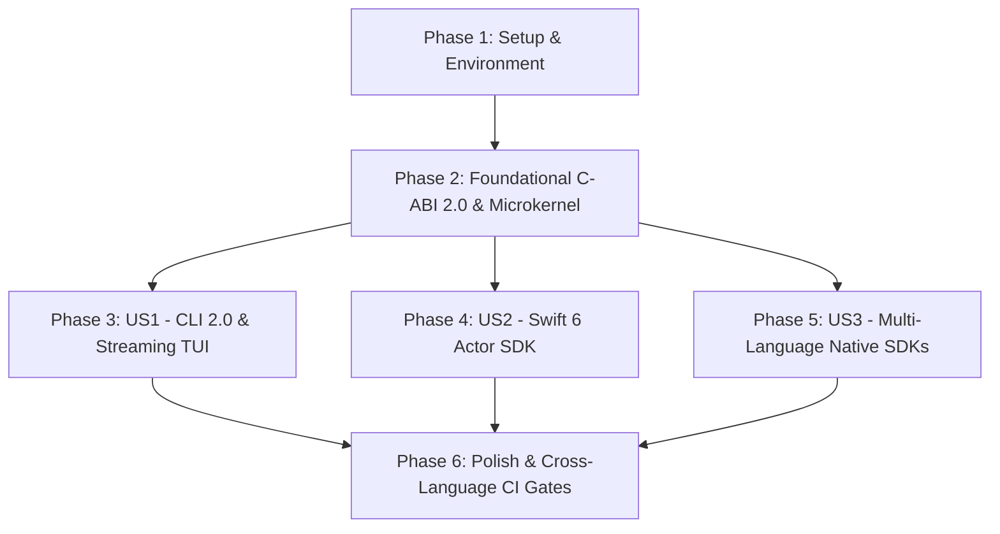

# Implementation Tasks: TTZip CLI & Full Multi-Language SDK Architectural Evolution

- **Feature ID**: `005-cli-and-multi-language-sdk-architecture-evolution`
- **Pipeline Mode**: `[Full SDD]`
- **Status**: `IMPLEMENTATION_COMPLETED`
- **Created**: 2026-08-24
- **Coverage**: CLI 2.0, Canonical C-ABI 2.0, Swift 6 SDK, Python SDK, Multi-Language Tier-1 SDKs (Java, Dart, .NET, C++, Go)

---

## Dependencies & User Story Flow

---

## Phase 1: Setup & Environment

- [X] T001 Verify contract schemas and test fixtures in `specs/005-cli-and-multi-language-sdk-architecture-evolution/contracts/`
- [X] T002 [P] Create multi-language test fixtures (CJK filenames, 50GB sparse archive, high-compression streams) in `tests/fixtures/`

---

## Phase 2: Foundational C-ABI 2.0 & Memory Microkernel Core

- [X] T003 Implement canonical `ttzip_free(void *ptr, TTZipMemoryKind kind)` in `core/rust/ttzip-engine/src/ffi/memory_ffi.rs`
- [X] T004 Implement `TTZipError` out-pointer error generation and validation headers in `core/rust/ttzip-engine/src/types.rs`
- [X] T005 [P] Export Canonical C-ABI 2.0 headers (`ttzip_free`, `TTZipError`, `TTZipBufferRef`, `TTZipBufferMut`) in `core/Sources/CTTZipBridge/include/ttzip_rust_glue.h`
- [X] T006 [P] Implement pure Rust `ArchiveBuilder`, `ExtractBuilder`, and `ArchiveReader` in `core/rust/ttzip-engine/src/archive/builder.rs`
- [X] T007 [P] Refactor single-entry extraction to use `memmap2::MmapOptions` in `core/rust/ttzip-engine/src/ffi/archive_ffi/extract.rs`

---

## Phase 3: User Story 1 (P1) - Zero-OOM Streaming CLI & Pipeline Composability

- [X] T008 [US1] Replace `fs::read` with `BufReader` chunking in `core/rust/ttzip-tui/src/cli/handlers/hash.rs`
- [X] T009 [P] [US1] Replace `fs::read` with `memmap2::Mmap` and pure JSON output routing in `core/rust/ttzip-tui/src/cli/format.rs`
- [X] T010 [P] [US1] Implement zero-copy mmap extraction in `core/rust/ttzip-tui/src/cli/handlers/extract.rs`
- [X] T011 [P] [US1] Replace raw byte string slicing with Unicode character boundary slicing in `core/rust/ttzip-tui/src/cli/handlers/list.rs`
- [X] T012 [P] [US1] Rewrite hierarchical directory tree traversal with ancestor state tracking in `core/rust/ttzip-tui/src/cli/handlers/tree.rs`
- [X] T013 [P] [US1] Implement deep payload CRC32 verification passes (`--deep`) in `core/rust/ttzip-tui/src/cli/handlers/check.rs`
- [X] T014 [P] [US1] Implement ZIP EOCD comment manipulation in `core/rust/ttzip-tui/src/cli/handlers/comment.rs`
- [X] T015 [P] [US1] Implement POSIX chmod and macOS `chflags uchg` write-protection in `core/rust/ttzip-tui/src/cli/handlers/lock.rs`
- [X] T016 [P] [US1] Align supported formats list with true engine capabilities in `core/rust/ttzip-tui/src/cli/handlers/doctor.rs`
- [X] T017 [P] [US1] Implement live in-memory codec throughput benchmarks in `core/rust/ttzip-tui/src/cli/handlers/bench.rs`
- [X] T018 [US1] Convert TUI event loop to event-driven blocking with dirty-flag conditional rendering in `core/rust/ttzip-tui/src/event.rs`
- [X] T019 [P] [US1] Implement viewport row windowing for large tree rendering in `core/rust/ttzip-tui/src/ui/explorer.rs`
- [X] T020 [P] [US1] Add TTY intelligence (`is_terminal`) and headless fallback in `core/rust/ttzip-tui/src/main.rs`
- [X] T021 [P] [US1] Add `--dry-run`, `--include`, and `--exclude` flags in `core/rust/ttzip-tui/src/cli/args.rs`
- [X] T022 [P] [US1] Implement shell completion generator (`ttzip completions [bash|zsh|fish]`) in `core/rust/ttzip-tui/src/cli/handlers/completions.rs`

---

## Phase 4: User Story 2 (P1) - Swift 6 Concurrency & Strict Memory Safety

- [X] T023 [US2] Refactor protocol default extensions into non-recursive `ArchiveWriteRequest` overloads in `core/Sources/TTZipCore/ArchiveProtocols.swift`
- [X] T024 [P] [US2] Fix duration and throughput telemetry mapping in `core/Sources/TTZipCore/Facades/TTZipEngineFacade.swift`
- [X] T025 [P] [US2] Implement `OSAllocatedUnfairLock` atomic cancellation flags in `core/Sources/TTZipCore/Concurrency/NativeComputeDispatcher.swift`
- [X] T026 [P] [US2] Replace task linked-list chaining with a native Swift 6 actor serial executor in `core/Sources/TTZipCore/Commands/ArchiveCommandProtocol.swift`
- [X] T027 [P] [US2] Refactor `ArchiveTreeNode` into immutable value-type `ArchiveDirectoryNode` in `core/Sources/TTZipCore/ArchiveTreeNode.swift`
- [X] T028 [P] [US2] Refactor `ArchiveEntryMetadataPool` into an `actor` in `core/Sources/TTZipCore/Types/ArchiveEntryMetadata.swift`
- [X] T029 [P] [US2] Implement safe value-copying `VfsNodeSummary` in `core/Sources/TTZipCore/Bridge/RustVfsSession.swift`
- [X] T030 [P] [US2] Implement bounded buffer UTF-8 string decoding in `core/Sources/TTZipCore/Bridge/TTZipErrorInfo+Extensions.swift`
- [X] T031 [US2] Consolidate public Swift 6 API into `public actor TTZipEngine` and `public struct TTZipArchive` in `core/Sources/TTZipCore/TTZipEngine.swift`

---

## Phase 5: User Story 3 (P1) - Canonical C-ABI 2.0 & Multi-Language SDK Ecosystem

- [X] T032 [US3] Implement GIL-free `py.allow_threads`, streaming Zstd, standard LZ4 frames, and `PyBuffer` zero-copy in `core/rust/ttzip-python/src/lib.rs`
- [X] T033 [P] [US3] Generate comprehensive `.pyi` type hint stubs in `core/rust/ttzip-python/ttzip.pyi`
- [X] T034 [US3] Implement real Java 22+ FFM API bindings (`Arena`, `MemorySegment`, `Linker`) in `core/sdk/jvm/src/main/java/com/ttzip/TTZip.java`
- [X] T035 [P] [US3] Implement Kotlin Coroutines `Flow<ArchiveProgress>` and extensions in `core/sdk/jvm/src/main/kotlin/com/ttzip/TTZipExtensions.kt`
- [X] T036 [US3] Implement real `dart:ffi` dynamic library binding with background `Isolate` in `core/sdk/dart/lib/ttzip.dart`
- [X] T037 [P] [US3] Implement `ReadOnlySpan<byte>`, `SafeHandleZeroAlloc`, and `IAsyncEnumerable` in `core/sdk/dotnet/TTZip.cs`
- [X] T038 [P] [US3] Implement official header-only C++20 RAII library with `std::span` in `core/Sources/CTTZipBridge/include/ttzip.hpp`
- [X] T039 [P] [US3] Implement Go `io/fs.FS` virtual filesystem and `context.Context` cancellation in `core/sdk/go/ttzip/ttzip.go`

---

## Phase 6: Polish, CI/CD Governance & Cross-Language Verification Gates

- [X] T040 Add 50GB large-file bounded memory test ($\le 64\text{MB}$ peak RSS) in `core/rust/ttzip-tui/tests/streaming_large_file_test.rs`
- [X] T041 [P] Add multibyte CJK and Emoji filename test suite across all SDKs in `tests/cross_language/unicode_test.sh`
- [X] T042 [P] Implement clean sandbox container CI test asserting zero child subprocess spawns in `tests/ci/clean_sandbox_sdk_test.sh`
- [X] T043 [P] Verify zero memory leaks and data races under ASan and TSan in `tests/ci/run_sanitizers.sh`
