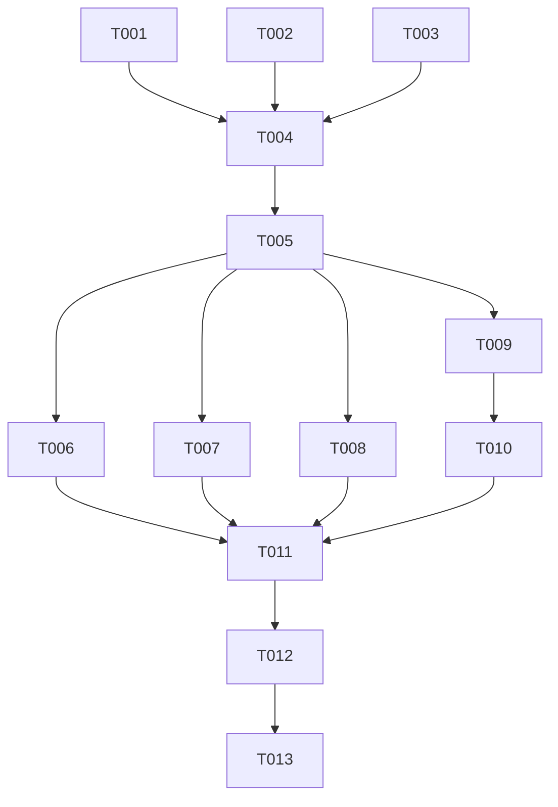

# Tasks: 前端性能指标监控与基准测试体系 (Frontend Performance Metrics System)

**Feature**: `005-frontend-perf-metrics`
**Date**: 2026-08-15
**Spec**: [spec.md](file:///Users/kevintung/Documents/dev/TTZip/specs/005-frontend-perf-metrics/spec.md) | **Plan**: [plan.md](file:///Users/kevintung/Documents/dev/TTZip/specs/005-frontend-perf-metrics/plan.md)

---

## Phase 1: Setup (Shared Infrastructure)

**Purpose**: 创建前端指标模型与基准执行器的基础架构文件

- [x] T001 [P] 创建前端性能指标模型文件 `Sources/TTZipCore/Benchmark/FrontendPerformanceMetrics.swift`
- [x] T002 [P] 创建前端基准测试执行器文件 `Sources/TTZipCore/Benchmark/FrontendBenchmarkRunner.swift`
- [x] T003 [P] 创建前端性能门禁测试文件 `Tests/TTZipTests/FrontendPerformanceGateTests.swift`

---

## Phase 2: Foundational (Blocking Prerequisites)

**Purpose**: 实现指标数据模型与纯内存基准测试引擎

- [x] T004 实现 `TreeBuildMetric`、`SearchFilterMetric`、`LRUCacheMetric`、`ProgressThrottleMetric` 与 `FrontendPerformanceReport` 实体模型在 `Sources/TTZipCore/Benchmark/FrontendPerformanceMetrics.swift`
- [x] T005 实现 `FrontendBenchmarkRunner` 纯内存数据集生成与异步压测引擎在 `Sources/TTZipCore/Benchmark/FrontendBenchmarkRunner.swift`

**Checkpoint**: 前端指标收集与运行引擎就绪，可开始编写门禁单测与 GUI 适配。

---

## Phase 3: User Story 1 - 前端核心操作量化指标采集与自动化门禁 (Priority: P1) 🎯 MVP

**Goal**: 在单测体系中建立前端 4 大核心操作（树构建、搜索过滤、LRU 缓存、进度节流）的硬性能门禁。

**Independent Test**: 运行 `swift test --filter FrontendPerformanceGateTests`，验证各场景耗时与吞吐均输出指标并达标。

- [x] T006 [P] [US1] 编写目录树构建延迟硬门禁测试（50k 条目 $\le 80\text{ ms}$）在 `Tests/TTZipTests/FrontendPerformanceGateTests.swift`
- [x] T007 [P] [US1] 编写搜索过滤吞吐硬门禁测试（20k 吞吐 $\ge 2,000,000\text{ items/s}$）在 `Tests/TTZipTests/FrontendPerformanceGateTests.swift`
- [x] T008 [P] [US1] 编写 LRU 缓存与高频进度节流拦截率硬门禁测试在 `Tests/TTZipTests/FrontendPerformanceGateTests.swift`

**Checkpoint**: User Story 1 独立可用，CI 流水线具备前端性能防倒退门禁。

---

## Phase 4: User Story 2 - GUI 性能测试中心增加前端与渲染指标面板 (Priority: P2)

**Goal**: 在 GUI Benchmark 控制台中支持一键执行前端性能基准并可视化渲染指标卡片。

**Independent Test**: 打开 `BenchmarkView`，选择前端测试模式并运行，确认速度仪表与指标列表正常展示。

- [x] T009 [US2] 在 `Sources/TTZipApp/Views/Benchmark/BenchmarkViewModel.swift` 中扩展前端性能测试调度与结果状态
- [x] T010 [US2] 在 `Sources/TTZipApp/Views/Benchmark/BenchmarkConfigSectionView.swift` 中增加前端性能模式选项与卡片呈现

**Checkpoint**: User Story 2 独立可用，用户可在 GUI 一键测试前端性能。

---

## Phase 5: Polish & Validation

**Purpose**: 全量回归验证

- [x] T011 [P] 运行全量 `FrontendPerformanceGateTests` 门禁测试：`swift test --filter FrontendPerformanceGateTests`
- [x] T012 运行核心性能门禁测试：`swift test --filter XCTestPerformanceMeasureTests`
- [x] T013 运行全量回归测试：`swift test` (589 tests 100% 通过)

---

## Dependencies & Execution Order

