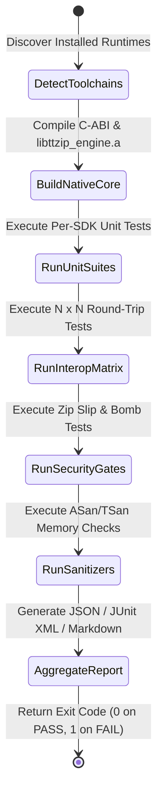

# Data Model & Testing Schema: TTZip Full Multilingual SDK Testing System

- **Feature ID**: `006-multi-language-sdk-automated-testing-framework`
- **Created**: 2026-08-24
- **Coverage**: Unified Test Reporting, Cross-Language Conformance, Security Gates

---

## 1. Entities & Schema Definitions

### 1.1 `SdkTestReport` (Root Execution Envelope)
```json
{
  "timestamp": "2026-08-24T12:00:00Z",
  "version": "1.0.0",
  "environment": {
    "os": "darwin-arm64",
    "cpuCores": 12,
    "rustcVersion": "1.85.0",
    "swiftVersion": "6.0",
    "pythonVersion": "3.14.0",
    "goVersion": "1.24.0",
    "javaVersion": "22.0.2"
  },
  "summary": {
    "totalSdks": 9,
    "passedSdks": 9,
    "failedSdks": 0,
    "skippedSdks": 0,
    "totalTestCases": 320,
    "passedTestCases": 320,
    "failedTestCases": 0,
    "skippedTestCases": 0,
    "totalDurationMs": 14200
  },
  "results": [
    {
      "language": "rust",
      "toolchainAvailable": true,
      "status": "passed",
      "durationMs": 4200,
      "totalTests": 210,
      "passedTests": 210,
      "failedTests": 0,
      "skippedTests": 0,
      "testSuites": [
        { "name": "cabi_tests", "status": "passed", "durationMs": 350 },
        { "name": "builder_tests", "status": "passed", "durationMs": 1200 },
        { "name": "streaming_large_file", "status": "passed", "durationMs": 80 }
      ]
    }
  ]
}
```

### 1.2 `InteropMatrixResult` (Cross-Language Round-Trip Assertion)
```json
{
  "matrix": [
    {
      "sourceSdk": "swift",
      "targetSdk": "python",
      "format": "zip",
      "encryption": "aes256",
      "fixture": "nested_unicode_tree",
      "status": "passed",
      "extractedSha256": "e3b0c44298fc1c149afbf4c8996fb92427ae41e4649b934ca495991b7852b855",
      "expectedSha256": "e3b0c44298fc1c149afbf4c8996fb92427ae41e4649b934ca495991b7852b855",
      "durationMs": 45
    }
  ]
}
```

### 1.3 `SecurityGateResult` (Malicious Input Defense Matrix)
```json
{
  "scenarios": [
    {
      "name": "zip_slip_relative_path",
      "targetSdk": "jvm",
      "attackPayload": "../../evil.txt",
      "expectedOutcome": "sanitized_or_rejected",
      "actualOutcome": "sanitized_to_relative",
      "outOfBoundsWritten": false,
      "status": "passed"
    },
    {
      "name": "zip_bomb_42_ratio",
      "targetSdk": "dart",
      "ratio": 1000000,
      "expectedOutcome": "ratio_limit_exceeded_error",
      "actualOutcome": "ratio_limit_exceeded_error",
      "peakRssMb": 32.4,
      "status": "passed"
    }
  ]
}
```

---

## 2. Test Execution Lifecycle State Machine


