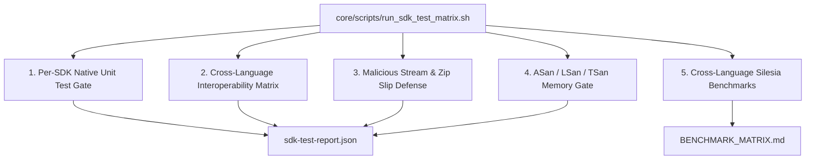

# Implementation Plan: TTZip 全语言 SDK 自动化测试体系与跨语言一致性验证矩阵 (Full Multilingual SDK Testing System)

- **Feature ID**: `006-multi-language-sdk-automated-testing-framework`
- **Pipeline Mode**: `[Full SDD]`
- **Status**: `PLANNED`
- **Created**: 2026-08-24
- **Coverage**: 9 SDK Ecosystems, Cross-Language Interop Matrix, Security Fuzzing, ASan/TSan Automation, Performance Regression Harness

---

## 1. Technical Context & Constraints

- **Language Ecosystems Tested**:
  1. **Rust Core Engine**: `cargo test -p ttzip-engine`
  2. **Swift 6 Core SDK**: `swift test` (XCTest & Swift Testing)
  3. **Python 3 SDK**: `python3 -m unittest discover` / `pytest`
  4. **JVM (Java 22+ & Kotlin)**: Standalone JUnit 5 Console Launcher & Panama FFM test suite
  5. **Dart / Flutter**: `dart test`
  6. **.NET 8 C#**: `dotnet test`
  7. **Modern C++20**: Clang++ compiled native test runner
  8. **C11 Native**: Clang compiled C-ABI test runner
  9. **Go (1.24+)**: `go test ./...`
- **Zero-Subprocess Compliance**: All test runners verify direct FFI/FFM in-process binding without shell spawning.
- **File Length Constraint**: $\le 800$ LOC per file across all new test harnesses and scripts.

---

## 2. Architecture & Subsystem Touchpoints

---

## 3. Implementation Phases

### Phase 1: Test Infrastructure & Canonical Test Corpus Setup
- Create canonical test fixtures generator in `core/tests/fixtures/generate_canonical_corpus.py` (Text, Nested Tree, CJK/Emoji, Sparse Large File).
- Create security vulnerability test fixtures in `core/tests/security/fixtures/` (Zip Slip, Zip Bomb ratio, Corrupt Header).
- Validate all JSON schemas in `specs/006-multi-language-sdk-automated-testing-framework/contracts/`.

### Phase 2: Per-SDK Native Unit Test Suites Hardening
- **Java / Kotlin**: Implement standalone JUnit 5 Panama FFM test harness in `core/sdk/jvm/src/test/java/com/ttzip/TTZipTest.java`.
- **Dart / Flutter**: Implement `core/sdk/dart/test/ttzip_test.dart` asserting background `Isolate` archive operations.
- **C# / .NET 8**: Implement `core/sdk/dotnet/TTZipTest.cs` asserting `ReadOnlySpan<byte>` and `IAsyncEnumerable`.
- **C++20 & C11**: Implement `core/sdk/cpp/test_cpp_sdk.cpp` and `core/sdk/c/test_c_sdk.c` native assertions.
- **Go**: Expand `core/sdk/go/ttzip/ttzip_test.go` with property-based round-trip checks.
- **Python**: Expand `core/python/tests/` with drop-in `zipfile` tests.
- **Swift 6**: Add actor-isolated regression tests in `core/Tests/TTZipTests/`.

### Phase 3: Cross-Language $N \times N$ Interoperability Matrix Engine
- Implement `core/tests/interop/test_interop_matrix.py` (or shell runner) orchestrating round-trip matrix tests across all compiled SDK binaries.
- Output `interop-matrix-report.json` conforming to `interop-matrix-contract.json`.

### Phase 4: Malicious Stream & Security Defense Suite
- Implement `core/tests/security/test_security_gates.py` testing all SDKs against Zip Slip, ratio overflow bombs, and truncated streams.
- Output `security-gate-report.json`.

### Phase 5: Automated Memory Sanitizer & Concurrency Gates
- Implement `core/scripts/run_sanitizers.sh` executing Rust, C11, C++20, Go CGO, and Python under AddressSanitizer and ThreadSanitizer.
- Verify 0 byte memory leaks across 10,000 iterations.

### Phase 6: Unified Test Matrix CLI & CI Coordinator
- Implement `core/scripts/run_sdk_test_matrix.sh` supporting `--sdk`, `--category`, `--json`, and `--junit` flags.
- Implement root `Makefile` target `test-all-sdk` and `test-interop`.
- Verify 100% execution pass rate.
