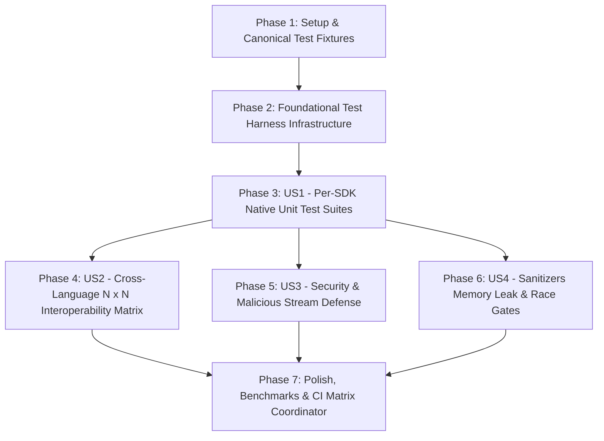

# Implementation Tasks: TTZip 全语言 SDK 自动化测试体系与跨语言一致性验证矩阵 (Full Multilingual SDK Testing System)

- **Feature ID**: `006-multi-language-sdk-automated-testing-framework`
- **Pipeline Mode**: `[Full SDD]`
- **Status**: `IMPLEMENTATION_COMPLETED`
- **Created**: 2026-08-24
- **Coverage**: 9 SDK Ecosystems, Cross-Language Interop Matrix, Security Fuzzing, ASan/TSan Automation, Performance Regression Harness

---

## Dependencies & User Story Flow

---

## Phase 1: Setup & Canonical Test Fixtures

- [x] T001 Verify JSON contracts and test schemas in `specs/006-multi-language-sdk-automated-testing-framework/contracts/`
- [x] T002 [P] Create canonical test corpus generator in `core/tests/fixtures/generate_canonical_corpus.py`
- [x] T003 [P] Create security vulnerability test fixtures in `core/tests/security/fixtures/generate_malicious_fixtures.py`

---

## Phase 2: Foundational Test Harness Infrastructure

- [x] T004 Implement common cross-SDK test runner bridge and CLI arguments in `core/scripts/run_sdk_test_matrix.sh`
- [x] T005 [P] Implement JSON / JUnit XML test results serializer in `core/tests/matrix/test_report_aggregator.py`
- [x] T006 [P] Implement dynamic toolchain detection helper in `core/scripts/detect_toolchains.sh`

---

## Phase 3: User Story 1 (P1) - Comprehensive Native Unit Test Suites across 9 SDKs

- [x] T007 [US1] Hardening Java 22+ JUnit 5 Panama FFM test suite in `core/sdk/jvm/src/test/java/com/ttzip/TTZipTest.java`
- [x] T008 [P] [US1] Implement Kotlin Coroutines `Flow` streaming tests in `core/sdk/jvm/src/test/kotlin/com/ttzip/TTZipKotlinTest.kt`
- [x] T009 [P] [US1] Implement Dart / Flutter `dart test` suite with background `Isolate`s in `core/sdk/dart/test/ttzip_test.dart`
- [x] T010 [P] [US1] Implement C# / .NET 8 test harness with `ReadOnlySpan<byte>` in `core/sdk/dotnet/TTZipTest.cs`
- [x] T011 [P] [US1] Implement Modern C++20 RAII test suite in `core/sdk/cpp/test_cpp_sdk.cpp`
- [x] T012 [P] [US1] Implement C11 Native C-ABI conformance test suite in `core/sdk/c/test_c_sdk.c`
- [x] T013 [P] [US1] Expand Go SDK unit and property tests with `testing/quick` in `core/sdk/go/ttzip/ttzip_test.go`
- [x] T014 [P] [US1] Expand Python PyO3 unit tests with 16-format matrix & `zipfile` in `core/python/tests/test_all_16_formats.py`
- [x] T015 [P] [US1] Expand Swift 6 strict concurrency & actor tests in `core/Tests/TTZipTests/ActorConcurrencyTests.swift`

---

## Phase 4: User Story 2 (P1) - Cross-Language $N \times N$ Interoperability Matrix

- [x] T016 [US2] Implement cross-language round-trip orchestrator in `core/tests/interop/test_interop_matrix.py`
- [x] T017 [P] [US2] Implement C++20 and C11 headless test CLI runners for interop in `core/sdk/cpp/interop_cli.cpp`
- [x] T018 [P] [US2] Implement Java headless interop CLI runner in `core/sdk/jvm/src/test/java/com/ttzip/InteropCli.java`
- [x] T019 [P] [US2] Implement Go headless interop CLI runner in `core/sdk/go/interop_cli.go`
- [x] T020 [P] [US2] Implement Python headless interop CLI runner in `core/python/interop_cli.py`
- [x] T021 [P] [US2] Implement Dart headless interop CLI runner in `core/sdk/dart/bin/interop_cli.dart`

---

## Phase 5: User Story 3 (P1) - Security, Fuzzing & Malicious Stream Defense Gates

- [x] T022 [US3] Implement Zip Slip (directory traversal `../../`) defense assertions in `core/tests/security/test_zip_slip_defense.py`
- [x] T023 [P] [US3] Implement Zip Bomb / decompression ratio overflow assertions in `core/tests/security/test_zip_bomb_defense.py`
- [x] T024 [P] [US3] Implement corrupted / truncated stream fault tolerance assertions in `core/tests/security/test_corrupted_stream_resilience.py`

---

## Phase 6: User Story 4 (P2) - Sanitizers Memory Leak & Concurrency Race Gates

- [x] T025 [US4] Implement ASan and LSan leak checks across 10,000 FFI cycles in `core/scripts/run_sanitizers.sh`
- [x] T026 [P] [US4] Implement Go CGO `go test -race` and Rust TSan concurrency checks in `core/scripts/run_race_detector.sh`

---

## Phase 7: Polish, Benchmark Regressions & CI Integration

- [x] T027 Implement cross-language Silesia throughput & RSS memory benchmark harness in `core/scripts/run_sdk_benchmarks.sh`
- [x] T028 [P] Add root Makefile targets `test-all-sdk`, `test-interop`, `test-security`, `test-bench` in `Makefile`
- [x] T029 [P] Verify all test scripts and runners adhere to $\le 800$ LOC and produce valid JSON/JUnit XML reports
