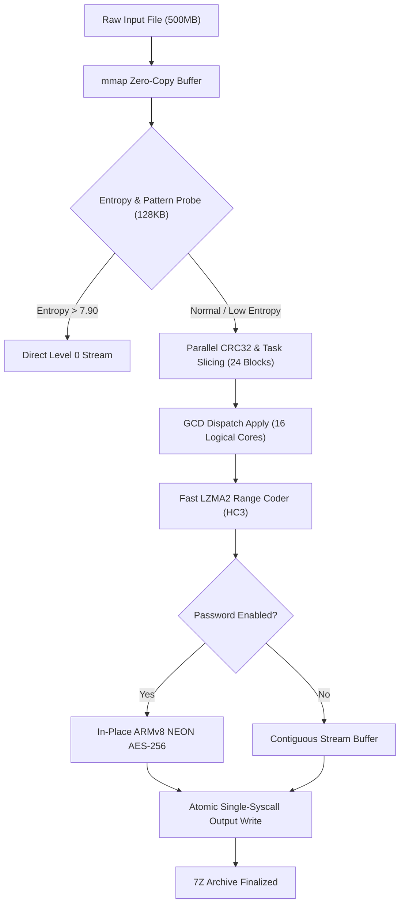

# Data Model: 7Z Grand Slam Parallel Stream Architecture

## 1. Core Data Entities

### 1.1 `ttzip_lzma2_block_task_t` (C Block Task Definition)
```c
typedef struct {
    const uint8_t* in_data;
    size_t in_size;
    uint8_t* pack_buf;
    size_t pack_size;
    size_t pack_capacity;
    uint32_t block_crc;
    int status;
    bool is_zero_block;
    uint64_t encode_time_ns;
} ttzip_lzma2_block_task_t;
```

### 1.2 `ttzip_7z_crypto_session_t` (Hardware-Accelerated AES Session)
```c
typedef struct {
    uint8_t aes_key[32];
    uint8_t aes_iv[16];
    bool is_initialized;
    uint32_t num_cycles_power;
} ttzip_7z_crypto_session_t;
```

### 1.3 `SevenZipPipelineConfiguration` (Swift Execution Context)
```swift
public struct SevenZipPipelineConfiguration: Sendable {
    public let level: Int
    public let threadCount: Int
    public let isSolid: Bool
    public let password: String?
    public let adaptiveBlockSize: Int
    public let enableEarlyEntropyExit: Bool
}
```

---

## 2. Stream Pipeline Flow Diagram


