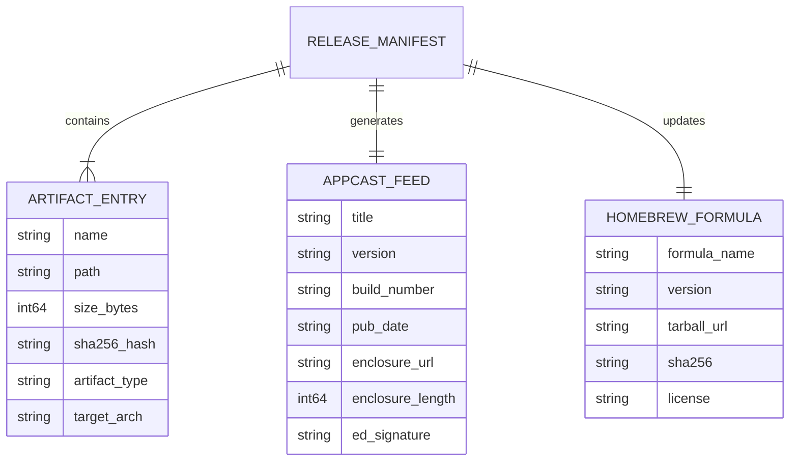

# Data Model: TTZip v1.0.0 发布制品、清单与元数据模型 (Feature 009)

- **Feature ID**: `009-v1-release-engineering-and-distribution-pipeline`
- **Created**: 2026-08-24
- **Status**: `COMPLETED`

---

## 1. 发布产物实体与关系 (Release Artifact Entities)

---

## 2. 核心字段定义

### 2.1 ArtifactEntry (发布制品条目)
* `name`: 制品文件名（如 `TTZip-1.0.0.dmg`、`ttzip-cli-v1.0.0-darwin-universal.tar.gz`）。
* `path`: 相对分发目录路径（`dist/...`）。
* `size_bytes`: 文件物理字节大小（`stat -f%z`）。
* `sha256_hash`: 64 字符小写十六进制 SHA-256 哈希值。
* `artifact_type`: 枚举值 `dmg_installer`, `cli_tarball`, `wheel`, `nuget_package`, `jar_bundle`。
* `target_arch`: 架构标识 `universal`, `arm64`, `x86_64`。

### 2.2 AppcastFeed (Sparkle 更新源元数据)
* `title`: `TTZip Version 1.0.0`
* `version`: `1.0.0`
* `build_number`: `10000`
* `pub_date`: 符合 RFC 2822 规范的 UTC 时间字符串。
* `enclosure_url`: 正式下载 URL。
* `enclosure_length`: DMG 文件大小字节数。
* `ed_signature`: EdDSA Base64 签名串（可选/生产必需）。
