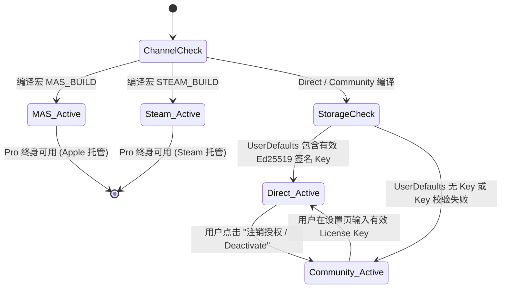

# Data Model: 授权实体与渠道状态机

## 1. 实体定义

### 1.1 LicensePayload (授权数据载荷)
```swift
public struct LicensePayload: Codable, Sendable, Equatable {
    public let v: Int                 // 协议版本，当前为 1
    public let email: String          // 被授权人邮箱
    public let tier: LicenseTier      // pro_lifetime 或 pro_business
    public let issued_at: String      // ISO8601 发行时间
    public let order_id: String       // 订单编号
}

public enum LicenseTier: String, Codable, Sendable {
    case proLifetime = "pro_lifetime"
    case proBusiness = "pro_business"
}
```

### 1.2 ChannelLicenseState (应用授权与渠道状态)
```swift
public enum ChannelLicenseState: Sendable, Equatable {
    case community                           // 社区版（未激活，全功能可用）
    case directPro(payload: LicensePayload)  // 官网直装版（已通过 Ed25519 验签激活）
    case masPro                              // Mac App Store 买断版
    case steamPro                            // Steam 商店买断版
    
    public var isPro: Bool {
        switch self {
        case .community: return false
        case .directPro, .masPro, .steamPro: return true
        }
    }
    
    public var badgeTitle: String {
        switch self {
        case .community: return "Community Edition"
        case .directPro: return "Pro Lifetime (Direct)"
        case .masPro: return "Pro Lifetime (App Store)"
        case .steamPro: return "Pro Lifetime (Steam)"
        }
    }
}
```

---

## 2. 状态机流转图 (License State Transitions)


