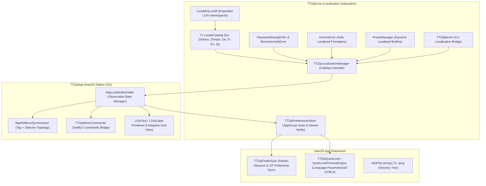

# Feature Specification: 012 Comprehensive i18n and Localization Architecture Overhaul

- **Feature Directory**: `specs/012-comprehensive-i18n-and-localization-architecture`
- **Classification**: `[Full SDD]`
- **Status**: `Specified`
- **Created**: 2026-08-25
- **Author**: Antigravity AI & TTZip Architectural Governance Team

---

## 1. Executive Summary & Problem Statement

TTZip's internationalization (i18n) infrastructure currently suffers from systemic defects across all tiers:
1. **Catalog Fabrication (Fake Localization)**: 95.6% (283/296) of strings in German (`de`), French (`fr`), Spanish (`es`), and Japanese (`ja`) are raw English copy-paste placeholders. Simplified Chinese (`zh-Hans`) and Traditional Chinese (`zh-Hant`) contain macOS HIG terminology deviations and regional vocabulary mix-ups.
2. **SwiftUI View Hardcoding & Broken Reactivity**: Over 884 hardcoded human-readable string literals exist across 125+ Swift source files. Nearly 70 views/sheets/popovers do not observe `AppLocalizationState`, causing frozen/mixed-language states when switching languages.
3. **AppKit Menu Synchronization Deadlock**: `AppKitMenuSynchronizer` relies on fragile title string pattern matching (`switch title`), causing cold-start failures in non-English/non-Chinese systems and permanently deadlocking top-level menus upon subsequent language switches.
4. **Cross-Process System Extensions Desynchronization**: QuickLook's HTML engine is statically hardcoded in English, and FinderSync runs in an isolated sandbox unable to access `UserDefaults.standard` without an AppGroup suite and Darwin notification bridge.
5. **Core Model & Error Pipeline Hardcoding**: `ArchiveError.passwordRequiredDetailed` concatenates localized prefixes with hardcoded English clauses; `PasswordVaultManager` hardcodes password strength ratings and Touch ID prompts.
6. **Missing macOS Bundle Localization**: No `.lproj/InfoPlist.strings` exist, leaving Finder document types and application descriptions in English across all foreign locales.

This feature executes a comprehensive, end-to-end overhaul to achieve 100% genuine multi-language support across all 7 supported languages, eliminate all UI hardcoding, ensure dynamic real-time language switching (< 1ms), and enforce automated CI gating against pseudo-localization and string regressions.

---

## 2. User Stories & Acceptance Criteria

### User Story 1: True Native Multi-Language Experience (7 Languages)
- **As a** global user speaking German, French, Spanish, Japanese, Simplified Chinese, Traditional Chinese, or English,
- **I want** all user-visible text, tooltips, dialogs, formats, errors, menus, and inspector details to be rendered in authentic, Apple HIG-compliant terminology,
- **So that** TTZip feels like a 100% native macOS application built for my language.
- **Acceptance Criteria**:
  - `LocaleCatalog+De.swift`, `LocaleCatalog+Fr.swift`, `LocaleCatalog+Es.swift`, `LocaleCatalog+Ja.swift`, `LocaleCatalog+ZhHans.swift`, `LocaleCatalog+ZhHant.swift`, and `LocaleCatalog+En.swift` contain 100% genuine, translated strings.
  - Zero English copy-pasted placeholders remain for non-English catalogs (verified by `< 3%` identical string threshold for neutral technical acronyms).
  - All format strings use positional specifiers (`%1$@`, `%2$d`) to eliminate syntax crashes across varying grammatical word orders.

### User Story 2: Instant Dynamic In-App Language Switching
- **As a** power user switching languages in TTZip Settings,
- **I want** the entire application (including active views, modal sheets, contextual menus, tooltips, menu bar items, and Finder extensions) to immediately re-render in the target language (< 10ms) without restarting the app,
- **So that** my workflow remains uninterrupted and all windows update synchronously.
- **Acceptance Criteria**:
  - Every SwiftUI component and modal sheet reactively re-evaluates upon `AppLocalizationState.shared.setLanguage(...)`.
  - Top-level and submenu items in `NSApplication.shared.mainMenu` update accurately via a robust Tag + Action hierarchy, regardless of starting or target language.
  - FinderSync contextual menus and QuickLook HTML previews reflect the newly selected language in real time via AppGroup shared preferences and Darwin notifications.

### User Story 3: System-Level Finder & QuickLook Localization
- **As a** macOS user viewing files in Finder and using Quick Look (Spacebar),
- **I want** TTZip document kinds, Quick Look HTML table headers, metadata badges, and Finder Sync contextual actions to display in my chosen language,
- **So that** macOS system-level integration is fully localized.
- **Acceptance Criteria**:
  - `en.lproj`, `zh-Hans.lproj`, `zh-Hant.lproj`, `ja.lproj`, `de.lproj`, `fr.lproj`, and `es.lproj` with valid `InfoPlist.strings` are compiled into `TTZip.app/Contents/Resources/`.
  - Quick Look HTML table headers (`Name`, `Size`), item counters, and encryption badges render dynamically in the active language.
  - FinderSync contextual menus construct localized titles without emoji/string concatenation hacks.

### User Story 4: Architectural & CI Regression Guardrails
- **As a** core maintainer,
- **I want** automated CI unit tests and AST static linter scripts to strictly enforce catalog completeness, anti-copy-paste rules, format string safety, and zero UI hardcoding,
- **So that** future features cannot introduce unlocalized strings or broken catalogs.
- **Acceptance Criteria**:
  - `TTZipLocalizationSecurityTests` passes 100% in CI: verifies 100% key coverage across all 7 languages, enforces `< 3%` untranslated ratio, checks positional format consistency, and runs parameter fuzzing.
  - AST localization linter passes with zero unwhitelisted string literals in SwiftUI views.

---

## 3. System Boundary & Component Changes

---

## 4. Non-Functional Requirements & Invariants

1. **Zero Heap Allocation & Sub-Millisecond Switch**: In-memory catalog lookups MUST complete in $\le 0.1\text{ ms}$; full AppKit menu tree synchronization MUST complete in $\le 1.0\text{ ms}$.
2. **Swift 6 Strict Concurrency**: All localization managers and preference stores MUST conform to `@MainActor` or `Sendable` guarantees without data races.
3. **Constitution Compliance**:
   - Single-file line count $\le 800$ LOC across all refactored files.
   - Zero external subprocess invocations.
   - Transparent packaging and out-of-tree testing compliance.
