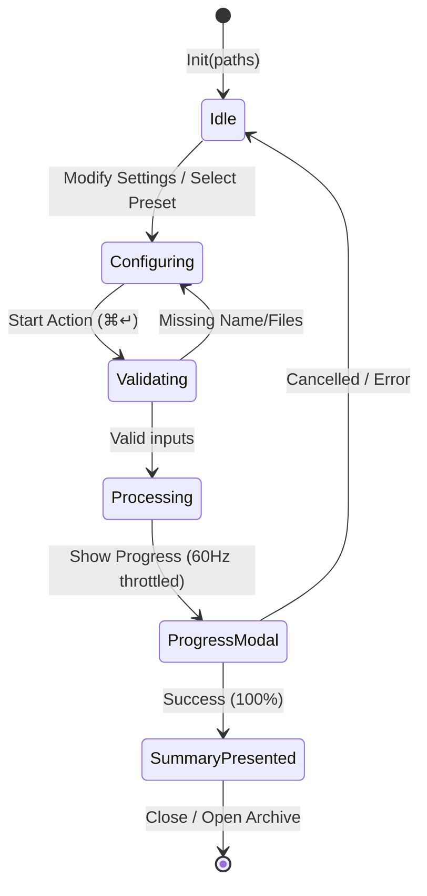
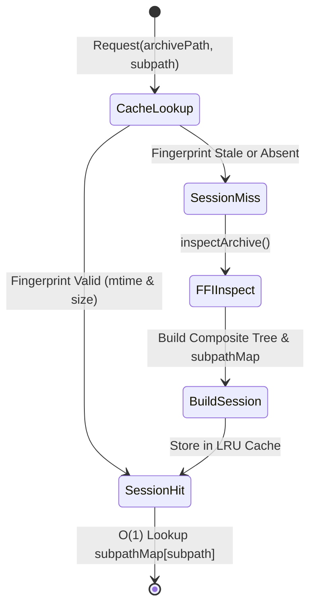

# Data Model: 014 Frontend Architecture Audit & Paradigm Evolution

- **Feature**: `014-frontend-architecture-evolution`
- **Created**: 2026-08-25
- **Status**: Completed

---

## 1. Domain Entities & State Structures

### 1.1 `CompressFormSession` (Observable Form Model)
Aggregates and encapsulates all state for compression workspace configuration, validation, and lifecycle execution.

```swift
@Observable
@MainActor
public final class CompressFormSession {
    // 1. Input Sources
    public var itemsList: [CompressFileItem]
    public var selectedItemIDs: Set<CompressFileItem.ID>
    public var totalSizeBytes: Int64
    
    // 2. Output Configuration
    public var outputName: String
    public var targetDirectory: String
    public var selectedFormat: ArchiveCompressionFormat
    public var compressionLevel: ArchiveCompressionLevel
    public var selectedPresetID: UUID?
    
    // 3. Split Volumes
    public var splitVolumeOption: Int64?
    public var isCustomVolumeSelected: Bool
    public var customVolumeValueString: String
    public var customVolumeUnit: String
    
    // 4. Security & Encryption
    public var enableEncryption: Bool
    public var password: String
    public var encryptFileNames: Bool
    public var zipEncryptionMethod: String
    
    // 5. Advanced Engine Parameters
    public var cpuThreadsOption: String
    public var dictionarySizeMB: Int
    public var compressionAlgorithm: String
    public var zipEncodingUTF8: Bool
    public var zstdLevel: Int
    public var zstdEnableLDM: Bool
    public var preservePosixAttributes: Bool
    public var enableSolidArchive: Bool
    
    // 6. Automation Policies
    public var createSeparateArchives: Bool
    public var deleteSourceAfterCompress: Bool
    public var openFinderAfterCompress: Bool
    public var skipMacJunk: Bool
    
    // 7. Modals & Presentation
    public var isAlgorithmMatrixPresented: Bool
    public var isCompressionGuidePresented: Bool
    public var isPasswordVaultPresented: Bool
    
    // 8. Execution State & Metrics
    public var isProcessing: Bool
    public var isProgressModalPresented: Bool
    public var currentProgress: ArchiveProgress
    public var isSummarySheetPresented: Bool
    public var completedSummary: CompressionCompletedSummary?
}
```

---

### 1.2 `ArchiveHierarchySession` (Immutable Archive Tree Session)
Represents a cached in-memory representation of an archive's directory tree for rapid subfolder traversal.

```swift
public struct ArchiveHierarchySession: Sendable {
    public let archivePath: String
    public let modificationTimestamp: TimeInterval
    public let fileByteSize: Int64
    public let rootComposite: ArchiveCompositeDirectory
    public let entries: [ArchiveEntry]
    public let subpathMap: [String: ArchiveComponentProtocol]
    public let unlockedPassword: String?
    public let cachedAt: Date
}
```

- **Validation / Fingerprinting**: Valid when `currentFileSize == fileByteSize && abs(currentMtime - modificationTimestamp) < 0.001`.
- **Subpath Indexing**: `subpathMap[""] = rootComposite`; for each directory, `subpathMap["path/to/folder"] = folderNode`.

---

### 1.3 `TokenSpan` (Syntax Token Entity)
Lightweight syntax highlight range definition passed from background tokenizer to main thread.

```swift
public struct TokenSpan: Sendable {
    public let range: NSRange
    public let colorType: ColorCategory
}

public enum ColorCategory: Sendable {
    case comment
    case string
    case keyword
    case number
    case type
}
```

---

### 1.4 `DiskItemInfo` (Enhanced Entity)
Supports zero-syscall initialization from Foundation pre-cached resource values.

```swift
public struct DiskItemInfo: Identifiable, Hashable, Equatable, Sendable {
    public var id: String { path }
    public let path: String
    public let name: String
    public let isDirectory: Bool
    public let isArchive: Bool
    public let sizeText: String
    public let rawSizeBytes: Int64
    public let creationDate: Date?
    public let modificationDate: Date?
    public let kindText: String
    
    public init(url: URL, resourceValues: URLResourceValues)
    public init(url: URL) // fallback
}
```

---

## 2. State Machine Transitions

### 2.1 Compression Session Lifecycle


### 2.2 In-Archive Navigation Cache Lifecycle

