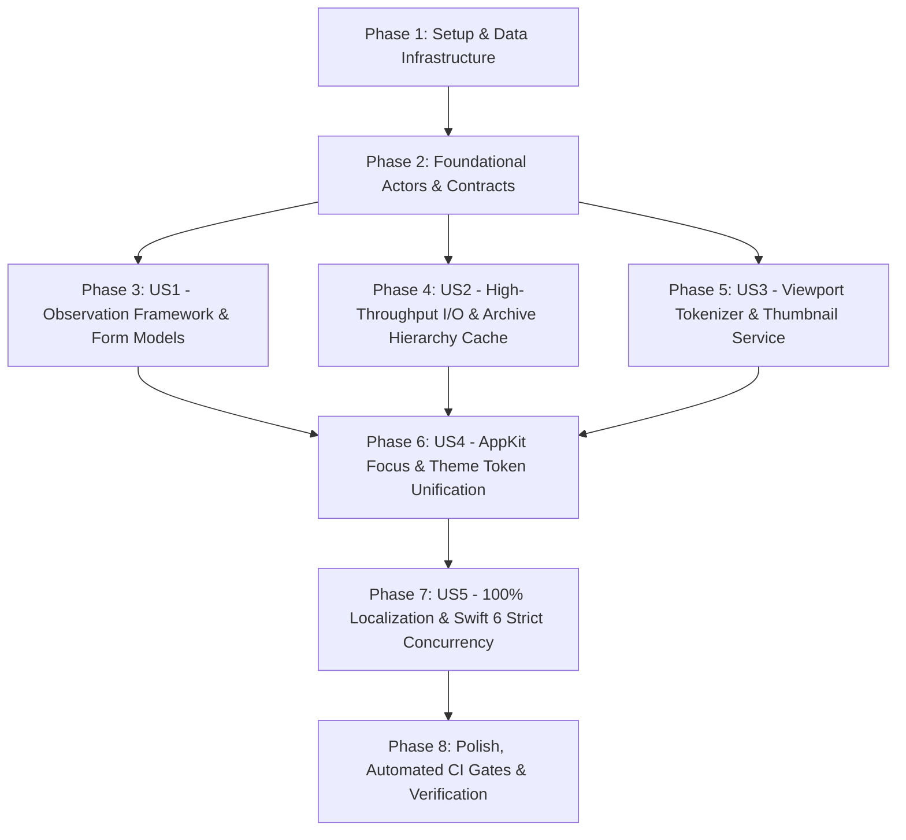

# Tasks: 014 Frontend Architecture Audit & Paradigm Evolution

- **Feature**: `014-frontend-architecture-evolution`
- **Classification**: `[Full SDD]`
- **Status**: `Ready for Execution`
- **Created**: 2026-08-25
- **Author**: Antigravity AI & TTZip Architectural Governance Team

---

## Dependencies & Story Sequence

---

## Phase 1: Setup & Data Infrastructure

- [x] T001 [P] Verify project build settings and ensure macOS 14+ Swift 6 tooling in `apple/Package.swift`
- [x] T002 [P] Establish Layout Token constants in `apple/Sources/TTZipApp/Theme/TTZipTheme.swift`

---

## Phase 2: Foundational Actors & Core Bridges

- [x] T003 [P] Implement `PrecompiledSyntaxEngine` and rule definitions in `apple/Sources/TTZipApp/Services/PrecompiledSyntaxEngine.swift`
- [x] T004 [P] Implement `actor DiskDirectoryScannerActor` with batch `URLResourceValues` prefetching in `apple/Sources/TTZipApp/Services/DiskDirectoryScannerActor.swift`
- [x] T005 [P] Implement `actor ArchiveHierarchySessionCache` with LRU fingerprinting in `apple/Sources/TTZipApp/Services/ArchiveHierarchySessionCache.swift`
- [x] T006 [P] Implement `actor BackgroundSyntaxTokenizer` in `apple/Sources/TTZipApp/Services/BackgroundSyntaxTokenizer.swift`
- [x] T007 [P] Implement `actor ImageIOThumbnailService` with in-flight deduplication in `apple/Sources/TTZipApp/Services/ImageIOThumbnailService.swift`

---

## Phase 3: User Story 1 - Modern Swift Observation Framework Paradigm (`@Observable`)

**Story Goal**: Eliminate all Combine `objectWillChange` forwarding storms and extract cohesive Form ViewModels.

- [x] T008 [P] [US1] Migrate `NavigationState`, `ArchiveExplorerState`, `TaskExecutionState`, `OverlayState` to `@Observable` in `apple/Sources/TTZipApp/ViewModels/AppSubStates.swift`
- [x] T009 [US1] Migrate `AppViewState` to `@Observable` and remove all Combine forwarding sinks in `apple/Sources/TTZipApp/ViewModels/AppViewState.swift`
- [x] T010 [P] [US1] Create `@Observable class CompressFormSession` model in `apple/Sources/TTZipApp/ViewModels/CompressFormSession.swift`
- [x] T011 [US1] Refactor `CompressModalView` to use single `CompressFormSession` model in `apple/Sources/TTZipApp/Views/CompressModalView.swift`
- [x] T012 [US1] Refactor `CompressIntegratedConfigSectionView` to receive single `@Bindable CompressFormSession` in `apple/Sources/TTZipApp/Views/Components/CompressIntegratedConfigSectionView.swift`
- [x] T013 [US1] Update `MainView` and `KeepAliveTabContainer` to leverage property-level fine-grained tracking in `apple/Sources/TTZipApp/Views/MainView.swift`

---

## Phase 4: User Story 2 - Non-Blocking High-Throughput I/O & Archive Hierarchy Cache

**Story Goal**: Eliminate individual `stat` system calls in disk browsing and achieve $O(1)$ subpath traversal in archives.

- [x] T014 [P] [US2] Enhance `DiskItemInfo` with `init(url:resourceValues:)` in `apple/Sources/TTZipApp/Models/DiskItemInfo.swift`
- [x] T015 [US2] Refactor `MillerColumnDirectoryScanner` to delegate to `DiskDirectoryScannerActor` and `ArchiveHierarchySessionCache` in `apple/Sources/TTZipApp/Services/MillerColumnDirectoryScanner.swift`
- [x] T016 [US2] Remove dead `@State var items` and duplicate background scan in `apple/Sources/TTZipApp/Views/Explorer/DiskDirectoryBrowserView.swift`
- [x] T017 [US2] Connect `FinderMillerColumnsView` to updated non-blocking directory scanner in `apple/Sources/TTZipApp/Views/Explorer/FinderMillerColumnsView.swift`

---

## Phase 5: User Story 3 - Viewport-Based Async Tokenization & True Non-Blocking Thumbnails

**Story Goal**: Offload code syntax highlighting and CoreGraphics image downsampling to background actors.

- [x] T018 [P] [US3] Refactor `CodeHighlightingEditorNSView` to use `BackgroundSyntaxTokenizer` and precompiled patterns in `apple/Sources/TTZipApp/Views/Preview/CodeSyntaxPreviewView.swift`
- [x] T019 [US3] Migrate `ImageIOThumbnailCache` callers to `ImageIOThumbnailService` in `apple/Sources/TTZipApp/Services/ImageIOThumbnailService.swift`
- [x] T020 [P] [US3] Ensure `PDFDocumentPreviewView` thumbnail loading executes in detached background tasks in `apple/Sources/TTZipApp/Views/Preview/PDFDocumentPreviewView.swift`

---

## Phase 6: User Story 4 - AppKit Focus & Theme Token Unification

**Story Goal**: Eliminate synthetic `NSEvent` hacks, fix dark mode in custom NSViews, and consolidate layout tokens.

- [x] T021 [P] [US4] Replace synthetic `NSEvent` key event dispatch with native `@FocusState` in `apple/Sources/TTZipApp/Views/Explorer/HomeExplorerContainerView.swift`
- [x] T022 [P] [US4] Fix monitor leaks and unregistration in `apple/Sources/TTZipApp/Services/QuickLookPreviewCoordinator.swift`
- [x] T023 [P] [US4] Update `DocxTextEditorNSView` with dynamic `NSColor.labelColor` and complete `updateNSView` diff in `apple/Sources/TTZipApp/Views/Preview/DocxDocumentReaderView.swift`
- [x] T024 [P] [US4] Enforce semantic `TTZipTheme.Layout` tokens across header bars and containers in `apple/Sources/TTZipApp/Views/Explorer/ArchiveExplorerHeaderBar.swift`

---

## Phase 7: User Story 5 - 100% Localization Coverage & Swift 6 Strict Concurrency

**Story Goal**: Eliminate all 45 hardcoded English strings and enforce Swift 6 strict concurrency across the UI.

- [x] T025 [P] [US5] Register 35 missing localization keys in Rust engine core in `core/rust/ttzip-engine/src/i18n/mod.rs`
- [x] T026 [P] [US5] Register matching enum cases in `LocaleKey.swift` in `core/Sources/TTZipCore/Localization/LocaleKey.swift`
- [x] T027 [US5] Replace hardcoded English strings in explorer, alerts, and sheets with `L10nText` / `L10nLabel` in `apple/Sources/TTZipApp/Views/Explorer/SingleMillerColumnView.swift`
- [x] T028 [US5] Replace hardcoded English strings in password vault and benchmark views in `apple/Sources/TTZipApp/Views/Vault/PasswordVaultLockedView.swift`

---

## Phase 8: Polish, Automated CI Gates & Verification

- [x] T029 [P] Run contract schema verification via `bash .specify/scripts/bash/lint-contracts.sh specs/014-frontend-architecture-evolution/contracts`
- [x] T030 [P] Run task format verification via `bash .specify/scripts/bash/lint-tasks.sh specs/014-frontend-architecture-evolution/tasks.md`
- [x] T031 Execute full Swift package test suite via `swift test --package-path apple`
- [x] T032 Verify single-file LOC threshold ($\le 800$ LOC) via `python3 apple/scripts/lint_loc_gate.py`
