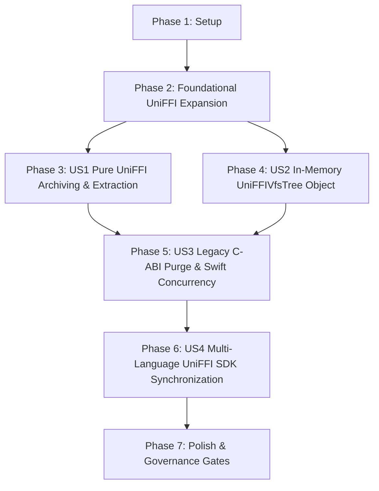

# Tasks: 015 100% Pure UniFFI Architecture & Total C-ABI Decommissioning

- **Feature Directory**: `specs/015-glue-and-bridge-architecture-evolution`
- **Classification**: `[Full SDD]`
- **Status**: `Complete`
- **Created**: 2026-08-25
- **Author**: Antigravity AI & TTZip Architectural Governance Team

---

## Dependencies & Story Execution Order

---

## Phase 1: Setup & Environment Initialization

- [x] T001 Verify Cargo uniffi-bindgen dependencies and Swift 6 compiler toolchain in `core/rust/Cargo.toml` and `core/Package.swift`
- [x] T002 Verify contract schema validation passes cleanly via `specs/015-glue-and-bridge-architecture-evolution/contracts/`

---

## Phase 2: Foundational UniFFI Engine Expansion

- [x] T003 [P] Implement `CancellationToken` atomic boolean object in `core/rust/ttzip-engine/src/uniffi_api/cancellation.rs`
- [x] T004 [P] Implement `ProgressHandler` callback interface and 60Hz rate gate in `core/rust/ttzip-engine/src/uniffi_api/progress.rs`
- [x] T005 [P] Define `UniFFICreateOptions` and `UniFFIExtractOptions` records in `core/rust/ttzip-engine/src/uniffi_api/types.rs`

---

## Phase 3: User Story 1 - 100% Pure UniFFI Archiving, Extraction & Inspection (Priority: P1)

**Story Goal**: Migrate all archiving, extraction, inspection, selective extraction, and waveform analysis to UniFFI without manual C-ABI pointers.

- [x] T006 [P] [US1] Implement `TTZipEngineCore.create_archive` and `extract_archive` in `core/rust/ttzip-engine/src/uniffi_api/archive.rs`
- [x] T007 [P] [US1] Implement `TTZipEngineCore.inspect_archive` and `extract_selected` in `core/rust/ttzip-engine/src/uniffi_api/inspect.rs`
- [x] T008 [P] [US1] Export `extract_audio_waveform` and `verify_integrity` via UniFFI in `core/rust/ttzip-engine/src/uniffi_api/audio.rs`
- [x] T009 [US1] Run `uniffi-bindgen generate` to produce updated Swift scaffolding in `core/Sources/TTZipCore/Generated/ttzip_engine.swift`

---

## Phase 4: User Story 2 - Persistent In-Memory UniFFIVfsTree Object & Paging (Priority: P1)

**Story Goal**: Export `UniFFIVfsTree` object for $< 0.5\text{ms}$ in-memory windowed paging and fuzzy search.

- [x] T010 [P] [US2] Implement `UniFFIVfsTree` object with `get_children` and `fuzzy_search` in `core/rust/ttzip-engine/src/uniffi_api/vfs.rs`
- [x] T011 [P] [US2] Refactor `RustVfsSession.swift` to wrap `UniFFIVfsTree` object in `core/Sources/TTZipCore/Bridge/RustVfsSession.swift`
- [x] T012 [P] [US2] Connect `FinderMillerColumnsView` to UniFFI VFS tree paging in `apple/Sources/TTZipApp/Views/FinderMillerColumnsView.swift`
- [x] T013 [US2] Add VFS object throughput unit tests in `core/Tests/TTZipTests/RustVfsSessionTests.swift`

---

## Phase 5: User Story 3 - Legacy C-ABI Purge & Swift 6 Strict Concurrency (Priority: P1)

**Story Goal**: Delete `CTTZipBridge`, remove all raw pointer adapters, and refactor Swift engine facade to pure UniFFI.

- [x] T014 [P] [US3] Delete `CUnsafeBufferAdapter.swift`, `ClosureBox.swift`, and manual `ProgressBridgeContext.swift` in `core/Sources/TTZipCore/Bridge/`
- [x] T015 [P] [US3] Remove `CTTZipBridge` target and header paths from `core/Package.swift`
- [x] T016 [P] [US3] Refactor `ArchiveReader.swift`, `ArchiveWriter.swift`, and `ArchiveExtractor.swift` to call UniFFI APIs in `core/Sources/TTZipCore/`
- [x] T017 [US3] Refactor `actor TTZipEngine` to use UniFFI `TTZipEngineCore` and `withTaskCancellationHandler` in `core/Sources/TTZipCore/Facades/TTZipEngine.swift`
- [x] T018 [US3] Verify clean compilation with zero `@unchecked Sendable` annotations under Swift 6 strict concurrency in `core/Tests/TTZipTests/TTZipEngineActorTests.swift`

---

## Phase 6: User Story 4 - Multi-Language UniFFI SDK Synchronization (Priority: P2)

**Story Goal**: Synchronize all multi-language SDKs to consume UniFFI-generated bindings directly from Rust.

- [x] T019 [P] [US4] Generate and package UniFFI Python bindings in `core/python/ttzip/`
- [x] T020 [P] [US4] Generate UniFFI Kotlin/Java bindings in `core/sdk/jvm/src/main/kotlin/com/ttzip/`
- [x] T021 [P] [US4] Generate UniFFI Go bindings in `core/sdk/go/ttzip/`
- [x] T022 [P] [US4] Generate UniFFI Dart bindings in `core/sdk/dart/lib/`
- [x] T023 [P] [US4] Generate UniFFI .NET C# bindings in `core/sdk/dotnet/src/TTZip/`

---

## Phase 7: Polish & Governance Gates

- [x] T024 Enforce strict single-file $\le 800$ LOC governance audit across all source files
- [x] T025 Execute multi-language out-of-tree smoke test validation via `make test-out-of-tree-smoke`
- [x] T026 Execute full test suites (`swift test` and `cargo test --all`) with zero warnings
