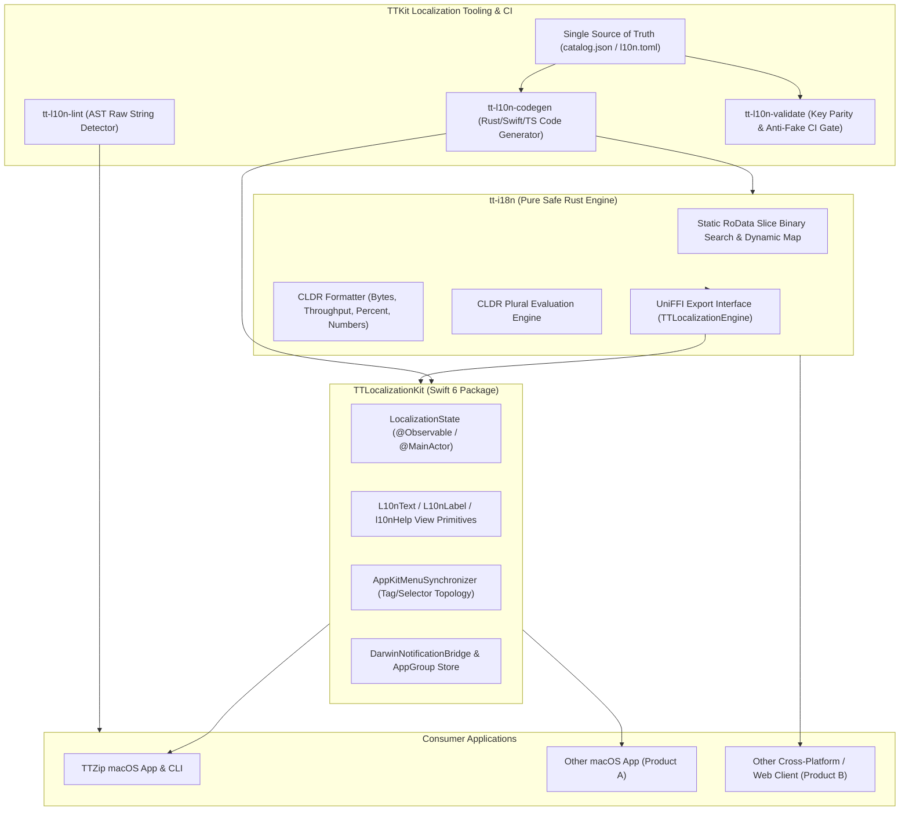

# Feature Specification: 018 TTKit Unified Localization SDK & Ecosystem Architecture

- **Feature Directory**: `specs/018-ttkit-unified-localization-sdk`
- **Classification**: `[Full SDD]`
- **Status**: `Specified`
- **Created**: 2026-08-25
- **Author**: Antigravity AI & TT Architectural Governance Team

---

## 1. Executive Summary & Problem Statement

In Feature 012 and 013, TTZip implemented a multi-tier internationalization (i18n) subsystem combining a Rust compile-time binary-search lookup engine, UniFFI C-ABI bindings, reactive Swift/SwiftUI presentation primitives (`AppLocalizationState`, `L10nText`, `L10nLabel`), AppKit dynamic menu tree synchronization (`AppKitMenuSynchronizer`), and AppGroup/Darwin cross-process synchronization.

However, these internationalization capabilities are currently hard-coupled directly inside `ttzip-engine` and `TTZipCore`. As the product ecosystem expands with additional desktop applications, CLI developer tools, cross-platform clients, and web/cloud frontends, the lack of an independent, reusable Localization SDK introduces significant risks:
1. **Re-inventing the Wheel**: Other applications within the ecosystem would have to duplicate the complex Darwin notifications, AppKit menu synchronizers, CLDR number/byte formatting, and reactive UI wrappers.
2. **Inconsistent Localization Ergonomics**: Without a unified SDK, different applications risk diverging on language fallback logic, pluralization rules, and format string safety.
3. **Manual 7-File Catalog Maintenance**: Developers currently must manually update 7 Rust files (`en.rs`, `zh_hans.rs`, `zh_hant.rs`, `ja.rs`, `de.rs`, `fr.rs`, `es.rs`) and Swift enum files for every string change, leading to synchronization drift.

This feature extracts and builds the standalone **`TTKit.Localization` SDK Suite** (comprising `tt-i18n` Rust Crate, `TTLocalizationKit` Swift 6 Package, `tt-i18n-web` TypeScript module, and automated CodeGen / CI Governance Tools), and outlines the seamless migration path for TTZip and future software products.

---

## 2. User Stories & Acceptance Criteria

### User Story 1: Standalone Cross-Platform Core Engine (`tt-i18n`)
- **As a** systems engineer building desktop apps, CLI tools, or server services,
- **I want** a standalone zero-allocation Rust crate `tt-i18n` with Mozilla UniFFI exports,
- **So that** any language ecosystem (Rust, Swift, Python, Kotlin, C#) can perform sub-microsecond string lookups, CLDR-standard formatting, and language resolution with zero heap allocation per lookup.
- **Acceptance Criteria**:
  - `tt-i18n` crate is decoupled from TTZip business logic.
  - Supports static compile-time `.rodata` dictionaries and dynamic JSON/MessagePack runtime catalog loading.
  - Exports `TTLocalizationEngine`, `AppLanguage`, `ByteSizeStandard`, and `PluralCategory` via UniFFI.
  - Zero heap allocation for static lookups; lookup latency $\le 10\text{ ns}$.

### User Story 2: Native Apple & Swift 6 SDK (`TTLocalizationKit`)
- **As an** Apple platform developer,
- **I want** a modern Swift Package (`TTLocalizationKit`) providing `@Observable` state management, SwiftUI primitives, AppKit menu synchronization, and cross-process Darwin notification bridges,
- **So that** any macOS/iOS app achieves instant zero-restart dynamic language switching (< 1ms) with full Swift 6 strict concurrency compliance.
- **Acceptance Criteria**:
  - `TTLocalizationKit` provides `LocalizationState` conforming to Swift 6 `@Observable` macro and `@MainActor`.
  - Provides reactive UI primitives `L10nText`, `L10nLabel`, and `.l10nHelp(_:)`.
  - Provides `AppKitMenuSynchronizer` supporting 3-tier topological synchronization (Permanent Tags $\to$ Action Selectors $\to$ Menu Tree Structural Slots).
  - Provides `DarwinNotificationBridge` and `AppGroupPreferenceStore` for sandboxed App Extensions (Finder Sync, Quick Look, Widgets).

### User Story 3: Single Source of Truth CodeGen & Tooling (`tt-l10n-tools`)
- **As an** application developer,
- **I want** to define all translation strings in a single structured contract (`catalog.json` or `l10n.toml`),
- **So that** Rust static tables, Swift enum namespaces (`L10n`), and TypeScript type definitions are generated automatically during build time without manual duplication.
- **Acceptance Criteria**:
  - `tt-l10n-codegen` converts structured catalog contracts into Rust `.rodata` tables and Swift `LocaleKeyProtocol` enums.
  - `tt-l10n-lint` statically analyzes view files to detect unlocalized raw string literals.
  - `tt-l10n-validate` enforces 100% key coverage across all languages, detects anti-fake localization duplicate thresholds (< 15%), and validates `%1$@` format specifier crash safety.

### User Story 4: Seamless TTZip App & Engine Migration
- **As a** TTZip core maintainer,
- **I want** TTZip's engine and GUI to consume `TTKit.Localization` with zero breaking changes to existing UI features,
- **So that** all 415+ existing keys, benchmark dashboards, password vaults, and archive error messages continue functioning seamlessly with 100% test pass rate.
- **Acceptance Criteria**:
  - `ttzip-engine` and `TTZipCore` migrate their localization dependencies to `tt-i18n` and `TTLocalizationKit`.
  - All existing unit and GUI localization tests pass 100%.

---

## 3. System Boundary & Component Architecture

---

## 4. Invariants & Constitution Compliance

1. **Mozilla UniFFI Mandatory Standard**: All cross-language interfaces between Rust `tt-i18n` and Swift/Python/TS MUST use UniFFI macro code generation; zero manual `UnsafePointer` or C headers allowed.
2. **Swift 6 Strict Concurrency**: All Swift components MUST conform to `@MainActor` or `Sendable` invariants without data races.
3. **Single-File LOC Threshold**: All generated and source files MUST remain $\le 800$ LOC.
4. **Zero Heap Allocation on Static Lookups**: In-memory catalog resolutions MUST execute in $O(\log N)$ or $O(1)$ time with zero dynamic allocations.
5. **Zero Subprocess Invocations**: Localization operations MUST occur strictly in-process with zero subprocess spawning.
