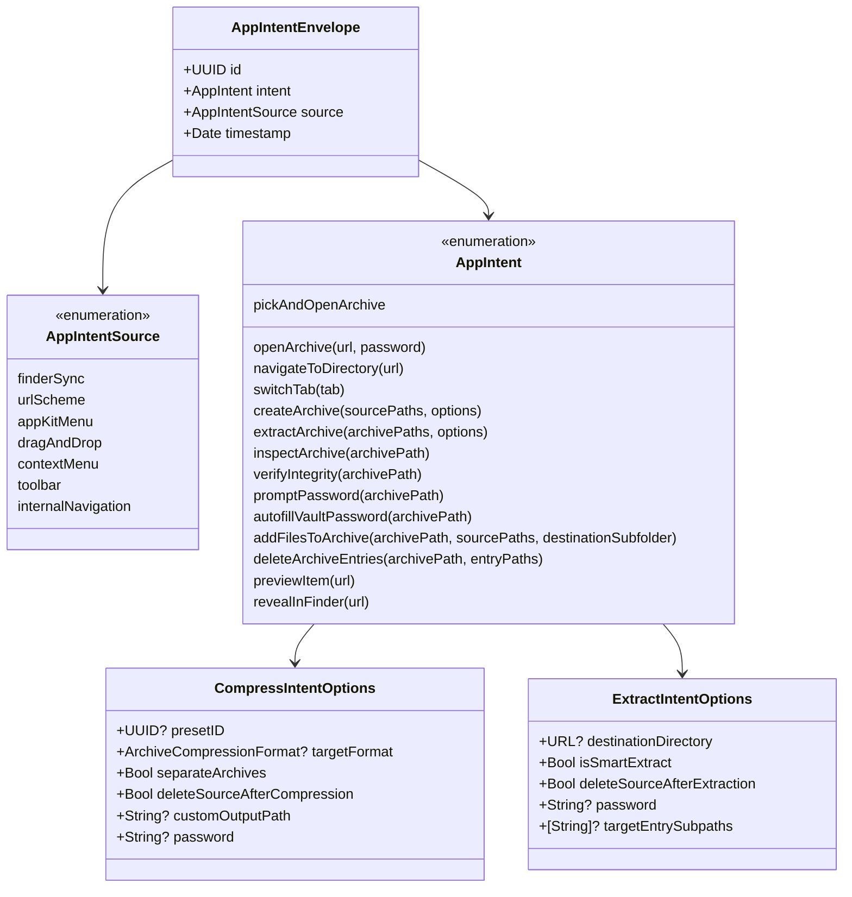
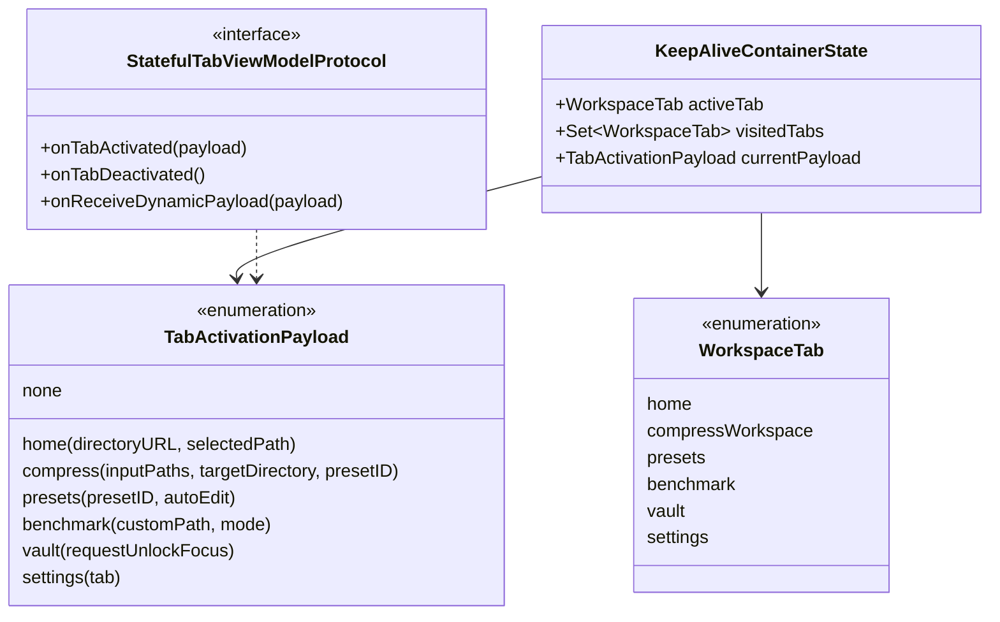

# Data Model: 019 Systemic Architecture & Quality Governance Hardening

- **Feature Directory**: `specs/019-systemic-architecture-and-quality-governance`
- **Status**: Completed
- **Created**: 2026-08-26
- **Author**: Antigravity AI & TTZip Architectural Governance Team

---

## 1. Intent Routing Domain Models



### 1.1 `AppIntent` & `AppIntentEnvelope`
```swift
public enum AppIntentSource: String, Sendable, Codable {
    case finderSync = "finder_sync"
    case urlScheme = "url_scheme"
    case appKitMenu = "appkit_menu"
    case dragAndDrop = "drag_and_drop"
    case contextMenu = "context_menu"
    case toolbar = "toolbar"
    case internalNavigation = "internal_navigation"
}

public struct AppIntentEnvelope: Sendable, Identifiable {
    public let id: UUID
    public let intent: AppIntent
    public let source: AppIntentSource
    public let timestamp: Date
}
```

---

## 2. Tab Lifecycle & Re-Entrancy Models



### 2.1 `TabActivationPayload`
```swift
public enum TabActivationPayload: Sendable, Equatable {
    case none
    case home(directoryURL: URL, selectedPath: String?)
    case compress(inputPaths: [String], targetDirectory: String?, presetID: UUID?)
    case presets(presetID: UUID?, autoEdit: Bool)
    case benchmark(customPath: String?, mode: BenchmarkMode?)
    case vault(requestUnlockFocus: Bool)
    case settings(tab: SettingsTab)
}
```

### 2.2 `StatefulTabViewModelProtocol`
```swift
@MainActor
public protocol StatefulTabViewModelProtocol: AnyObject {
    func onTabActivated(payload: TabActivationPayload)
    func onTabDeactivated()
    func onReceiveDynamicPayload(_ payload: TabActivationPayload)
}
```

---

## 3. Finite State Machine Transitions

| From State | Event / Intent | To State | Side Effects |
| :--- | :--- | :--- | :--- |
| `Any` | `.switchTab(tab)` | `Tab(tab)` | Previous tab calls `onTabDeactivated()`; target tab added to `visitedTabs` and calls `onTabActivated(payload: .none)`. |
| `Any` | `.createArchive(paths, options)` | `CompressWorkspace` | Active tab switches to `.compressWorkspace`; calls `onTabActivated(payload: .compress(paths))`; sets `itemsList`, `targetDirectory`, `outputName`. |
| `CompressWorkspace` | `.createArchive(newPaths, options)` | `CompressWorkspace` | Remains in `.compressWorkspace`; calls `onReceiveDynamicPayload(.compress(newPaths))`; reloads file items without full view recreation. |
| `Any` | `.inspectArchive(path)` | `Overlay(ArchiveInspector)` | Sets `overlayState.inspectingArchivePath = path`; `overlayState.showArchiveInspectorModal = true`. |
| `Any` | `.promptPassword(path)` | `Overlay(PasswordPrompt)` | Sets `pendingEncryptedPath = path`; `showPasswordPrompt = true`. |
