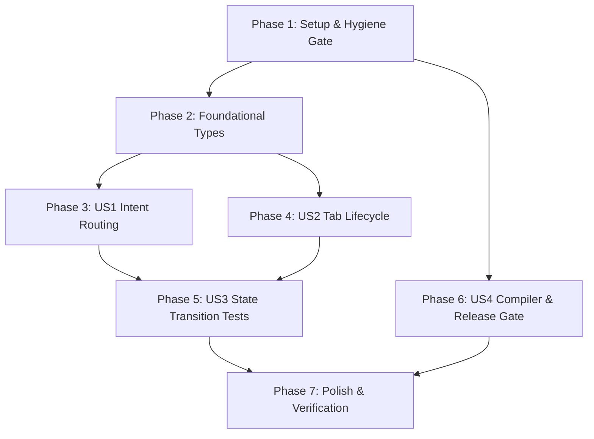

# Tasks: 019 Systemic Architecture & Quality Governance Hardening

- **Feature Directory**: `specs/019-systemic-architecture-and-quality-governance`
- **Classification**: `[Full SDD]`
- **Status**: `Ready for Execution`
- **Created**: 2026-08-26
- **Author**: Antigravity AI & TTZip Architectural Governance Team

---

## Task Summary

- **Total Tasks**: 26
- **Tasks per User Story**:
  - Setup & Hygiene: 2 tasks (T001–T002)
  - Foundational: 2 tasks (T003–T004)
  - User Story 1 (Unified Intent Routing): 6 tasks (T005–T010)
  - User Story 2 (Reactive Tab Lifecycle): 6 tasks (T011–T016)
  - User Story 3 (State Transition Test Suite): 3 tasks (T017–T019)
  - User Story 4 (Compiler & Release Engineering): 4 tasks (T020–T023)
  - Polish & Quality Gate Verification: 3 tasks (T024–T026)
- **Parallelizable Tasks**: 14 tasks marked with `[P]`
- **Suggested MVP Scope**: Phase 1 + Phase 2 + Phase 3 (US1: Unified Intent Routing)

---

## Phase 1: Setup & Hygiene Gate Foundation

- [x] T001 Implement deterministic repository hygiene linter in `scripts/lint_repo_hygiene.sh` and grant executable permissions.
- [x] T002 Clean up dead/orphaned files (`core/*.html`, `core/CNAME`, `core/_config.yml`, `core/.nojekyll`, and orphaned `core/Sources/TTZipApp`, `TTZipFinderSync`, `TTZipQuickLook`).

---

## Phase 2: Foundational Types & Core Data Models

- [x] T003 [P] Define `AppIntentSource`, `CompressIntentOptions`, `ExtractIntentOptions`, `AppIntent`, and `AppIntentEnvelope` in `apple/Sources/TTZipApp/Services/AppIntent.swift`.
- [x] T004 [P] Define `TabActivationPayload` and `StatefulTabViewModelProtocol` in `apple/Sources/TTZipApp/Components/TabLifecycle.swift`.

---

## Phase 3: User Story 1 - Unified Intent Routing & Entrypoint Hardening (P1)

> **Story Goal**: All 5 native entrypoints (FinderSync, URL Scheme, Drag & Drop, Context Menus, AppKit Menus) route through a strongly-typed `AppIntentDispatcher` without silent drops.

- [x] T005 [P] [US1] Implement `AppIntentParser.swift` for URL Scheme parsing, POSIX path sanitization, and safe `NSItemProvider` file URL extraction in `apple/Sources/TTZipApp/Services/AppIntentParser.swift`.
- [x] T006 [US1] Implement `@MainActor` `AppIntentDispatcher.swift` with frontmost window activation and state routing in `apple/Sources/TTZipApp/Services/AppIntentDispatcher.swift`.
- [x] T007 [US1] Refactor `TTZipApp.swift` and `AppDelegate.swift` to route `onOpenURL` and `openFiles` through `AppIntentParser` & `AppIntentDispatcher` in `apple/Sources/TTZipApp/TTZipApp.swift`.
- [x] T008 [US1] Refactor `TTZipMenuCommands.swift` and `MainView+Toolbar.swift` to eliminate dead notifications and route shortcuts (Cmd+N, Cmd+O) to `AppIntentDispatcher` regardless of archive open state in `apple/Sources/TTZipApp/Views/TTZipMenuCommands.swift`.
- [x] T009 [US1] Fix `HomeDropZoneView.swift` `NSItemProvider` casting by utilizing `AppIntentParser.extractPaths` in `apple/Sources/TTZipApp/Views/Explorer/HomeDropZoneView.swift`.
- [x] T010 [US1] Refactor `MillerColumnItemRowView+ContextMenu.swift` and `SingleMillerColumnView.swift` to route context menu operations through `AppIntentDispatcher` in `apple/Sources/TTZipApp/Views/Explorer/MillerColumnItemRowView+ContextMenu.swift`.

---

## Phase 4: User Story 2 - Reactive Tab Lifecycle Invariant & KeepAlive State (P2)

> **Story Goal**: Cached tabs in `KeepAliveTabContainer` receive lifecycle signals (`isActive`, `onTabActivated`), preventing keyboard event leaks and updating dynamic session inputs.

- [x] T011 [P] [US2] Upgrade `KeepAliveTabContainer.swift` to propagate `isActive: Bool` and `payload: TabActivationPayload` to child tab views in `apple/Sources/TTZipApp/Components/KeepAliveTabContainer.swift`.
- [x] T012 [P] [US2] Implement `TabLifecycleModifier.swift` (`.onTabLifecycle(isActive:payload:onActivate:onDeactivate:)`) in `apple/Sources/TTZipApp/Components/TabLifecycleModifier.swift`.
- [x] T013 [US2] Fix `DiskDirectoryBrowserView.swift` to add `.onChange(of: rootDirectory)` for external navigation synchronization in `apple/Sources/TTZipApp/Views/Explorer/DiskDirectoryBrowserView.swift`.
- [x] T014 [US2] Scope `FinderMillerColumnsView.swift` `NSEvent` key monitor strictly to `isActive == true` to prevent keyboard hijacking in other tabs in `apple/Sources/TTZipApp/Views/Explorer/FinderMillerColumnsView.swift`.
- [x] T015 [US2] Update `CompressModalView.swift` and `CompressFormSession.swift` to handle dynamic re-entrant activation, clear lingering summary sheets, and reload input paths in `apple/Sources/TTZipApp/Views/CompressModalView.swift`.
- [x] T016 [P] [US2] Migrate `PresetWorkspaceViewModel.swift`, `BenchmarkViewModel.swift`, and `PasswordVaultViewModel.swift` to `@Observable` + `@MainActor` and implement `StatefulTabViewModelProtocol`.

---

## Phase 5: User Story 3 - Multi-Entrypoint & State Transition Test Suite (P3)

> **Story Goal**: Deploy automated XCTest integration tests for state transitions, cross-tab payload re-entrancy, and FinderSync action mappings.

- [x] T017 [P] [US3] Create test harness utilities (`MockFileURLHarness.swift`, `MockDarwinNotificationHarness.swift`, `KeepAliveTabHarness.swift`) in `apple/Tests/TTZipAppTests/Harnesses/`.
- [x] T018 [P] [US3] Implement `AppNavigationStateFlowTests.swift` verifying tab transitions, KeepAlive retention, and overlay invariants in `apple/Tests/TTZipAppTests/AppNavigationStateFlowTests.swift`.
- [x] T019 [P] [US3] Implement `FinderSyncIntentMappingTests.swift` verifying URL scheme roundtrips, CJK path decoding, 10 action identifiers, and Darwin notification sync in `apple/Tests/TTZipAppTests/FinderSyncIntentMappingTests.swift`.

---

## Phase 6: User Story 4 - Zero-Warning Compiler & Release-by-Default Engineering (P4)

> **Story Goal**: Lock compilation and release pipelines to zero warnings, strict concurrency, Release-by-Default, and Hardened Runtime signatures.

- [x] T020 [P] [US4] Update `apple/Package.swift` to enable Strict Concurrency (`.enableUpcomingFeature("StrictConcurrency")`) and enforce `-warnings-as-errors`.
- [x] T021 [P] [US4] Update `core/Package.swift` to remove `-no-whole-module-optimization` and enable Strict Concurrency.
- [x] T022 [US4] Update `apple/scripts/bundle_app.sh` with dynamic architecture bin path resolution, Sparkle runtime signing, symbol stripping (`strip -x`), and `-warnings-as-errors`.
- [x] T023 [US4] Update `core/Install-TTZip.command` and `core/Makefile` to coordinate with `apple/scripts/bundle_app.sh --release`.

---

## Phase 7: Polish & Governance Verification

- [x] T024 Execute `scripts/lint_repo_hygiene.sh` and verify 0 violations across the repository.
- [x] T025 Execute `swift test` across both `apple/` and `core/` and verify 100% test pass rate with 0 failures.
- [x] T026 Execute `./apple/scripts/bundle_app.sh --release` and verify pristine 0-warning compilation and valid code-signed `dist/TTZip.app`.

---

## Dependencies & Execution Order

---

## Parallel Execution Examples

- **Batch 1 (Foundational Models)**: T003 (`AppIntent.swift`) and T004 (`TabLifecycle.swift`) can be implemented in parallel.
- **Batch 2 (Core Services & Container)**: T005 (`AppIntentParser.swift`), T011 (`KeepAliveTabContainer.swift`), and T012 (`TabLifecycleModifier.swift`) can be implemented in parallel.
- **Batch 3 (Test Harnesses & Suites)**: T017 (`Harnesses`), T018 (`AppNavigationStateFlowTests`), and T019 (`FinderSyncIntentMappingTests`) can be authored in parallel.
- **Batch 4 (Package Manifests)**: T020 (`apple/Package.swift`) and T021 (`core/Package.swift`) can be updated in parallel.
