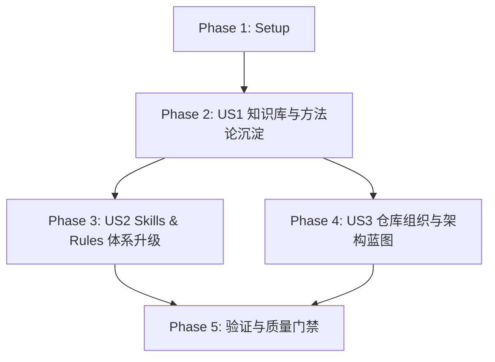

# Tasks: libarchive 全方位工程卓越性学习与体系改进规范

**Feature Directory**: `specs/036-libarchive-standards-architecture-workflow-synthesis`  
**Date**: 2026-08-16  
**Status**: Ready for Implementation  
**Spec**: [spec.md](file:///Users/kevintung/Documents/dev/TTZip/specs/036-libarchive-standards-architecture-workflow-synthesis/spec.md)  
**Plan**: [plan.md](file:///Users/kevintung/Documents/dev/TTZip/specs/036-libarchive-standards-architecture-workflow-synthesis/plan.md)

---

## Dependencies & Phase Map

---

## Phase 1: Setup & Groundwork

- [x] T001 [Setup] Initialize architecture doc directory structure in `docs/architecture/`
- [x] T002 [Setup] Assert Schema and Contract integrity for feature 036 in `specs/036-libarchive-standards-architecture-workflow-synthesis/quickstart.md`

---

## Phase 2: User Story 1 - 全面萃取 libarchive 核心架构、安全与工程标准规范 (Priority: P1)

- [x] T003 [P] [US1] Author comprehensive engineering excellence synthesis report in `docs/architecture/libarchive_engineering_excellence.md`
- [x] T004 [P] [US1] Synthesize testing philosophy and golden oracle corpus guide in `docs/architecture/libarchive_testing_oracle_philosophy.md`

---

## Phase 3: User Story 2 - 提示词 (Prompts)、Rules 与 Agent Skills 体系全量升级 (Priority: P2)

- [x] T005 [P] [US2] Upgrade code-review skill with C system-level & hardware defense checklists in `.agents/skills/code-review/SKILL.md`
- [x] T006 [P] [US2] Upgrade upstream-contribution skill with mdoc, bisectability & bidding protocol in `.agents/skills/upstream-contribution/SKILL.md`
- [x] T007 [P] [US2] Upgrade design-patterns-guide skill with streaming pipeline & lock-free buffer patterns in `.agents/skills/design-patterns-guide/SKILL.md`
- [x] T008 [US2] Update GEMINI.md project rules with libarchive systems defensive & streaming architecture invariants in `GEMINI.md`

---

## Phase 4: User Story 3 - 代码仓库组织与跨语言架构模式改进方案 (Priority: P3)

- [x] T009 [P] [US3] Author multi-tier repository architecture layout and dependency isolation blueprint in `docs/architecture/repository_organization_guide.md`
- [x] T010 [P] [US3] Update ARCHITECTURE.md with 4-tier layer boundaries and upstream worktree isolation in `ARCHITECTURE.md`

---

## Phase 5: Polish & Final Quality Gates

- [x] T011 [Polish] Execute verification commands defined in quickstart.md and validate contract compliance
- [x] T012 [Polish] Run unit tests and benchmark suite to ensure zero regression in TTZip test suite

