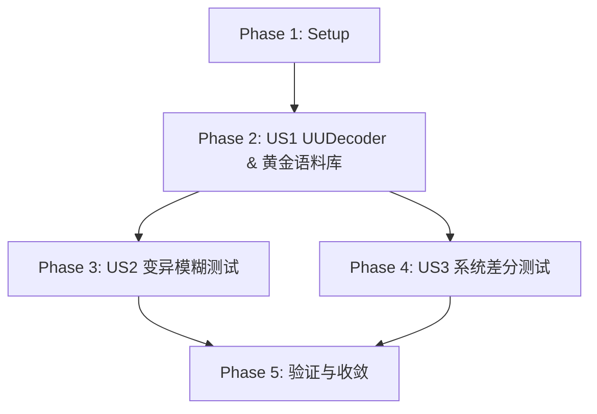

# Tasks: libarchive 黄金预言机语料库、变异模糊测试与系统差分测试工程落地

**Feature Directory**: `specs/037-libarchive-golden-oracle-and-fuzz-integration`  
**Date**: 2026-08-16  
**Status**: Ready for Implementation  
**Spec**: [spec.md](file:///Users/kevintung/Documents/dev/TTZip/specs/037-libarchive-golden-oracle-and-fuzz-integration/spec.md)  
**Plan**: [plan.md](file:///Users/kevintung/Documents/dev/TTZip/specs/037-libarchive-golden-oracle-and-fuzz-integration/plan.md)

---

## Dependencies & Phase Map

---

## Phase 1: Setup & Groundwork

- [x] T001 [Setup] Initialize GoldenCorpus directory in `Tests/TTZipTests/Fixtures/GoldenCorpus/`
- [x] T002 [Setup] Assert Schema and Contract integrity for feature 037 in `specs/037-libarchive-golden-oracle-and-fuzz-integration/quickstart.md`

---

## Phase 2: User Story 1 - UUEncode 黄金缺陷语料库与解码回归套件 (Priority: P1)

- [x] T003 [P] [US1] Implement streaming UUDecoder in `Sources/TTZipCore/Utilities/UUDecoder.swift`
- [x] T004 [P] [US1] Import curated upstream .uu historical bug fixtures into `Tests/TTZipTests/Fixtures/GoldenCorpus/`
- [x] T005 [US1] Implement ArchiveGoldenCorpusTests in `Tests/TTZipTests/ArchiveGoldenCorpusTests.swift`

---

## Phase 3: User Story 2 - In-Process 变异模糊测试与崩溃优先转储门禁 (Priority: P2)

- [x] T006 [US2] Implement ArchiveMutationFuzzTests with crash-first persistence in `Tests/TTZipTests/ArchiveMutationFuzzTests.swift`

---

## Phase 4: User Story 3 - macOS 系统原生工具跨进程双向差分测试 (Priority: P3)

- [x] T007 [US3] Implement SystemDifferentialTests with /usr/bin/tar and /usr/bin/unzip in `Tests/TTZipTests/SystemDifferentialTests.swift`

---

## Phase 5: Polish & Final Quality Gates

- [x] T008 [Polish] Execute quickstart verification suite and validate test coverage

