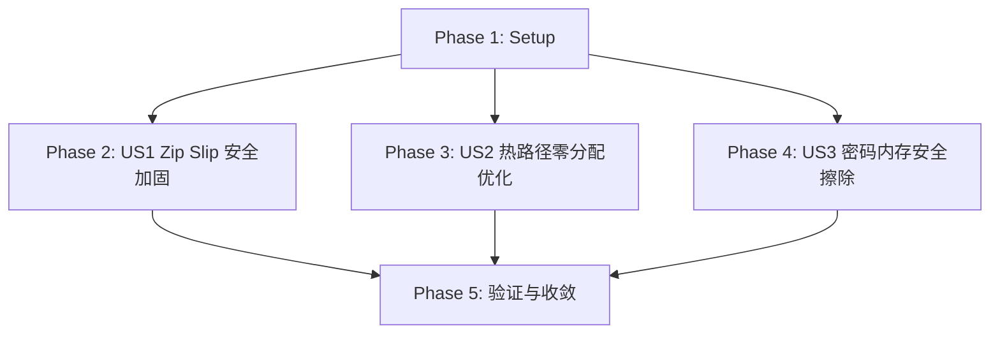

# Tasks: libarchive 级防御性安全与零分配热路径加固

**Feature Directory**: `specs/038-libarchive-defensive-security-and-zero-allocation-hardening`  
**Date**: 2026-08-16  
**Status**: Ready for Implementation  
**Spec**: [spec.md](file:///Users/kevintung/Documents/dev/TTZip/specs/038-libarchive-defensive-security-and-zero-allocation-hardening/spec.md)  
**Plan**: [plan.md](file:///Users/kevintung/Documents/dev/TTZip/specs/038-libarchive-defensive-security-and-zero-allocation-hardening/plan.md)

---

## Dependencies & Phase Map

---

## Phase 1: Setup & Groundwork

- [x] T001 [Setup] Assert Schema and Contract integrity for feature 038 in `specs/038-libarchive-defensive-security-and-zero-allocation-hardening/quickstart.md`

---

## Phase 2: User Story 1 - 解压管道 Zip Slip 与符号链接穿透防御加固 (Priority: P1)

- [x] T002 [P] [US1] Enable ARCHIVE_EXTRACT_SECURE_SYMLINKS and ARCHIVE_EXTRACT_SECURE_NOABSOLUTEPATHS in `Sources/CTTZipBridge/CTTZipBridge_Archive.c`
- [x] T003 [P] [US1] Implement sanitizePath and Zip Slip defense in `Sources/TTZipCore/SecurityScanner.swift`

---

## Phase 3: User Story 2 - 消除热路径隐式内核零填充与内存分配优化 (Priority: P2)

- [x] T004 [US2] Refactor LibdeflateCAdapter with uninitialized raw pointers and bytesNoCopy in `Sources/TTZipCore/Adapters/LibdeflateCAdapter.swift`

---

## Phase 4: User Story 3 - C 桥接层句柄魔数清零与敏感内存安全擦除 (Priority: P3)

- [x] T005 [US3] Add secure memset_s memory zeroing before freeing sensitive credentials in `Sources/CTTZipBridge/CTTZipBridge_Crypto.c`

---

## Phase 5: Polish & Final Quality Gates

- [x] T006 [Polish] Execute quickstart verification suite and validate hardening implementation

