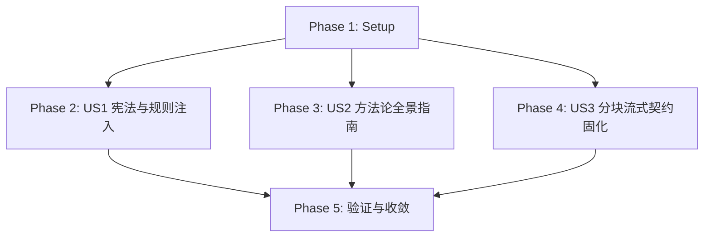

# Tasks: 系统性工程方法论与底层不变量体系重塑

**Feature Directory**: `specs/039-systemic-engineering-methodology-and-invariants-reconstruction`  
**Date**: 2026-08-16  
**Status**: Ready for Implementation  
**Spec**: [spec.md](file:///Users/kevintung/Documents/dev/TTZip/specs/039-systemic-engineering-methodology-and-invariants-reconstruction/spec.md)  
**Plan**: [plan.md](file:///Users/kevintung/Documents/dev/TTZip/specs/039-systemic-engineering-methodology-and-invariants-reconstruction/plan.md)

---

## Dependencies & Phase Map

---

## Phase 1: Setup & Groundwork

- [x] T001 [Setup] Assert Schema and Contract integrity for feature 039 in `specs/039-systemic-engineering-methodology-and-invariants-reconstruction/quickstart.md`

---

## Phase 2: User Story 1 - 宪法与项目级规则注入四大系统工程铁律 (Priority: P1)

- [x] T002 [P] [US1] Inject Four Systemic Engineering Invariants into `.specify/memory/constitution.md`
- [x] T003 [P] [US1] Inject Four Systemic Engineering Invariants into `GEMINI.md`

---

## Phase 3: User Story 2 - 编写《TTZip 工业级系统工程方法论与心智模型指南》 (Priority: P2)

- [x] T004 [US2] Author `systemic_engineering_methodology.md` in `docs/architecture/`

---

## Phase 4: User Story 3 - 7z 实体流分块压缩架构重构计划与接口契约固化 (Priority: P3)

- [x] T005 [US3] Finalize `chunked_solid_stream_spec.json` and `systemic_engineering_spec.json` in `contracts/`

---

## Phase 5: Polish & Final Quality Gates

- [x] T006 [Polish] Execute quickstart verification suite for feature 039

