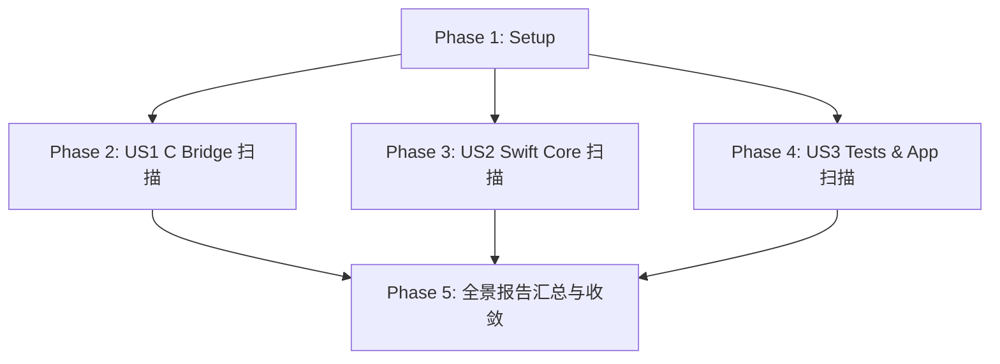

# Tasks: 基于四大系统工程铁律的 TTZip 全仓库深度代码审计

**Feature Directory**: `specs/040-comprehensive-systemic-invariants-codebase-audit`  
**Date**: 2026-08-16  
**Status**: In Progress  
**Spec**: [spec.md](file:///Users/kevintung/Documents/dev/TTZip/specs/040-comprehensive-systemic-invariants-codebase-audit/spec.md)  
**Plan**: [plan.md](file:///Users/kevintung/Documents/dev/TTZip/specs/040-comprehensive-systemic-invariants-codebase-audit/plan.md)

---

## Dependencies & Phase Map

---

## Phase 1: Setup & Groundwork

- [x] T001 [Setup] Assert Schema and Contract integrity for feature 040 in `specs/040-comprehensive-systemic-invariants-codebase-audit/quickstart.md`

---

## Phase 2: User Story 1 - C 桥接层与底层引擎系统级不变量全量扫描 (Priority: P1)

- [x] T002 [US1] Complete C Bridge source-level scan and consolidate findings in `research.md`

---

## Phase 3: User Story 2 - Swift 核心管道与设计模式数据平面合规审计 (Priority: P2)

- [x] T003 [US2] Complete Swift Core hot-path and memory scan and consolidate findings in `research.md`

---

## Phase 4: User Story 3 - 测试套件预言机有效性与应用层防御审计 (Priority: P3)

- [x] T004 [US3] Complete Tests Oracle and UI Layer isolation scan and consolidate findings in `research.md`

---

## Phase 5: Polish & Final Quality Gates

- [x] T005 [Polish] Author `docs/architecture/comprehensive_systemic_audit_report.md` with full defect matrix and roadmap
- [x] T006 [Polish] Execute quickstart verification suite for feature 040

