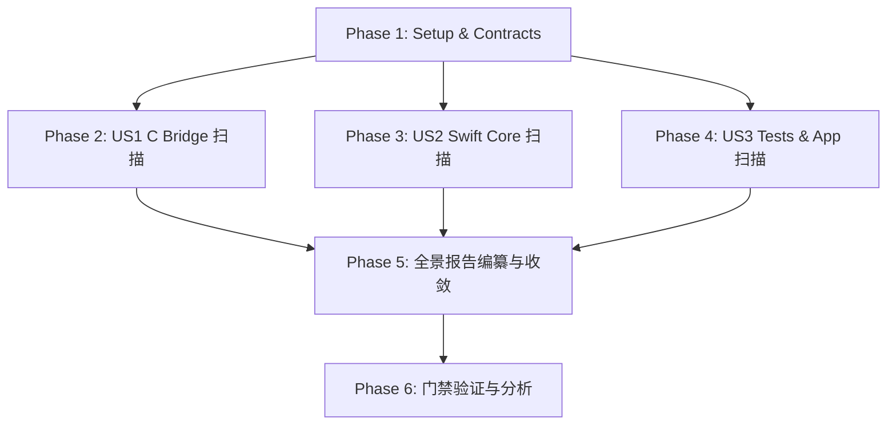

# Tasks: 基于项目规范与最高行业标准的 TTZip 全代码库深度审计 (Full Codebase Standards Audit Tasks)

**Feature Branch**: `041-full-codebase-standards-audit`  
**Feature Directory**: `specs/041-full-codebase-standards-audit`  
**Created**: 2026-08-17  
**Status**: In Progress  
**Spec**: [spec.md](file:///Users/kevintung/Documents/dev/TTZip/specs/041-full-codebase-standards-audit/spec.md)  
**Plan**: [plan.md](file:///Users/kevintung/Documents/dev/TTZip/specs/041-full-codebase-standards-audit/plan.md)

---

## Dependencies & Phase Map

---

## Phase 1: Setup & Groundwork (Shared Infrastructure)

- [x] T001 [Setup] Assert Schema and Contract integrity for feature 041 in `specs/041-full-codebase-standards-audit/contracts/codebase_audit_spec.json`
- [x] T002 [Setup] Create and validate data model in `specs/041-full-codebase-standards-audit/data-model.md`

---

## Phase 2: User Story 1 - 底层 C 桥接与汇编硬件加速层系统级安全与确界审计 (Priority: P1)

- [x] T003 [P] [US1] Scan Stream-First memory allocations (Solid/LZFSE/7Z) in `Sources/CTTZipBridge/CTTZipBridge_7zSolid.c`, `ttzip_lzma2_enc_native.c`, `CTTZipBridge_LZFSE.c`
- [x] T004 [P] [US1] Scan Invariant-First Zip-Slip, symlink and O_NOFOLLOW defenses in `Sources/CTTZipBridge/ttzip_tar_zstd_direct.c`, `CTTZipBridge_7zNativeDecoder.c`, `CTTZipExtract.c`
- [x] T005 [P] [US1] Scan Bounds-First memset_s physical erasing and struct magic lifecycles in `Sources/CTTZipBridge/ttzip_7z_kdf_arm64.c`, `CTTZipBridge_Crypto.c`, `CTTZipBridge_ZipWrite.c`
- [x] T006 [US1] Consolidate US1 findings with exact line numbers and remediation into `specs/041-full-codebase-standards-audit/research.md`

---

## Phase 3: User Story 2 - Swift 6 核心管道与 28 大设计模式数据平面合规审计 (Priority: P2)

- [x] T007 [P] [US2] Scan 7z CBC encryption concurrency model and decompressor data drop in `Sources/TTZipCore/SevenZip/SevenZipCryptoEngine.swift`, `SevenZipBlockParallelDecompressor.swift`
- [x] T008 [P] [US2] Scan Password recovery engine memory probe vs disk unpack in `Sources/TTZipCore/PasswordRecoveryEngine.swift`, `TemplateMethod/PasswordRecoveryEngineTemplate.swift`
- [x] T009 [P] [US2] Scan CUnsafeBufferAdapter tail recursion stack overflow in `Sources/TTZipCore/Adapters/CUnsafeBufferAdapter.swift`
- [x] T010 [P] [US2] Scan MemoryPageFlyweightPool force unwrap and redundant memset in `Sources/TTZipCore/Flyweights/MemoryPageFlyweightPool.swift`
- [x] T011 [US2] Consolidate US2 findings with exact line numbers and remediation into `specs/041-full-codebase-standards-audit/research.md`

---

## Phase 4: User Story 3 - 应用交互层架构规范与测试套件真实预言机审计 (Priority: P3)

- [x] T012 [P] [US3] Scan Fuzz tests fake-pass and GoldenCorpus decompression execution in `Tests/TTZipTests/ArchiveMutationFuzzTests.swift`, `ArchiveGoldenCorpusTests.swift`
- [x] T013 [P] [US3] Scan SystemDifferentialTests bidirectional testing in `Tests/TTZipTests/SystemDifferentialTests.swift`
- [x] T014 [P] [US3] Scan SecureField IME deadlock across 7 views in `Sources/TTZipApp/Views/`
- [x] T015 [P] [US3] Scan CTTZipBridge module leakage and layer bypass in `Sources/TTZipApp/TTZipApp.swift`, `Sources/TTZipCLI/TTZipCLIApp.swift`, `Sources/TTZipCore/Utilities/TTZipProcessExecutor.swift`
- [x] T016 [US3] Consolidate US3 findings with exact line numbers and remediation into `specs/041-full-codebase-standards-audit/research.md`

---

## Phase 5: Polish & Comprehensive Report Authoring

- [x] T017 [Polish] Author comprehensive 41-defect audit report with P0/P1/P2/P3 matrices and remediation roadmap in `docs/architecture/comprehensive_systemic_audit_report.md`
- [x] T018 [Polish] Execute quickstart test suite to assert contract and report integrity in `specs/041-full-codebase-standards-audit/quickstart.md`

---

## Phase 6: Final Verification & Quality Gates

- [x] T019 [Verify] Run full test suite regression `swift test`
- [x] T020 [Analyze] Execute speckit-converge and speckit-analyze consistency validations
