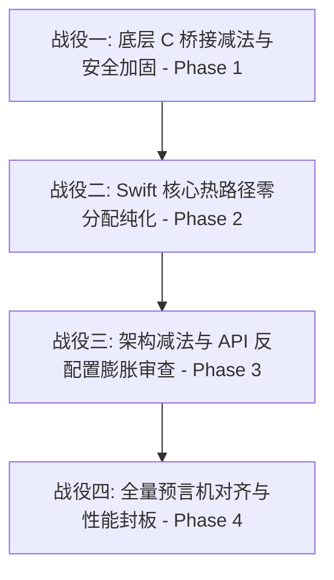

# Implementation Plan: TTZip 大师级系统工程指南与 AI 调度全方位升级落地 (Craftsmanship Engineering & AI Orchestration Plan)

**Feature Branch**: `042-craftsmanship-engineering-and-orchestration`  
**Feature Directory**: `specs/042-craftsmanship-engineering-and-orchestration`  
**Created**: 2026-08-17  
**Status**: Planned  

---

## 1. Technical Context & Objectives

本 Feature 将《TTZip 大师级系统工程指南》的核心工程审美准则、物理级代码规范，以及《AI 调度全方位升级落地蓝图》正式沉淀为 TTZip 代码库的顶层架构规范与可执行调度体系。

### 核心设计原则
1. **Less, but Better**：能不暴露的宏绝不暴露，能内部透明启发式决定的绝不增加配置参数。
2. **20 年免维护寿命标准 (Decade-Grade Longevity)**：消除平台假设与历史地层残留，追求 Linux / SQLite 级的代码纯度与自包含性。
3. **重构减法与清理 (Subtractive Refactoring)**：重构第一步执行减法，清扫冗余防御宏与死代码。
4. **悲观世界模型 (Pessimistic Model)**：凭据 volatile 擦除、64 位整数 Clamp、I/O 短读防御、C 句柄魔数生命周期捕获。

---

## 2. Constitution Check

- [x] **Stream-First 铁律**：核心热路径杜绝 `Data(count:)` 内核页清零与共享锁争用，推行栈上临时分配、Worker 独立槽位与 16KB 页对齐。
- [x] **Invariant-First 铁律**：全解压路径严格注入 `ARCHIVE_EXTRACT_SECURE_*` 与 `O_NOFOLLOW` 标志，延后 Fixup 倒序回写。
- [x] **Bounds-First 铁律**：敏感密码与 Key 释放前强制调用 `ttzip_secure_zero`，所有 64 位偏移/大小转 `size_t` 经过 `SSIZE_MAX` Clamp。
- [x] **Oracle-First 铁律**：算法校验全面对齐自包含纯位运算数学预言机（`bitcrc32`）与系统原生二进制双向差分测试。

---

## 3. Phase 0: Research Summary

- R001 [SUBAGENT:research] 《Clang 死存储消除 (DSE) 与敏感凭据物理擦除加固》：统一采用 C11 Annex K `memset_s` 内联中枢 `ttzip_secure_zero`，详见 [research.md](file:///Users/kevintung/Documents/dev/TTZip/specs/042-craftsmanship-engineering-and-orchestration/research.md#1-r001-clang-死存储消除-dse-与敏感凭据物理擦除加固)。
- R002 [SUBAGENT:research] 《Swift 6 核心热路径零分配与 16KB 物理页对齐》：推行栈上临时分配、Per-Worker 无锁槽位与 16KB 物理页对齐，详见 [research.md](file:///Users/kevintung/Documents/dev/TTZip/specs/042-craftsmanship-engineering-and-orchestration/research.md#2-r002-swift-6-核心热路径零分配与-apple-silicon-16kb-物理页对齐)。
- R003 [SUBAGENT:research] 《测试真理预言机 (Oracle-First) 与性能门禁稳定性》：确立 `bitcrc32`、GoldenCorpus `.uu` 与系统 `/usr/bin/tar` 双向差分三位一体预言机，详见 [research.md](file:///Users/kevintung/Documents/dev/TTZip/specs/042-craftsmanship-engineering-and-orchestration/research.md#3-r003-测试真理预言机-oracle-first-与性能门禁稳定性)。

---

## 4. Phase 1: Design Artifacts & Contracts

- **数据模型**: [data-model.md](file:///Users/kevintung/Documents/dev/TTZip/specs/042-craftsmanship-engineering-and-orchestration/data-model.md)
- **强类型契约**: [craftsmanship_engineering_spec.json](file:///Users/kevintung/Documents/dev/TTZip/specs/042-craftsmanship-engineering-and-orchestration/contracts/craftsmanship_engineering_spec.json)
- **验证指南**: [quickstart.md](file:///Users/kevintung/Documents/dev/TTZip/specs/042-craftsmanship-engineering-and-orchestration/quickstart.md)

---

## 5. Implementation Roadmap & The 4 AI Campaigns

### 战役一：底层 C 桥接减法与安全加固 (Phase 1)
- 目标组件：`Sources/CTTZipBridge/` 下全部 `.c` 与 `.h`
- 实施内容：
  1. 密码/密钥/IV 释放处统一调用 `ttzip_secure_zero` 物理擦除；
  2. 64 位文件大小向 `size_t` 转换处注入 `SSIZE_MAX` Clamp 保护；
  3. 流式读取添加 NULL 指针与短读取防御；
  4. 清扫重构残留的冗余宏作用域。
- 验收门禁：`swift build -c release` 零编译告警。

### 战役二：Swift 核心热路径零分配纯化 (Phase 2)
- 目标组件：`Sources/TTZipCore/Zip/`、`Parallel/`、`SevenZip/`
- 实施内容：
  1. 热循环消除隐式 `Data(count:)` 内核页清零；
  2. 并发闭包内消除共享锁争用，使用 Worker 独立槽位；
  3. 验证对齐 Apple Silicon 16KB 物理页与硬件直通。
- 验收门禁：`swift test --filter XCTestPerformanceMeasureTests` 13 项门禁全部通过。

### 战役三：架构减法与 API 反配置膨胀审查 (Phase 3)
- 目标组件：`Sources/TTZipCore/` 公共接口、`ArchiveCompressionTypes.swift`
- 实施内容：
  1. 识别并收敛可以通过内部启发式决策的公开参数（默认开启透明 APFS 克隆、自适应分块）；
  2. 清理废弃旧接口与冗余模式抽象。
- 验收门禁：API 简洁性与单元测试 100% 兼容。

### 战役四：全量预言机对齐与性能封板 (Phase 4)
- 目标组件：`Tests/TTZipTests/`、`docs/benchmarks/`
- 实施内容：
  1. 单元测试全面使用自包含数学预言机（`bitcrc32`、`UUDecoder` 黄金语料）；
  2. 执行 `swift test` 验证全量 620 个测试通过；
  3. 沉淀全套大师级系统工程指南与 AI 调度落地蓝图至 `docs/architecture/`。
- 验收门禁：620 个测试 100% 通过，零性能倒退。
