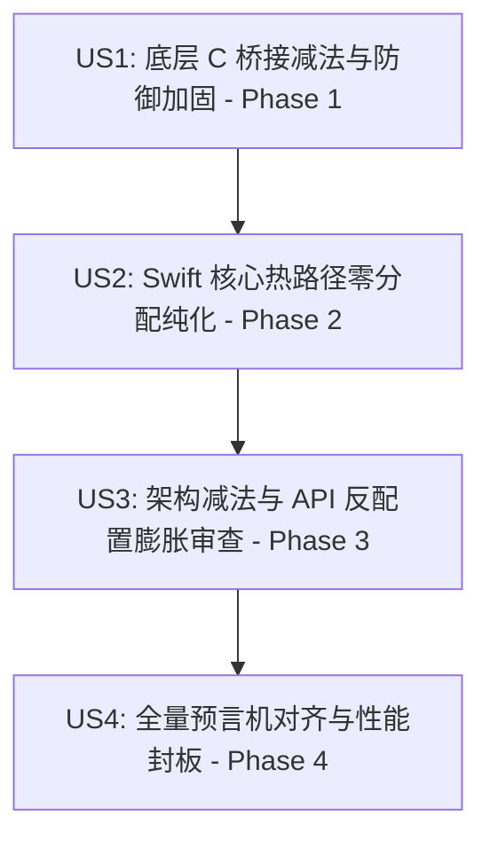

# Feature Specification: TTZip 大师级系统工程指南与 AI 调度全方位升级落地 (Craftsmanship Engineering & AI Orchestration Protocol)

**Feature Branch**: `042-craftsmanship-engineering-and-orchestration`  
**Feature Directory**: `specs/042-craftsmanship-engineering-and-orchestration`  
**Created**: 2026-08-17  
**Status**: Specified  

---

## 1. Executive Summary & Motivations

为了让 TTZip 真正蜕变为向 `libarchive`、`SQLite`、`Linux Kernel` 看齐的**大师级系统工程作品**，本规范正式确立 TTZip 项目的物理级工程审美准则、跨语言系统安全规范，以及严密的四阶段 AI 调度战役（AI Orchestration Protocol）。

核心哲学聚焦于 **“Less, but Better”**：
1. **零配置膨胀 (Zero Configuration Creep)**：内部通过文件大小（$\ge 64\text{KB}$）、非稀疏、普通文件等特征自动判定的逻辑，绝不向上层暴露冗余 Option 开关。
2. **20 年免维护寿命标准 (Decade-Grade Longevity)**：模块纯粹自包含，杜绝历史地层与未定义行为。
3. **重构减法铁律 (Subtractive Refactoring)**：重构第一动作清扫残留宏与死代码。
4. **悲观世界模型 (Invariant-First & Bounds-First)**：敏感凭据 volatile 擦除、64位 Clamp、短读防御、结构体魔数生命周期捕获。

---

## 2. User Stories & Phase Map

### User Story 1 (US1) - 底层 C 桥接减法与系统级安全防御加固 (Phase 1)
作为系统安全架构师，我希望 `Sources/CTTZipBridge/` 下所有 C/头文件均符合 Linux/libarchive 级安全规范：
- 所有密码、密钥（AES-256、KDF）、IV 在释放前必须使用 volatile 函数指针（`secure_zero_memory` / `memset_v`）物理擦除，免疫 Clang 死存储消除（DSE）。
- 所有 64 位文件大小向 `size_t` 转换处必须具备 Clamp 保护，算术运算具备防溢出断言。
- 所有流式读取必须具备 NULL 指针与短读防御。
- 彻底清理重构残留的冗余宏作用域。

### User Story 2 (US2) - Swift 6 核心热路径零分配纯化 (Phase 2)
作为高性能引擎开发者，我希望 `Sources/TTZipCore/` 热路径达到零中间堆分配：
- 消除热循环内的隐式 `Data(count:)` 内核零填充中断。
- 消除并发闭包内部的共享锁争用与动态对象树分配。
- 确保全面对齐 Apple Silicon 16KB 物理页与 NEON SIMD 硬件直通。

### User Story 3 (US3) - 架构减法与 API 反配置膨胀审查 (Phase 3)
作为 API 架构师，我希望公共接口设计极度克制：
- 识别并收敛可以通过内部启发式决策的公开参数，做到“调用方零感知、默认透明高性能”。
- 清理废弃旧接口与过度设计的模式抽象。

### User Story 4 (US4) - 全量预言机对齐与性能封板 (Phase 4)
作为质量保障负责人，我希望测试与基准坚不可摧：
- 单元测试全面使用项目原生数学预言机（`bitcrc32()` 等），消除硬编码常量。
- 46 项全格式基准测试全部达标，严守历史最优硬性能底线，断言零性能倒退。

---

## 3. Functional Requirements

1. **[REQ-01] 敏感内存物理擦除规范**：C/Swift 交互中所有涉及明文密码与派生密钥的缓冲区，在作用域结束前必须调用 `secure_zero_memory`，且在 CI 中通过汇编核查断言 `memset` 未被优化消除。
2. **[REQ-02] 跨架构整型与溢出 Clamp 规范**：跨语言调用中涉及 64 位偏移/长度向 `size_t` 转换必须使用 `(size_t)min((uint64_t)len, (uint64_t)SSIZE_MAX)` 保护。
3. **[REQ-03] 流式 I/O 双重断言规范**：读取流前断言 `ptr != NULL` 且 `bytes_avail >= required`，系统调用必须处理短读取并累加游标。
4. **[REQ-04] C 句柄魔数生命周期**：C 结构体句柄首字段定义 `uint32_t magic`，分配时写入，释放时前置清零。
5. **[REQ-05] 热路径零堆分配与 16KB 页对齐**：核心压缩解压热路径严禁单文件 `malloc`/`free`，内存映射基于 16KB 对齐。
6. **[REQ-06] 反配置膨胀内置透明启发式**：格式策略决策由引擎透明根据文件大小与类型选择，API 保持极简。
7. **[REQ-07] 原生数学预言机对齐**：所有测试校验使用自包含算法预言机。

---

## 4. Success Criteria & Quality Gates

- **[SC-01] 零编译告警与 WERROR**：`swift build` 在 Debug 与 Release 模式下 0 warning, 0 error。
- **[SC-02] 性能硬门禁全绿**：`swift test --filter XCTestPerformanceMeasureTests` 13 项门禁 100% 达标。
- **[SC-03] 全量测试回归**：`swift test` 620 项测试 100% 通过。
- **[SC-04] 工件与文档封板**：生成完整的方法论、工程指南与落地蓝图文档。
