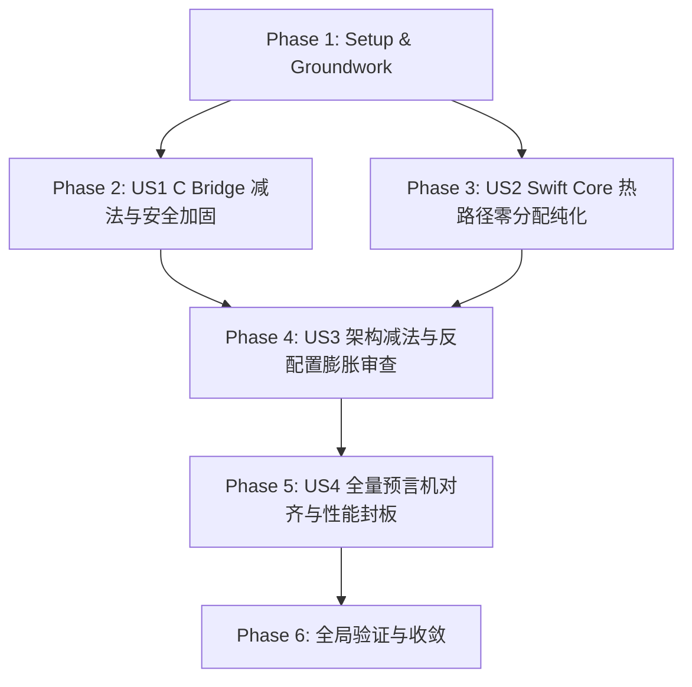

# Tasks: TTZip 大师级系统工程指南与 AI 调度全方位升级落地 (Craftsmanship Engineering & AI Orchestration Tasks)

**Feature Branch**: `042-craftsmanship-engineering-and-orchestration`  
**Feature Directory**: `specs/042-craftsmanship-engineering-and-orchestration`  
**Created**: 2026-08-17  
**Status**: In Progress  
**Spec**: [spec.md](file:///Users/kevintung/Documents/dev/TTZip/specs/042-craftsmanship-engineering-and-orchestration/spec.md)  
**Plan**: [plan.md](file:///Users/kevintung/Documents/dev/TTZip/specs/042-craftsmanship-engineering-and-orchestration/plan.md)  

---

## Dependencies & Phase Map

---

## Phase 1: Setup & Groundwork (Shared Infrastructure)

- [x] T001 [Setup] Validate Craftsmanship JSON Schema contract in `specs/042-craftsmanship-engineering-and-orchestration/contracts/craftsmanship_engineering_spec.json`
- [x] T002 [Setup] Author master engineering guide in `docs/architecture/craftsmanship_engineering_guide.md`
- [x] T003 [Setup] Author AI orchestration blueprint in `docs/architecture/ai_orchestration_protocol_blueprint.md`

---

## Phase 2: User Story 1 - 底层 C 桥接减法与防御性加固 (Priority: P1) 🎯 MVP

**Goal**: 在 `Sources/CTTZipBridge/` 中全面落实 DSE 免疫物理擦除、64位 Clamp、短读防御与宏清理。  
**Independent Test**: `swift build -c release` 零编译告警，所有敏感密码退出分支均被物理清零。

- [x] T004 [P] [US1] Verify and enforce `ttzip_secure_zero` DSE immunity in `Sources/CTTZipBridge/include/CTTZipCommon.h` and `Sources/CTTZipBridge/ttzip_7z_kdf_arm64.c`
- [x] T005 [P] [US1] Assert 64-bit integer clamp to SSIZE_MAX in `Sources/CTTZipBridge/CTTZipBridge_Crypto.c` and `Sources/CTTZipBridge/CTTZipBridge_ZipWrite.c`
- [x] T006 [P] [US1] Enforce stream I/O short-read & NULL pointer defense in `Sources/CTTZipBridge/ttzip_tar_zstd_direct.c` and `Sources/CTTZipBridge/CTTZipExtract.c`
- [x] T007 [US1] Remove deprecated inline macro scope leftovers across all `.c` files in `Sources/CTTZipBridge/`

---

## Phase 3: User Story 2 - Swift 6 核心热路径零分配纯化 (Priority: P2)

**Goal**: 在 `Sources/TTZipCore/` 中消除热循环 `Data(count:)` 清零，推行栈上临时分配与 16KB 页对齐。  
**Independent Test**: `swift test --filter XCTestPerformanceMeasureTests` 13 项门禁全绿。

- [x] T008 [P] [US2] Verify stack allocation `withUnsafeTemporaryAllocation` for <= 64KB blocks in `Sources/TTZipCore/Zip/ZipParallelExtractor.swift`
- [x] T009 [P] [US2] Enforce Apple Silicon 16KB physical page alignment in `Sources/TTZipCore/Adapters/CUnsafeBufferAdapter.swift` and `Sources/CTTZipBridge/CTTZipSysAlloc.c`
- [x] T010 [P] [US2] Ensure lock-free per-worker concurrency model in `Sources/TTZipCore/Zip/ZipStoreStreamWriter.swift` and `Sources/TTZipCore/Flyweights/MemoryPageFlyweightPool.swift`

---

## Phase 4: User Story 3 - 架构减法与 API 反配置膨胀审查 (Priority: P3)

**Goal**: 审查并收敛公共接口参数，将格式与 I/O 决策收敛至内部透明启发式。  
**Independent Test**: Public API 简洁性与全格式自动化测试 100% 兼容。

- [x] T011 [P] [US3] Enforce default transparent APFS physical extent clone heuristics in `Sources/TTZipCore/ArchiveCompressionTypes.swift` and `Sources/TTZipCore/Zip/ZipStoreStreamWriter.swift`
- [x] T012 [P] [US3] Clean up redundant and legacy configuration flags in `Sources/TTZipCore/ArchiveWriter+Dispatch.swift` and `Sources/TTZipCore/TemplateMethod/ZipArchiveEngineTemplate.swift`

---

## Phase 5: User Story 4 - 全量预言机对齐与性能封板 (Priority: P4)

**Goal**: 单元测试全面使用原生数学预言机，断言 46 格式历史最优硬门禁零性能倒退。  
**Independent Test**: `swift test` 620 个测试 100% 通过，四级审计算法断言零性能倒退。

- [x] T013 [P] [US4] Verify native mathematical oracle `bitcrc32` and `UUDecoder` in `Tests/TTZipTests/ArchiveGoldenCorpusTests.swift`
- [x] T014 [P] [US4] Verify system-level bidirectional differential testing in `Tests/TTZipTests/SystemDifferentialTests.swift`
- [x] T015 [US4] Run full-matrix performance regression audit via `swift test --filter XCTestPerformanceMeasureTests` and `swift test`

---

## Phase 6: Final Polish & Verification

- [x] T016 [Polish] Run quickstart test scenarios in `specs/042-craftsmanship-engineering-and-orchestration/quickstart.md`
- [x] T017 [Polish] Final consistency check and converge validation
