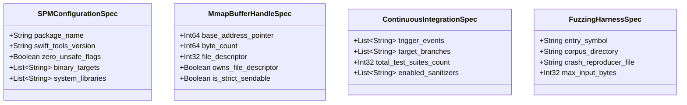

# Phase 1 Data Model: 043-top-tier-open

**Feature Directory**: `specs/043-top-tier-open`  
**Status**: Completed  

---

## 1. Entities Overview

本功能设计涵盖 4 大系统架构实体，所有字段与类型均与 `contracts/` 下的 JSON Schema 严格保持双向一致：

---

## 2. Entity Specifications

### 2.1 `SPMConfigurationSpec`
定义 Swift Package Manager 的标准化零 `unsafeFlags` 配置实体：
- `package_name` (`string`, 必填): 包名，固定为 `"TTZip"`
- `swift_tools_version` (`string`, 必填): 工具链版本，固定为 `"6.0"`
- `zero_unsafe_flags` (`boolean`, 必填): 必须为 `true`，断言没有任何 `.unsafeFlags`
- `binary_targets` (`array of string`, 必填): 包含 `"TTZipVendor"`
- `system_libraries` (`array of string`, 必填): 包含 `["bz2", "z", "iconv", "xml2", "expat", "c++"]`

### 2.2 `MmapBufferHandleSpec`
定义基于 ARC/RAII 的虚拟内存只读映射句柄模型：
- `base_address_pointer` (`integer`, 必填): 底层虚拟内存映射的基地址（非空且已对齐）
- `byte_count` (`integer`, 必填): 映射区域的实际字节数（$\ge 0$）
- `file_descriptor` (`integer`, 必填): 关联的文件描述符（$\ge 0$ 或 $-1$）
- `owns_file_descriptor` (`boolean`, 必填): 是否由 RAII 句柄在 `deinit` 时负责 `close`
- `is_strict_sendable` (`boolean`, 必填): 必须为 `true`，符合 Swift 6 严格并发检查标准

### 2.3 `ContinuousIntegrationSpec`
定义 GitHub Actions 工业级 CI/CD 流水线模型：
- `trigger_events` (`array of string`, 必填): 包含 `["pull_request", "push", "workflow_dispatch"]`
- `target_branches` (`array of string`, 必填): 包含 `["main"]`
- `total_test_suites_count` (`integer`, 必填): CI 执行的测试套件总数，必须 $\ge 90$
- `enabled_sanitizers` (`array of string`, 必填): 包含 `["address", "thread"]`

### 2.4 `FuzzingHarnessSpec`
定义 Coverage-Guided Fuzzing 基础设施与 Harness 模型：
- `entry_symbol` (`string`, 必填): 固定为 `"LLVMFuzzerTestOneInput"`
- `corpus_directory` (`string`, 必填): 语料库目录，固定为 `"Tests/Fuzz/Corpus"`
- `crash_reproducer_file` (`string`, 必填): 崩溃现场预存文件，固定为 `"fuzz_crash_reproducer.bin"`
- `max_input_bytes` (`integer`, 必填): 单次 Fuzz 输入上限，固定为 `10485760` (10MB)
