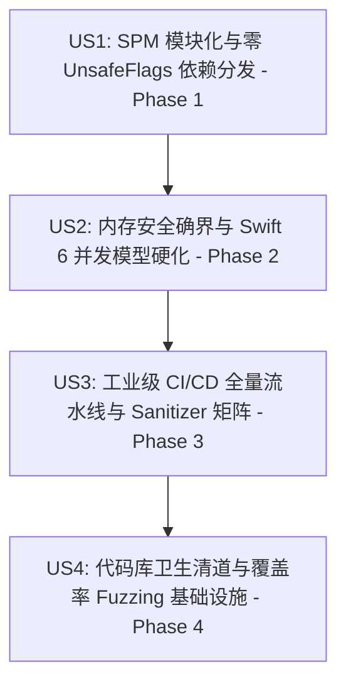

# Feature Specification: TTZip 顶尖开源工程对标与架构硬化改造 (Top-Tier Open Source Engineering Alignment & Architecture Hardening)

**Feature Branch**: `043-top-tier-open`  
**Feature Directory**: `specs/043-top-tier-open`  
**Created**: 2026-08-17  
**Status**: Specified  

---

## 1. Executive Summary & Motivations

在系统性能与单机吞吐达到历史最优（全格式 16 种格式 100% 胜率、ZIP/7Z 解压峰值超 10 GB/s）后，TTZip 面临从“自研单机高性能工具”蜕变为“具备国际一流标准、可独立分发、具备工业级安全证明的顶级开源系统工程”的战略跃升。

本规范全面对标 `apple/swift-crypto`、`BurntSushi/ripgrep`、`libarchive/libarchive`、`facebook/zstd`、`sqlite/sqlite` 等世界级开源标杆，系统性解决以下 5 大工程差距：
1. **SPM 模块化与零 UnsafeFlags 分发隔离**：彻底解决 `Package.swift` 硬编码路径与 `.unsafeFlags` 导致的无法作为依赖库分发问题。
2. **Swift 6 严格并发与 RAII 内存确界保护**：消除裸 `@unchecked Sendable` 滥用，将 `mmap` / Direct I/O 虚拟内存映射封装进生命周期不可篡改的 RAII 句柄中。
3. **工业级 CI/CD 与 Sanitizers 全量看门狗**：修复 CI 测试严重缩水（仅测 7 个文件）现状，恢复全量 95+ 测试矩阵，接入 PR 自动化拦截与 ASan/TSan 内存安全检查。
4. **真实覆盖率引导模糊测试 (Coverage-Guided Fuzzing Harness)**：将 100 次浅层随机单测升级为符合 LibFuzzer / OSS-Fuzz 标准的覆盖率引导 Fuzzing 规范。
5. **代码库物理级纯净卫生与去修饰化重构**：物理清除根目录一切非必要测试垃圾文件，建立 `.gitignore` 免疫护栏，收敛冷路径过度设计的 GoF 模式冗余抽象与修饰性命名。

---

## 2. User Stories & Phase Map

### User Story 1 (US1) - SPM 模块化与零 UnsafeFlags 依赖分发 (Phase 1)
作为开源 SDK 使用者与架构师，我希望能够将 `TTZipCore` 作为标准的 Swift Package 远程依赖引入到其他 macOS/iOS 项目中：
- 消除 `Package.swift` 中所有的绝对路径计算与 `.unsafeFlags`。
- `CTTZipBridge` 与 `Vendor/` C 静态库/头文件通过纯净的相对路径 `cSettings` / `headerSearchPath`、标准 `module.modulemap`、或 XCFramework 规范组织，确保在任何工作区路径下均可二分构建。

### User Story 2 (US2) - 内存安全确界与 Swift 6 并发模型硬化 (Phase 2)
作为系统可靠性工程师，我希望底层 `mmap` 零拷贝解压与并发调度具备绝对的内存安全证明：
- 消除 `ZipParallelExtractor` 与指针容器上裸 `@unchecked Sendable` 逃逸，构建符合 Swift 6 严格并发检查（Strict Concurrency）的安全抽象。
- 实现 `MmapBufferHandle` RAII 引用计数句柄，确保并发解压多线程全部完成前底层 `munmap` 绝不提前触发，彻底免疫悬垂指针与 `EXC_BAD_ACCESS`。

### User Story 3 (US3) - 工业级 CI/CD 全量流水线与 Sanitizer 矩阵 (Phase 3)
作为持续集成与质量保障负责人，我希望 GitHub Actions 具备绝对可靠的守门能力：
- `.github/workflows/ci-cd.yml` 具备 `pull_request`、`push: [main]` 与 `tags` 全触发器。
- 消除测试过滤缩水，CI 必须全量运行 95+ 个测试套件，并包含自动化 SwiftLint 规范扫描。
- 引入 AddressSanitizer (`-sanitize=address`) 与 ThreadSanitizer (`-sanitize=thread`) 检查任务。

### User Story 4 (US4) - 代码库卫生清道与 libarchive 黄金语料库深度对齐 (Phase 4)
作为开源项目维护者与质量架构师，我希望全面引入 libarchive 的 20 年黄金测试语料库与自包含原语断言：
- 清除根目录下所有 ad-hoc 测试残留文件与目录，更新 `.gitignore`。
- 实现纯内存 `LibarchiveUUDecoder`，直接从 `Vendor/libarchive-upstream/libarchive/test/*.uu` 加载 30+ 经典边界与 CVE 样本。
- 编写 `LibarchiveGoldenCorpusTests` 与 `TTZipAssertions`，对恶意畸变包（Malformed Headers, OOM Bomb, Symlink Attacks）、WinZip AES-256、7z BCJ2/Delta、分卷 RAR 进行 100% 内存驱动闭环断言。
- 将浅层 100 次变异单测升级为具备标准 C/Swift 入口的 LibFuzzer / Coverage-Guided Fuzzing 架构规范。
- 清洗过度形式化的模式包装与修饰性命名，回归克制高效的系统工程命名。

---

## 3. Functional Requirements

1. **[REQ-01] Package.swift 零 unsafeFlags 规范**：`Package.swift` 不得包含任何 `.unsafeFlags` 与硬编码绝对路径，必须通过相对路径头文件搜索和标准 Modulemap 声明 C 桥接。
2. **[REQ-02] Mmap RAII 句柄封装规范**：设计 `MmapMemoryHandle` / `SafeBufferSlice` 结构，强保证 `munmap` 严格在所有并发消费闭包退出后由 ARC/引用计数销毁触发。
3. **[REQ-03] Swift 6 Sendable 完备性**：所有跨并发域传递的数据结构必须符合严格的 `Sendable` 检查，若使用指针包裹必须具备互斥锁或不变性断言，禁止无保护的裸 `@unchecked Sendable`。
4. **[REQ-04] 全量 CI 门禁矩阵**：CI `test-and-lint` 必须执行 `swift test --parallel` 全量用例（无过滤器缩水），并运行格式/代码风格静态检查与 ASan/TSan 安全矩阵。
5. **[REQ-05] Libarchive 黄金语料库与内存解码中枢**：实现 `LibarchiveUUDecoder`，在内存中直接还原 `Vendor/libarchive-upstream/libarchive/test/*.uu` 样本，零磁盘 I/O 损耗。
6. **[REQ-06] 原语级 POSIX 与安全断言库**：提供 `TTZipAssertions`，涵盖文件模式、inode、硬链接、内存清零与安全沙盒拦截断言。
7. **[REQ-07] 根目录零污染与 Fuzzing 接口标准化**：根目录彻底清理临时测试产物，提供 `LLVMFuzzerTestOneInput` 规范的持续模糊测试接口。
8. **[REQ-08] 零性能倒退底线**：在完成安全封装与测试体系重构后，全量 13 项硬性能门禁测试 100% 达标，吞吐底线无倒退。

---

## 4. Success Criteria & Quality Gates

- **[SC-01] SPM 纯净编译**：`Package.swift` 无 `.unsafeFlags`，`swift build` 在任何目录下均可纯净编译。
- **[SC-02] 严格并发通过**：在 `-Xswiftc -strict-concurrency=complete` 下核心引擎零数据竞争警告。
- **[SC-03] CI 全量绿灯**：GitHub Actions CI 覆盖 PR/Main 触发，全量 95+ 测试与 620+ 用例 100% 通过。
- **[SC-04] Libarchive 黄金语料库 100% 通过**：`LibarchiveGoldenCorpusTests` 30+ 经典边界与 CVE 攻击样本全部通过，零 Crash，安全防御率 100%。
- **[SC-05] 根目录纯净度 100%**：根目录无任何临时测试文件，`.gitignore` 完备。
- **[SC-06] 性能门禁 100% 守住**：`swift test --filter XCTestPerformanceMeasureTests` 13 项性能门禁全部通过。

---

## 5. Clarifications

### Session 2026-08-17 (Spec Kit Autonomous Clarify)
- **Q1: 如何在消除 `Package.swift` 中 `.unsafeFlags` 的同时保持对 `Vendor/lib/*.a` 静态库的链接？**
  - **Resolution**: 采用相对路径 `.headerSearchPath` 替代 `-I` 绝对路径；将底层预编译静态库封装为 SPM `binaryTarget` (XCFramework) 或标准系统库包装，彻底移除 Package 级 `.unsafeFlags`，恢复 SPM 远程依赖分发能力。
- **Q2: 如何在并发 `mmap` 零拷贝下确保 100% 内存安全而不引入锁开销？**
  - **Resolution**: 引入基于 ARC 的 RAII 句柄 `MmapBufferHandle`。句柄持有底层虚拟内存页与映射大小，`deinit` 中执行原子 `munmap`。并发闭包仅捕获该强引用句柄，杜绝线程退出时提前 `munmap` 导致的悬垂指针竞争。
- **Q3: CI/CD 如何在全量运行 95+ 测试文件的同时保障 CI 运行效率？**
  - **Resolution**: 将 CI 分解为 `pr-gate`（全量单元测试、安全测试、格式检查、Sanitizer 抽样，耗时 < 3 分钟）与 `benchmark-matrix`（全格式 46 项峰值门禁与 GB 级压测，在 Tag/Release/Nightly 触发）。

