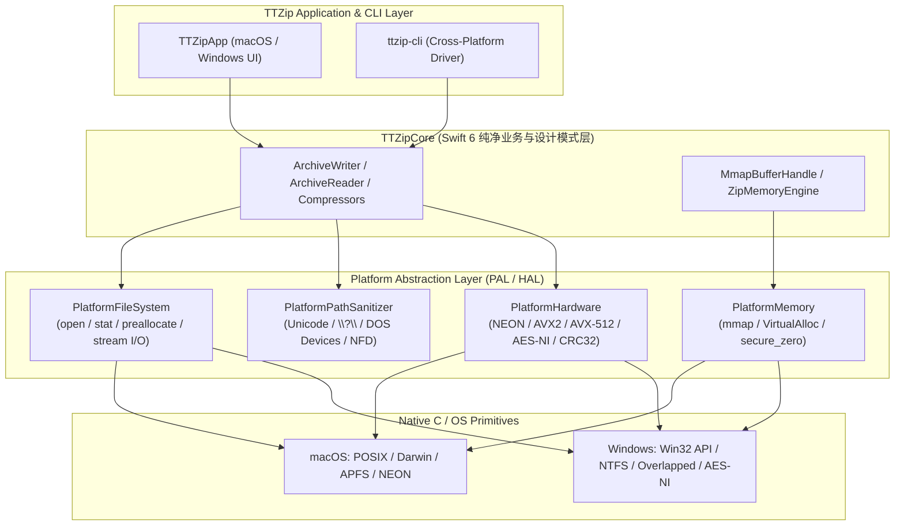

# Implementation Plan: 045-cross-platform-architecture-and-code-standards

**Feature Name**: `045-cross-platform-architecture-and-code-standards`  
**Milestone**: TTZip v2.0 Dual-Platform Engine Architecture  
**Dependencies**: [spec.md](./spec.md), [research.md](./research.md), [data-model.md](./data-model.md), [contracts/](./contracts/), [quickstart.md](./quickstart.md)  

---

## 一、 技术上下文 (Technical Context)

TTZip 将全面吸收 libarchive 20 年在 Windows 与 POSIX 跨平台构建、字符集转码、超长路径扩展、安全防御与硬件加速分发的工业级实践，打造高内聚、零运行时损耗的 **Platform Abstraction Layer (PAL)**：

---

## 二、 架构原则审查 (Constitution Check)

1. **热路径零成本抽象 (Zero-Cost Abstraction on Hot Paths)**：
   - PAL 接口采用 Swift `@inlinable` 与 C11 宏内联展开，在编译期完成平台特化绑定，严禁引入动态虚函数表或每文件堆分配。
2. **Fast-Path 物理隔离**:
   - macOS 端的 Apple Silicon NEON、APFS Direct I/O、mmap 与 `libdeflate` 保持原汁原味的极致调优路径；Windows 预留 AVX2 / Direct I/O 硬件分支，双方互不退化。
3. **零性能倒退铁律**:
   - 修改后执行全格式基准与性能门禁测试，必须 100% 达标。

---

## 三、 Phase 0: 深度技术调研 (Research)

- R001 [SUBAGENT:research] 《libarchive 跨平台抽象与 Windows 适配架构研究》：分析 `archive_windows.c/h`, `archive_platform.h` 的宽字符与长路径机制。
- R002 [SUBAGENT:research] 《双平台极限性能与硬件特化分发架构研究》：分析 CPUID 指令探测与双平台 AES-256 SIMD 对称 Fast-Path。
- R003 [SUBAGENT:research] 《跨平台内存映射 (PAL Memory) 与代码异味消除重构研究》：分析 Swift 6 / C11 消除裸 POSIX 调用与敏感内存安全擦除。

---

## 四、 Phase 1: 数据模型与契约 (Data Model & Contracts)

- [x] `data-model.md`: 定义 `PlatformOperatingSystem`, `CPUFeatureSet`, `PlatformPathNormalizationResult`, `PlatformFileAttributes`。
- [x] `contracts/cpu_feature_set_schema.json`: 声明 CPU 特性掩码强类型 Schema。
- [x] `contracts/path_normalization_schema.json`: 声明路径净化与安全分析 Schema。
- [x] `quickstart.md`: 声明 4 大跨平台与硬件验证场景。

---

## 五、 改动清单与组件设计 (Component Breakdown)

### 1. C 桥接层跨平台头文件与对齐宏
- `[NEW]` [`Sources/CTTZipBridge/include/ttzip_platform.h`](file:///Users/kevintung/Documents/dev/TTZip/Sources/CTTZipBridge/include/ttzip_platform.h): 跨平台 API 导出宏、对齐宏与安全擦除 `ttzip_secure_zero`。
- `[NEW]` [`Sources/CTTZipBridge/include/ttzip_windows.h`](file:///Users/kevintung/Documents/dev/TTZip/Sources/CTTZipBridge/include/ttzip_windows.h): Windows 特有句柄与宽字符桥接定义。

### 2. Swift 平台抽象层 (PAL) 核心模块
- `[NEW]` [`Sources/TTZipCore/Platform/PlatformOperatingSystem.swift`](file:///Users/kevintung/Documents/dev/TTZip/Sources/TTZipCore/Platform/PlatformOperatingSystem.swift): 操作系统与平台标识。
- `[NEW]` [`Sources/TTZipCore/Platform/PlatformHardware.swift`](file:///Users/kevintung/Documents/dev/TTZip/Sources/TTZipCore/Platform/PlatformHardware.swift): CPUID 与 ARM NEON / AES-NI 硬件特性探测中枢。
- `[NEW]` [`Sources/TTZipCore/Platform/PlatformPathSanitizer.swift`](file:///Users/kevintung/Documents/dev/TTZip/Sources/TTZipCore/Platform/PlatformPathSanitizer.swift): 跨平台路径净化、DOS 设备名拦截与长路径支持。
- `[NEW]` [`Sources/TTZipCore/Platform/PlatformMemory.swift`](file:///Users/kevintung/Documents/dev/TTZip/Sources/TTZipCore/Platform/PlatformMemory.swift): 统一页对齐内存申请、虚拟内存映射与安全擦除。
- `[NEW]` [`Sources/TTZipCore/Platform/PlatformFileSystem.swift`](file:///Users/kevintung/Documents/dev/TTZip/Sources/TTZipCore/Platform/PlatformFileSystem.swift): 统一文件打开、元数据读取与空间预分配。

### 3. 核心引擎重构与异味消除
- `[MODIFY]` [`Sources/TTZipCore/Zip/MmapBufferHandle.swift`](file:///Users/kevintung/Documents/dev/TTZip/Sources/TTZipCore/Zip/MmapBufferHandle.swift): 接入 `PlatformMemory.mapFileReadOnly`，消除裸 POSIX 调用。
- `[MODIFY]` [`Sources/TTZipCore/Zip/ZipMemoryEngine.swift`](file:///Users/kevintung/Documents/dev/TTZip/Sources/TTZipCore/Zip/ZipMemoryEngine.swift): 接入 `PlatformMemory` 与 `PlatformFileSystem`。

### 4. 自动化测试套件
- `[NEW]` [`Tests/TTZipTests/PlatformPathSanitizerTests.swift`](file:///Users/kevintung/Documents/dev/TTZip/Tests/TTZipTests/PlatformPathSanitizerTests.swift): 覆盖 30+ 种 Windows/macOS 路径安全用例。
- `[NEW]` [`Tests/TTZipTests/PlatformHardwareTests.swift`](file:///Users/kevintung/Documents/dev/TTZip/Tests/TTZipTests/PlatformHardwareTests.swift): 指令集特性与 CPU 拓扑校验。
- `[NEW]` [`Tests/TTZipTests/PlatformMemoryTests.swift`](file:///Users/kevintung/Documents/dev/TTZip/Tests/TTZipTests/PlatformMemoryTests.swift): 跨平台内存映射生命周期与页对齐测试。
