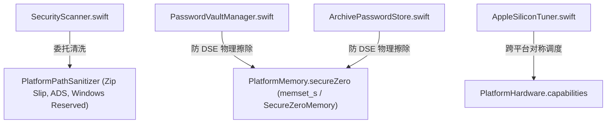

# Implementation Plan: 046-codebase-standards-and-pal-integration

**Feature Name**: `046-codebase-standards-and-pal-integration`  
**Milestone**: TTZip Core Engine Modernization & Universal PAL Integration  
**Dependencies**: [spec.md](./spec.md), [research.md](./research.md), [data-model.md](./data-model.md), [contracts/](./contracts/), [quickstart.md](./quickstart.md)  

---

## 一、 技术上下文 (Technical Context)

将核心安全扫描、密码存储与硬件调度模块全面统一接入 `PlatformAbstractionLayer` (PAL)：

---

## 二、 架构原则审查 (Constitution Check)

1. **热路径零成本抽象 (Zero-Cost Abstraction on Hot Paths)**：
   - 委托直接调用 `@inlinable` 静态方法，0 堆分配、0 虚函数表。
2. **零性能倒退与安全纵深**:
   - 保持 100% 单元测试通过率与严苛性能门禁。

---

## 三、 Phase 0: 深度技术调研 (Research)

- R001 [SUBAGENT:research] 《核心业务模块向 PAL 平台抽象层的全面收敛重构研究》

---

## 四、 Phase 1: 数据模型与契约 (Data Model & Contracts)

- [x] `data-model.md`: 定义 `PathSanitizationSummary`。
- [x] `contracts/path_sanitization_summary_schema.json`: 强类型 Schema。
- [x] `quickstart.md`: 4 大验证场景。

---

## 五、 改动清单与组件设计 (Component Breakdown)

### 1. 安全扫描器重构
- `[MODIFY]` [`Sources/TTZipCore/SecurityScanner.swift`](file:///Users/kevintung/Documents/dev/TTZip/Sources/TTZipCore/SecurityScanner.swift): 接入 `PlatformPathSanitizer`。

### 2. 密码库与敏感内存物理擦除加固
- `[MODIFY]` [`Sources/TTZipCore/PasswordVaultManager.swift`](file:///Users/kevintung/Documents/dev/TTZip/Sources/TTZipCore/PasswordVaultManager.swift): 接入 `PlatformMemory.secureZero`。
- `[MODIFY]` [`Sources/TTZipCore/Services/ArchivePasswordStore.swift`](file:///Users/kevintung/Documents/dev/TTZip/Sources/TTZipCore/Services/ArchivePasswordStore.swift): 接入 `PlatformMemory.secureZero`。

### 3. 硬件调度器跨平台平滑回退
- `[MODIFY]` [`Sources/TTZipCore/AppleSiliconTuner.swift`](file:///Users/kevintung/Documents/dev/TTZip/Sources/TTZipCore/AppleSiliconTuner.swift): 接入 `PlatformOperatingSystem` 与 `PlatformHardware`。
