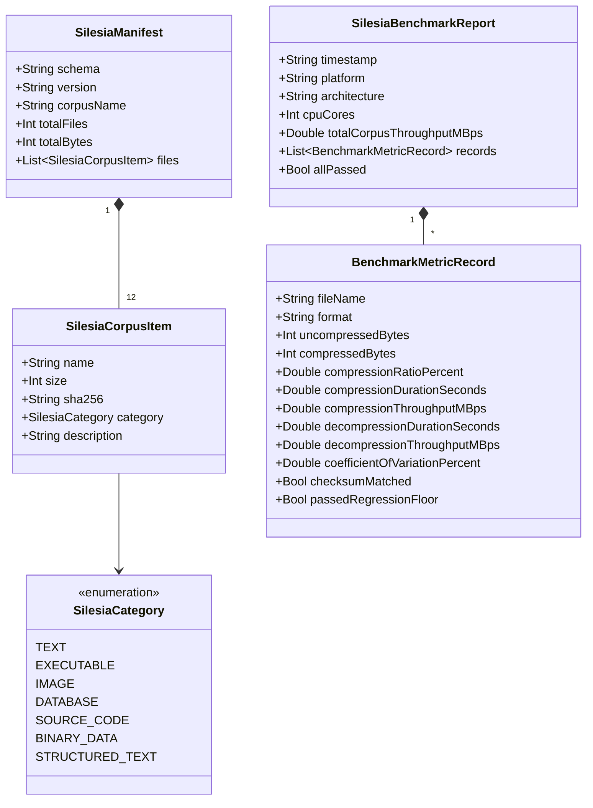

# Data Model: Silesia Corpus Benchmark Fixtures & Regression Gates

## 1. Core Domain Entities

---

## 2. Entity Field Specifications

### 2.1 `SilesiaManifest`
Top-level metadata describing the immutable gold-standard corpus.

| Field Name | Swift Type | Constraints | Description |
| :--- | :--- | :--- | :--- |
| `schema` | `String` | Must equal `"http://json-schema.org/draft-07/schema#"` | JSON Schema specification identifier |
| `version` | `String` | SemVer format (e.g. `"1.0.0"`) | Corpus specification version |
| `corpusName` | `String` | Non-empty, default `"Silesia Compression Corpus"` | Descriptive corpus title |
| `totalFiles` | `Int` | Must equal `12` | Total number of files in the corpus |
| `totalBytes` | `Int` | Must equal `211945550` | Total uncompressed byte size of all 12 files |
| `files` | `[SilesiaCorpusItem]` | Array length must equal `12` | List of corpus item definitions |

### 2.2 `SilesiaCorpusItem`
Defines an individual file within the Silesia benchmark dataset.

| Field Name | Swift Type | Constraints | Description |
| :--- | :--- | :--- | :--- |
| `name` | `String` | One of the 12 standard names (`dickens`, `mozilla`, etc.) | File base name without extension |
| `size` | `Int` | Range: `[5000000, 60000000]`, must match exact byte size | File size in bytes |
| `sha256` | `String` | Exact 64-character lowercase hex string | Cryptographic SHA-256 integrity hash |
| `category` | `SilesiaCategory` | Enum string value | Data category for entropy profiling |
| `description` | `String` | Non-empty string | Human-readable explanation of contents |

### 2.3 `SilesiaCategory` (Enum)
Categorization of real-world payload entropy.

| Enum Case | String Value | Typical Characteristics |
| :--- | :--- | :--- |
| `.text` | `"text"` | ASCII/ISO natural language text |
| `.executable` | `"executable"` | Compiled machine code and shared libraries |
| `.image` | `"image"` | Raw 2D/3D raster or medical imaging data |
| `.database` | `"database"` | Relational database table dumps |
| `.sourceCode` | `"source_code"` | C/C++ source code, headers, and build manifests |
| `.binaryData` | `"binary_data"` | Fixed-width floating point / coordinate tables |
| `.structuredText` | `"structured_text"` | XML / HTML markup rich documents |

### 2.4 `BenchmarkMetricRecord`
Measured performance metrics for a single format and file combination.

| Field Name | Swift Type | Constraints | Description |
| :--- | :--- | :--- | :--- |
| `fileName` | `String` | Must match a valid `SilesiaCorpusItem.name` | Target file name |
| `format` | `String` | Supported archive format (e.g. `"ZIP"`, `"7Z"`, `"TAR.ZST"`) | Target archive format |
| `uncompressedBytes` | `Int` | $> 0$ | Original byte length |
| `compressedBytes` | `Int` | $> 0$ | Resulting archive byte length |
| `compressionRatioPercent` | `Double` | Range: `(0.0, 200.0]` | $(\text{compressed} / \text{uncompressed}) \times 100\%$ |
| `compressionDurationSeconds` | `Double` | $> 0.0$ | Median compression wall-clock duration |
| `compressionThroughputMBps` | `Double` | $> 0.0$ | Compression throughput in MB/s |
| `decompressionDurationSeconds` | `Double` | $> 0.0$ | Median decompression wall-clock duration |
| `decompressionThroughputMBps` | `Double` | $> 0.0$ | Decompression throughput in MB/s |
| `coefficientOfVariationPercent` | `Double` | $\le 2.5\%$ | Standard deviation divided by mean over 3 runs |
| `checksumMatched` | `Bool` | Must equal `true` | CRC32/SHA-256 byte parity verification |
| `passedRegressionFloor` | `Bool` | Must equal `true` | Throughput drop $\le 3.0\%$ vs historical baseline |

### 2.5 `SilesiaBenchmarkReport`
Aggregated suite report emitted for CI/CD metrics collection.

| Field Name | Swift Type | Constraints | Description |
| :--- | :--- | :--- | :--- |
| `timestamp` | `String` | ISO 8601 UTC timestamp | Benchmark run execution time |
| `platform` | `String` | Non-empty (`"macOS 14.0"`, `"Windows 11"`) | Host OS identification |
| `architecture` | `String` | `"arm64"` or `"x86_64"` | CPU architecture |
| `cpuCores` | `Int` | $\ge 1$ | Physical CPU core count |
| `totalCorpusThroughputMBps` | `Double` | $> 0.0$ | Overall aggregated corpus throughput |
| `records` | `[BenchmarkMetricRecord]` | Non-empty array | Individual test records |
| `allPassed` | `Bool` | `true` if all records passed regression floor | Suite overall status |
